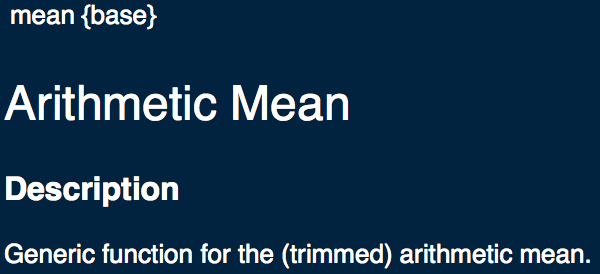
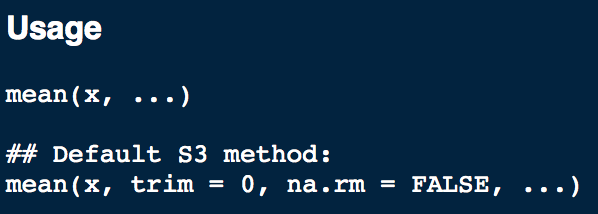
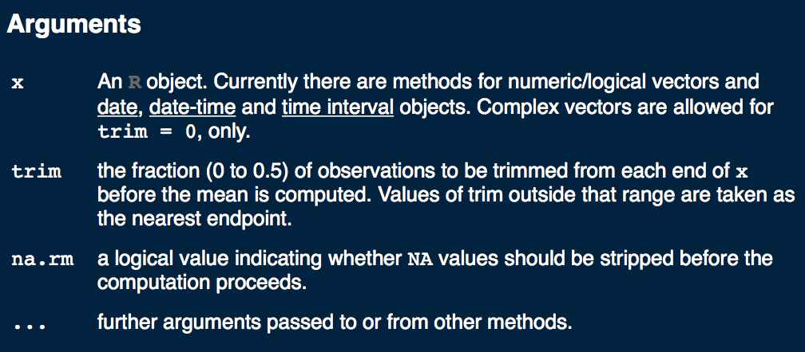
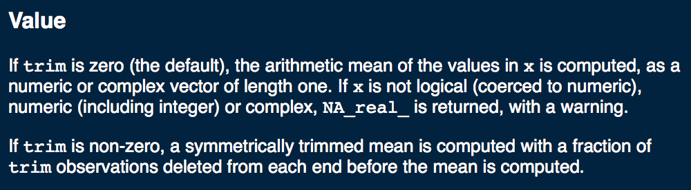
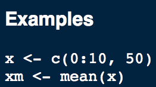

# Packages and Getting Help

```{r 05-setup, echo = FALSE}
knitr::opts_chunk$set(fig.align = "center", warning = FALSE, message = FALSE, cache = TRUE)
```

## Packages

A <span class = 'vocab'>package</span> is just a collection of functions, data, and already-written code that is in a well-defined format. We'll introduce a few packages as we go, but a lot of what we'll cover will rely on the `base` package, which is just the functions that `R` already comes with. They're the *base* of most analyses and other operations you'll want to do in R, hence the name of the package. To install a new package, you want to use the `install.packages()` function, with the name of the package quoted and inside of the parenthesis. 

One package that you'll want to install is the `swirl` package, which was developed as a self-guided class to help you learn R. To install this package, copy and paste the following line into your `Console`.

```{r 05-install-swirl, eval = FALSE}
install.packages('swirl')
```

Once the package is installed, you'll want to <span class = 'vocab'>load</span> the package (tell `R` that you'll be using commands, data, and other information from the package). Copy/paste or type the following into your console to do so, and follow the prompts:

```{r 05-load-swirl, eval = FALSE}
library(swirl)
```

## Help Files {#helpfiles}

Another great aspect of `R` is how well-documented the language is. If you don't know how to use a particular function, there are a lot of ways to learn how to use it and see it in action. The help files provide the <span class = 'vocab'>syntax</span> (what order to put things into the function), an explanation of the arguments, as well as information about the <span class = 'vocab'>output</span> (what the function gives back to you), and examples of the function in use.

### An Example {-}

Let's say you wanted to learn more about the `mean()` function. You can type `?mean` into your console, and the help file will pull up in the `Help` tab. From there, you can learn all about the function.

<div style = 'text-align: center'>The header of the `mean()` documentation</div>

```{r 05-help-head, echo = FALSE}

```

As you can see, the top of the help function starts with the name of the function, with the package it comes from in brackets. Then it provides a brief description of what the function does. This one gets the mean (average) of a list of numbers.

<div style = 'text-align: center'>Syntax for `mean()`</div>

```{r 05-help-usage, echo = FALSE}

```

This part tells us that all the function looks for is an object `x`, which is just the numbers you'd like to take the average of. Something to note: the `trim` argument has a default value of `0`, and `na.rm` is set to `FALSE`. As you hopefully remember from <a href = 'functions-and-data-types.html#default-argument-note'>chapter 2</a>, these will be the values that the function uses unless you specify differently. Then it explains the arguments it's looking for as it does its job in the **Arguments** section:

<div style = 'text-align: center'>Arguments for `mean()`</div>

```{r 05-help-args, echo = FALSE}

```

Next is the **Value** section, which explains what the output of the function actually is.

<div style = 'text-align: center'>Value for `mean()`</div>

```{r 05-help-value, echo = FALSE}

```

Lastly, the documentation provides examples of it in use. You'll understand this code by the end of the chapter, but for now trust that it's doing its job appropriately.

<div style = 'text-align: center'>Examples of `mean()`</div>

```{r 05-help-examples, echo = FALSE}

```

## Other Helpful Resources

If the help file isn't much help in solving your problem, there's a plethora of other helpful resources available to you. What do you do when you don't understand something? What about if you get an error message and your code doesn't run properly?

One of the most important things to remember is that you're not the first person to struggle with wherever you're stuck, or get the error message you just got. There may not always be a TA that's available to help right when you need them, so it's a good idea to start learning how to help yourself solve your problems.

[StackOverflow](https://stackoverflow.com/questions/tagged/r) is one of the best resources available to you in terms of help. It's an open, online forum for people to post and answer questions. Think of it like reddit, but for code. This is a fantastic place to start your search, and the questions range from the very simple beginner questions to incredibly technical and advanced concepts. If a post is too technical for you to understand, there's almost always another one (or more!) that can help.

It may seem odd, but Googling is also a great way to learn. Because of how powerful Google is, copying and pasting error messages will usually result in a good explanation of the error message, why you're getting it, and multiple ways to correct it. **[<span style = 'color:#4885ed'>G</span><span style = 'color:#db3236'>o</span><span style = 'color:#f4c20d'>o</span><span style = 'color:#4885ed'>g</span><span style = 'color:#3cba54'>l</span><span style = 'color:#db3236'>e</span>](www.google.com) is your friend.**

There's also plenty of resources online to help you learn `R` programming as well. In addition to the `swirl` library we talked about earlier, there are some websites, like [codeschool](http://tryr.codeschool.com/levels/1/challenges/1), that allow you to practice writing `R` code. Feel free to use this one as much or as little as you'd like, but the best way to get better at programming is to practice as much as possible.

Lastly, there's also a variety of books that you can make use of to help learn and understand `R`, like [this book](https://leanpub.com/rprogramming) It's based off a Coursera course, and the author made videos that are linked in the book. You can download it for free by just sliding the price slider to 0 (or you can pay if you want).
