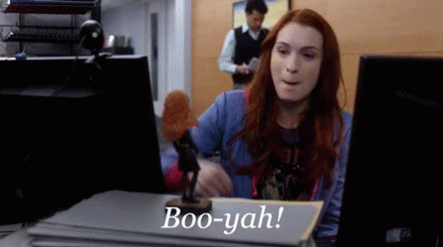

# Linear Regression

```{r 13-setup, echo = FALSE}
knitr::opts_chunk$set(fig.align = "center", comment = '', warning = FALSE, message = FALSE, fig.height = 7, fig.width = 12, cache = TRUE)
```

Statistics tries to do two things:

1) Explain the trends we observe within data

2) Make predictions on new data based on the trends we see

So far, much of what we've covered goes to objective #1. Let's start working on the second part and using the trends we've observed to make predictions.

<a name = 'reg-line'></a>

## Regression

<span class = 'vocab'>**Regression**</span> is the process of using a relationship between two or more variables (the predictor(s) and response variables) to make a better prediction of the response than guessing. We're focused on what's called <span class = 'vocab'>**simple linear regression (SLR)**</span>, which just means doing regression with one predictor. Knowing the <a href = 'correlation.html#correlation'>correlation</a> between two variables definitely helps make a better prediction since we know the trend between the two variables, but it doesn't really help us make a prediction... Yet.

Now it's time to put $r$ to use. What the correlation coefficient *really* tells us is how much, on average, how many standard deviations of the response we move up (or down) when we increase by one standard deviation in the predictor. Admittedly, that's confusing to type and involves a lot of math words, and it's probably easier to understand with an example anyways, so we'll go right to one.

Pretend we're looking at the relationship between your height and your shoe size. This has a positive correlation (think about it: an NBA player will have a bigger foot than a toddler), and since we're making this example up, let's say that the correlation is $r$ = .7. The average shoe size (Avg$_\text{y}$) is 10, with standard deviation of .5, and the average height (Avg$_\text{x}$) in our data set is 69" with standard deviation 3".

```{r 13-regression-example, echo = FALSE}
cors = rep(paste('$r$ =', .7), 2)
summary_stats = data.frame(c(10, 69), c(.5, 4), cors)
names(summary_stats) = c('Average', 'Standard Deviation', '')
row.names(summary_stats) = c('Shoe Size', 'Height')
knitr::kable(summary_stats,
             format = 'html',
             align = 'c',
             digits = 1) %>% kableExtra::column_spec(4, bold = TRUE) %>% kableExtra::collapse_rows(columns = 4)
```

What $r$ tells us here is that, for every 4 additional inches taller someone is, we'd expect their feet to be .7 $\cdot$ .5 sizes bigger on average. This should make some sense with other things we know too: if $r$ was $\pm$ 1, we know *exactly* what size shoe you'd wear based on your height every time. If the correlation were 0, we'd have no idea what your shoe size would be so we'd guess the average shoe size. When it's in between, we don't know for sure, so we can use $r$ to improve our guess to be somewhere in the middle.

As you may have noticed, our guess is *always* going to be moving closer to the average. This effect, where bottom groups are expected to perform better and top groups are expected to perform worse, is called the <span class = 'vocab'>**regression effect**</span>.

> "This is all great, but I just want to know how to use it to make predictions."
>
> <div style = 'text-align: right'>You (we're guessing)</div>

```{r 13-scroll-down-gif, echo = FALSE, out.height = '20%',out.width = '20%'}

```

## Using $r$ to Make Predictions

One way to make a regression prediction is to start by converting the $x$ value at which you're trying to predict be a Z-score. Take this Z-score, multiply it by $r$, and boom! You've got your Z-score for $y$. Finally, rearrange the <a href = 'the-normal-approximation.html#z-score-formula'>Z-score formula</a> to solve for the Value. This is your regression estimate. Going back to our example above, we can illustrate in a table. We'll see what the predicted shoe size is for someone that's 73" tall.

```{r 13-make-predictions-process, echo = FALSE}
out = data.frame(73, (73 - 69) / 4, .7, .7 * (73 - 69) / 4, ((.7 * (73 - 69) / 4) * .5) + 10)
names(out) = c('Height', 'Z$_\\text{Height}$', '$r$', 'Z$_\\text{Shoe Size}$', 'Shoe Size')
knitr::kable(out, format = 'html', align = 'c', booktabs = TRUE)
```

Like we outlined above: take the first column and convert to a Z-score, then put it in column 2. Multiply the Z-score in column 2 and multiply by $r$, which is in column 3. The product is the new Z-score, which we put in column 4, and then we convert back to a value. We'd predict that someone that's 73" tall would have a size 10.35 shoe.

This process does take a while to complete, however. It's a multi-step procedure with a lot of switching back and forth between Z-scores and values. It's pretty easy to make a mistake doing this, so let's introduce another way to do regression.

## The Regression Line

Like we said above, $r$ tells us how much $y$ changes (in terms of standard deviations) for a 1-SD change in $x$. Hopefully, this is screaming "IT'S A SLOPE!" loud and in your face, but in case it isn't, this is the definition of a slope! Slopes are a characteristic of a line, so we can create a <span class = 'vocab'>**regression line**</span> to make predictions quickly and easily for every point we could want.

We typically describe lines as taking the form

$$ y = m \cdot x + b $$

where $x$ is the value we're making the prediction at, $m$ is the <span class = 'vocab'>slope</span> of the line (how much $y$ changes for each 1-unit increase in $x$), and $b$ is the <span class = 'vocab'>intercept</span> (the predicted $y$ value when $x$ is 0). With what we just realized about $r$, we can define the slope of our new friend -- the regression line -- to be

$$ r \cdot \frac{\text{SD}_\text{y}}{\text{SD}_\text{x}} $$

Great! Now all we need to do is figure out the intercept of the equation, and we'll be on auto-pilot for predictions. Luckily, this isn't hard to do. Just like the <a href = 'correlation.html#sd-line'>SD line</a>, the regression line also has to go through the point of averages. Since this point falls on the line, its $x$ and $y$ values are great to plug in. We then know $y$, $m$, and $x$, which leaves us with one equation with one unknown variable. Thus, we can solve for $b$ and be on our merry way.

Let's try it with the example from above. We're trying to predict shoe size from height, so our equation should take the form

$$ \text{Shoe size} = \left( r \cdot \frac{\text{SD}_\text{Shoe size}}{\text{SD}_\text{Height}} \right) \cdot \text{Height} + \text{intercept} $$

$r$ was .7, and the SDs for shoe size and height were 4 and .5 respectively. $.7 \cdot \frac{.5}{4} = `r .7*.5/4`$, so this is our slope. We can get the intercept by plugging in 10 for shoe size and 69 for height.

$$ 10 = .0875 \cdot 69 + \text{intercept} \\ 10 - \left( .0875 \cdot 69 \right) = \text{intercept} \\ \implies \text{intercept} = 3.9625 $$

Awesome! Now, let's make our prediction for a 73" tall person. If everything worked out correctly, we should get `r ((.7 * (73 - 69) / 4) * .5) + 10` just like before.

```{r 13-make-prediction-hand-numbers}
(.0875 * 73) + 3.9625
```

```{r 13-booyah-gif, echo = FALSE}

```

## `lm()`

While `R` does make computing the summary statistics for a data set very easy with `mean()`, `sd()` (with our modification, of course), and `cor()`, these can get frustrating to keep typing over and over to get regression equations. This is where the `lm()` function comes up clutch. `lm()` stands for <span class = 'vocab'>**linear model**</span>, which is exactly what we've just created. Essentially, this function allows us to create regression equations quickly and easily, while having additional functionality as well.

Part of the reason that we create a model is to be able to use it to make predictions. In order to use it, however, it's probably a good idea to store the model as a variable. Assignment works the same way it always has. To create a linear model, use formula syntax to specify which variables you'd like as your predictor and response. 

<span class = 'note'>Note: you could create the model by specifying the predictor (i.e. a variable called</span> <span style = 'color: #a21bd7'>`predictor`</span><span class = 'note'>) and response (i.e. a variable called </span><span style = 'color: #a21bd7'>`response`</span><span class = 'note'> from a data frame called </span><span style = 'color: #a21bd7'> `df` </span><span class = 'note'> as </span><span style = 'color: #a21bd7'>`lm(df$response ~ df$predictor)`</span>, <span class = 'note'>however it's much cleaner and clearer to specify the same thing as</span> <span style = 'color: #a21bd7'> `lm(response ~ predictor, data = df)` </span><span class = 'note'>.</span>

Let's take our example that we did last chapter one step further. As a refresher, here's what we were dealing with.

```{r 13-height-weight-table, echo = FALSE}
cors = rep(paste('$r$ =', round(cor, 1)), 2)
summary_stats = data.frame(means, stdvs, cors)
names(summary_stats) = c('Average', 'Standard Deviation', '')
row.names(summary_stats) = c('`height`', '`weight`')
knitr::kable(summary_stats,
             format = 'html',
             align = 'c',
             digits = 1) %>% kableExtra::column_spec(4, bold = TRUE) %>% kableExtra::collapse_rows(columns = 4)
```

Graphically, we had the following going on. The black line is the SD line, the vertical and horizontal lines are the averages in `height` and `weight` respectively, and the grey dot where the lines overlap is the point of averages.

```{r 13-height-weight-plot, echo = FALSE}
plot(
  weight ~ height,
  data = survey1,
  pch = 16,
  xlab = 'Height in Inches',
  ylab = 'Weight in Pounds',
  main = 'Height vs. Weight',
  col = '#0088ce'
)

abline(
  h = mean(survey1$weight),
  col = '#ffcc33',
  lwd = 1.5,
  lty = 2
)

abline(
  v = mean(survey1$height),
  col = '#7a0019',
  lwd = 1.5,
  lty = 2
)

sd_line_slope = stdvs[2] / stdvs[1]

abline(a = means[2] - (sd_line_slope * means[1]),
       b = sd_line_slope,
       col = '#000000',
       lwd = 1.5,
       lty = 2)

points(
  x = mean(survey1$height),
  y = mean(survey1$weight),
  col = '#939598',
  pch = 16
)
```

As a quick practice round, let's get the slope and intercept by hand first.

$$
r \cdot \frac{\text{SD}_\text{weight}}{\text{SD}_\text{height}} = 5.00 \\
147.2 = \left( 5.00 \cdot 66.9 \right) + \text{intercept} \implies \text{intercept} = -187.63
$$

Awesome, but annoying to calculate by hand. Let's make use of `lm()` and get the same results straight away. We'll store our model as `mod1` so we can refer back to it, and we'll follow the good coding style we just outlined a minute ago. 

```{r 13-height-weight-model}
mod1 = lm(weight ~ height, data = survey1)
```

To see what the model determined for the slope and intercept, we can use the `coef()` function, and just supply the name of our model to it.

```{r 13-mod1-output}
coef(mod1)
```

Hmmm... this is close to what we got, but it's not exactly the same. Why is that? Easy: rounding. We've hidden some unecessary code throughout the book that's rounded many results for us, but if we wanted to really calculate what the values would be, we'd do this. <span class = 'note'>Note: The</span> <span style = 'color: #a21bd7'>`stdv()`</span> <span class = 'note'>is the user-defined function for standard deviation we wrote in <a href = 'measures-of-central-tendency.html#stdv-function'>chapter 9</a>.</span>

```{r 13-get-same-params}
# Get summary statistics
average_weight = mean(survey1$weight)
average_height = mean(survey1$height)
sd_weight = stdv(survey1$weight)
sd_height = stdv(survey1$height)
r = cor(survey1$weight, survey1$height)

# Get slope and intercept
slope = r * (sd_weight / sd_height)
intercept = average_weight - (slope * average_height)
c(intercept, slope)
```

Since we know now that we'll get the same result, let's just keep going with `mod1`. We can add it to our plot with the `abline()` function. `coef` returns a vector, so we can use `[]` to access its elements.

```{r 13-reg-line-display-code, eval = FALSE}
plot(weight ~ height,
     data = survey1,
     pch = 16,
     xlab = 'Height in Inches',
     ylab = 'Weight in Pounds',
     main = 'Height vs. Weight'
)

abline(a = coef(mod1)[1],
       b = coef(mod1)[2],
       col = '#e04e39',
       lwd = 1.5,
       lty = 2
)
```

```{r 13-reg-line-plot-code, echo = FALSE}
plot(weight ~ height,
     data = survey1,
     pch = 16,
     xlab = 'Height in Inches',
     ylab = 'Weight in Pounds',
     main = 'Height vs. Weight',
     col = '#0088ce'
)

abline(h = mean(survey1$weight),
       col = '#ffcc33',
       lwd = 1.5,
       lty = 2
)

abline(v = mean(survey1$height),
       col = '#7a0019',
       lwd = 1.5,
       lty = 2
)

sd_line_slope = stdvs[2] / stdvs[1]

abline(a = means[2] - (sd_line_slope * means[1]),
       b = sd_line_slope,
       col = '#000000',
       lwd = 1.5,
       lty = 2)

abline(a = coef(mod1)[1],
       b = coef(mod1)[2],
       col = '#e04e39',
       lwd = 1.5,
       lty = 2
)

legend(x = 87, y = 250,
       legend = c('SD Line', 'Regression Line', 'Avg Height', 'Avg Weight'),
       col = c('#000000', '#e04e39', '#7a0019', '#ffcc33'),
       lwd = rep(1.5, 4),
       lty = rep(2, 4)
)

points(
  x = mean(survey1$height),
  y = mean(survey1$weight),
  col = '#939598',
  pch = 16
)
```

<a name = 'predict-function'></a>

## Using `predict()` to Make Predictions

Rather than having to convert to Z-scores to make predictions, we can use the regression line to make predictions. By hand, we'd take our value for $x$ (`height` in our example), multiply by the slope, add the intercept, and then we'd have our predicted value of $y$. 

<span class = 'note'>Note: To distinguish the original values in our dataset from our predictions, we often call our predictions $\hat{y}$. </span>

In `R`, the `predict()` function allows us to make predictions quickly and easily. To use it, start with the model you'd like to use, followed by passing a data frame of the predictor(s) to `predict()`'s `newdata` argument. In the `newdata` argument, we can either create a data frame with `data.frame()`, or we can put the name of an already existing data frame. If you're going to make your own data frame, however, make sure that you specify the names of the values you're putting in as they were when the model was fit.

If we wanted to use `mod1` to make a prediction for the weight of a 72" person, we can make use of `predict()` like this:

```{r 13-predict-example}
predict(mod1, newdata = data.frame(height = 72))
```

<span class = 'note'>Note: With SLR like we're doing, it may seem a little annoying to put it into a data frame, but when the problem involves multiple predictors, this can be much easier than typing out the whole calculation by hand. Don't worry about that case though; that's a problem for another day.</span>

## Switching the Predictions

In the example above, we predicted someone's weight from their height using two different methods: by using $r$, and by finding the regression equation. Instead, what if we wanted to predict someone's height from their weight? Would these methods still apply? In short, kind of.

Method 1 (using $r$) works identically, since it's just based off of the Z-scores of each variable. Just do the exact same process backwards: convert the weight to a Z-score, multiply by $r$ to get the Z-score for height, then convert back to a value. Easy peasy.

However, for Method 2, your $x$ and $y$ variables changed. This means that your slope changed, and your intercept changed as well. We would have to repeat the entire process of finding the slope and intercept, then plug in new values to make our predictions. The thing to remember here is that an equation to predict $y$ from $x$ is ***not*** the same as the equation to predict $x$ from $y$.