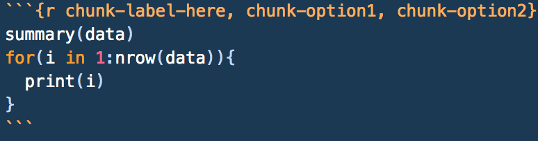

# Document Creation

```{r 19-setup, echo = FALSE}
knitr::opts_chunk$set(fig.align = "center", warning = FALSE, message = FALSE, fig.height = 7, fig.width = 12, cache = TRUE)
```

Another great feature of `R` is the ability to make nicely-formatted documents through the use of the `rmarkdown` package. This allows you to become a literate programmer, where you can write code and explain what you're doing, why you're doing it, and explain the results all in the same place. Before we can really start showing how powerful these documents are, you need to install `rmarkdown`.

```{r 19-install-rmarkdown, eval = FALSE}
install.packages('rmarkdown')
```

This package allows you to create an <span class = 'vocab'>R markdown</span> document. (They'll have the file extension <span style = 'color: #e04e39'>`.Rmd`</span>). We'll refer to them as markdown documents since they make use of markdown syntax (we'll go over this; hang tight for now!). They allow you to weave together code and commentary/explanation into a single file, allowing you to explain your work as you go. To create a markdown document, go to `File > New File > R Markdown...`.

R Markdown documents can be <span class = 'vocab'>rendered</span>, or put together, into 3 formats: HTML, PDF, and Word. When you create your document, you'll be asked which format you'd like it to render as. For our purposes, we'll use HTML, since they open very nicely in a web browser. You'll be asked to pick a format when you create a new markdown file. You'll also be asked to title your document. Don't freak out about naming it; you can always change it later.

Just to give you an idea of how powerful R Markdown is, it's what was used to create this entire textbook. Seriously! If you want to see them, you can find the source files by clicking <a href = 'https://github.com/rossdrucker/STAT-100-Honors-Project'>this link</a>. To download them, click any file that ends in `.Rmd`, then right click the `Raw` button, and click `Save Link As...`. This will save the file for you to see how the whole document is put together.

<span class = 'note'>Note: the markdown files that make up this book are actually from a package called</span> <span style = 'color: #a21bd7'> `bookdown` </span><span class = 'note'>, which you can read more about [here](https://bookdown.org/yihui/bookdown/) if you want to learn more. While </span><span style = 'color: #a21bd7'> `bookdown` </span><span class = 'note'> is way beyond the focus of this project, it's a really cool way to combine markdown files.</span>

Since this *is* going to be one of the longer chapters in the book, we've provided a <a href = 'https://github.com/rossdrucker/STAT-100-Honors-Project/blob/master/R%20Markdown%20Example.zip?raw=true'>downloadable example</span> for you to look at as you go. While the content of the document itself doesn't exactly mean anything, we've tried to demonstrate as much of the formatting we cover and usefulness of R Markdown as we possibly can within it.

## Knitting

We're going to start a little bit backwards and teach you how to <span class = 'vocab'>knit</span> a document first before we teach you how to write them and make good use of them. In `R`, knitting a document means *knitting* together the code and the context that the document contains and rendering the document in the format that you specified when you created it. You can render it in other formats after you create it too! To knit your document, you can use the knit button .

<span class = 'tip'>Pro tip: you can also knit your documents using keyboard shortcuts. On a Mac, use</span> <span style = 'color: #00ce45'>`Cmd + Shift + K`</span><span class = 'tip'>, or on a PC, use</span> <span style = 'color: #00ce45'>`Ctrl + Shift + K`</span><span class = 'tip'>.</span>

We have one more point to make before we go and start with the components of a markdown document, and that is where the markdown file looks for files that it needs to run (like data files, images, etc.). When knitting your document, `R` will look for any files in the *same* directory that the document is contained in unless you tell it otherwise.

What this means is that if the markdown file is contained in the directory `/User/Desktop/STAT 100`, `R` will automatically look for any files just specified by name in the `/User/Desktop/STAT 100` directory. If inside of this directory, there's a folder called `data` that we want to get data from (the data is saved as `data-to-use.csv`), we can specify a <span class = 'vocab'>relative filepath</span>, or a filepath that's *relative* to the one that we're working in. We could say `data = read.csv('data/data-to-use.csv')` in our file, and it would work identically to `data = read.csv('User/Desktop/STAT 100/data/data-to-use.csv')`. It's preferred to use the relative filepath, since the full one may be more specific to your computer.

Now that we know how to create and render a markdown file, let's take a closer look at its parts and how to make the best use of them.

## Document Elements

When you create a document, the first thing that gets put at the top is what's called a <span class = 'vocab'>YAML header</span>. This header contains some very basic information about the document that follows, such as the author, the title of the document, the date it was created, and what kind of output should be created. You're welcome to edit this header as you need to. For example, if you'd like to change the title from the one you originally gave, just change what goes inside the quotation marks next to `title:` in the YAML header. This header is always enclosed by three dashes on each side of it (`---`).

Next, we can put <span class = 'vocab'>(section) headers</span> to create different sections of our document. To create a header, we start the line with a pound sign (`#`), then follow it with the header you'd like to use. Headers of the same level nest inside each other. Depending on the number of pound signs you use, your header will be a different <span class = 'vocab'>level</span>, or size. More `#`s means a smaller size header, or a lower header level. Play around with them to see what we mean!

```
# This is a first-level header
## This is a second-level header
## A nested second-level header here
### This is a third-level header
# Now we're back to a first-level header
```

After a header, we may want to give a little overview of what we're going to be talking about throughout the rest of the document. There's nothing really special about this body of text, but we *know* that it's not meant to be interpreted as a section header or as code. We can just type regular text in the section, skipping 2 lines to do so. For example, if our header is "Overview", we could put this into our markdown document and start writing our problem up.

```
# Overview

In this section, we'll provide a brief overview of the problem. 
We used methods x, y, and z to solve it, and we're having a lot 
of fun writing up this markdown document to explain what we did 
as we did it!
```

## Text Formatting, Lists Links, and Images

There's also a few special characters in markdown that you may find helpful as you write your documents. If you use [reddit](www.reddit.com/r/uiuc), these should all be fairly familiar, as this is how you can create and format a text post.

One of the most common is the asterisk (`*`). Surrounding any regular text in a single set of asterisks italicizes the text. For example, `*this text will be italicized*` will appear as *this text will be italicized* in your final document. Using two asterisks will keep the text in a regular font, but will make it bold. `**Bolded Phrase**` will become **Bolded Phrase**. Using a triple set of asterisks will both italicize and bold the enclosed text: `***bolded and italicized***` becomes ***bolded and italicized***. Putting three (or more) asterisks on their own line will create a horizontal line on the page, like the one right below this paragraph.

***

<span class = 'note'>Note: instead of using asterisks, you could also use the same number of underscores</span> <span style = 'color: #a21bd7'> (`_`) </span><span class = 'note'> to accomplish the same stylization.

Another common markdown character is the caret (`^`). Enclosing text in a single set of carets will superscript the text. As an example, `i^th^` will become i^th^ when we're all done here.

The last common character is the tilde (`~`) character. A single set will subscript the enclosed text (`X~i~` will look like X~i~), and a double set of tildes strikes through whatever it encloses. To see an example, include `~~strikethrough~~` in your document and it should appear as ~~strikethrough~~.

> Starting a line with `>` will make it look like a block quote, and will appear like this line in your text.

Should you want to provide a hyperlink to something in your document, put the text you'd like displayed inside a single set of square brackets (`[]`), followed immediately by a set of parentheses that contain the link you'd like it to go to. If we wanted a link that says "Click Here" and have it take us to Google, for example, we'd put `[Click Here](www.google.com)` into our document. We can also link to files using the same syntax, but instead of putting a website in the parentheses, we'd put the filepath.

Images work the same way as links, we just lead with a `!`. So, if we have an image file called `image-to-use.png` in a subdirectory called `img` that's inside our working directory, we'd want to put `` in our text where we want the image to be displayed. If you want your image to have a caption, you can put it inside of the brackets.

Items in a bulleted, unnumbered/unordered list should begin with `-` and each be put on their own line. To create a sublisted item, move down two lines, tab twice, and put another `-`, like so:

```
- Main item

    - Sub-item 1
```

Numbered lists work the same way, but instead of starting the item with a `-`, start the item with the number it should take in the list.

## Code Chunks

Great! Now we can write as much text as we want, but how's that better than a Word document? Well, Word documents can't process `R` code like R markdown documents can. To include code, you need to make use of a <span class = 'vocab'>code chunk</span>. You can create them by creating a <span class = 'vocab'>fence</span>, which is just three backticks (`` ` ``) in a row.

Chunks need a <span class = 'vocab'>chunk header</span>, which just tells the document that whatever's inside the fence should be processed as `R` code. The header goes next to the opening fence and inside a set of curly braces (`{}`), and should begin with `r`. Inside this header, you can include a <span class = 'vocab'>chunk label</span> and other <span class = 'vocab'>chunk options</span> that help control output (these should be separated by a comma). While only the `r` is necessary, the chunk label helps you to remember what that chunk does, and the chunk options allow you to format the code and output accordingly. You can learn more about chunk options <a href = 'https://yihui.name/knitr/options/'>here</a>.

<div style = 'text-align: center'>A template of a code chunk with a label and chunk options</div>
```{r 19-chunk-example, echo = FALSE}

```

While chunks can contain as much or as little code as you'd like them to, it's a better practice to keep chunks short in your document and explain the parts as you go. Part of the beauty of R Markdown documents is that the code/results from a previous chunk is saved and can be accessed/used later in the document. Again, they're great at allowing you to be a *literate* programmer, explaining code and results as you go.

In addition to having code chunks like the one illustrated above, you can also have code run directly in your document. Instead of having to calculate a value or type out the full value of a variable, you can use an <span class = 'vocab'>in-line code chunk</span> to do the dirty work for you. It will just display that value in your document as if it were the values you typed yourself! Just type `` `r ` ``, but before that closing backtick, just put the code you'd like to run (example: `mean(x)`).

Another quick note about using backticks: if you want to just have text in monospace font within a paragraph (like we've done to show the difference between code and regular commentary), you can just enclose it in a set of backticks. As long as you don't start it with `` `r` `` followed by a space, it will just appear as plain text.

One last thing: in a script, you've probably been using the `View()` command to look at the data. **DO NOT DO THIS IN MARKDOWN**. Instead, use the `kable()` function from the `knitr` package. Everything formats nicely with it. To make one, call `knitr::kable(DATA FRAME GOES HERE)` in a code chunk, and set `echo = FALSE` in that chunk's header. While hiding the code is arbitrary, we don't necessarily need to see every line of code you wrote. We just need to see how you got to your final answer. Being able to see the raw data most likely didn't help you like a `for` loop did, so we'd rather see the `for` loop and save the space on the document.

Again, markdown allows you to be a *literate* programmer. This means that *you* get to decide what the important parts of your code are, and what code the reader sees. R Markdown will still run all of the code you wrote in the background, but adding lines of output or extra code actually weaken the strength of your document (and cause it to take longer to render).

## $\LaTeX$ and Equation Formatting

The final stylistic element of an R Markdown document is being able to quickly and easily include <span class = 'vocab'>$\LaTeX$</span> (pronounced as LAY-tek)</span> formatting. What is $\LaTeX$ formatting? Glad you asked! Essentially $\LaTeX$ formatting allows us to include equations, other special characters (i.e. characters from other languages), mathematical expressions, constants, and other operations easily into our document. To format something with $\LaTeX$ in the line you're working on, just enclose it in a set of `$`s. For example, if you wanted to make the letter $\pi$ appear, you'd use the $\LaTeX$ command `$\pi$`. Note the `\`: this tells $\LaTeX$ that the following part (the `pi`) is actually a code word for something that $\LaTeX$ understands. Some other common ones you may see are as follows:

- `{}` essentially means "Whatever's enclosed in here, treat together and do the $\LaTeX$ command to it"

- `\sqrt{}` puts everything inside of the curly braces under a radical. `$\sqrt{4}$` will appear as $\sqrt{4}$

- `\frac{}{}` nicely formats fractions. The numerator goes in the first set of braces, and the denominator goes in the second set. If you wanted to express 0.5 as a fraction, you could write in in $\LaTeX$ as `$\frac{1}{2}$`

- `\cdot` puts a multiplication operator ($\cdot$) into your equation

- `\text{}` reformats anything inside of the braces to appear as plain text. For example, using the $\LaTeX$ command `$Z-score = \frac{Val - Avg}{SD}$` will appear as $Z-score = \frac{Val - Avg}{SD}$, however enclosing the phrases in the equation in the `\text{}` command (i.e. using `$\text{Z-score} = \frac{\text{Val} - \text{Avg}}{\text{SD}}$`) we get $\text{Z-score} = \frac{\text{Val} - \text{Avg}}{\text{SD}}$, which is how we're used to seeing it.

- `^` and `_` are superscript and subscript respectively. Without using `{}`, these will only take the first character that follows them and super/subscript it. Remember: `{}` means "treat as a group"

If instead of enclosing the $\LaTeX$ commands in one `$`, and instead they were enclosed by `$$`, the $\LaTeX$ would still work fine, but would actually format to be centered and on it's own line.

## HTML Tags and CSS

If you're familiar with HTML and/or CSS, you can use these to customize your R Markdown documents. We won't go over how to do this, but you can feel free to look it up and use it as you want to. We've used both to help style the textbook, so if you see something in a .Rmd file that looks like `<a name/href = 'something in here'></a>` or `<span class = 'class name here'></span>`, that's what these are.

## Cheat Sheets

This chapter contained a TON of information. Feel free to refer back to it as you need to, but (as always in `R`) there's a good resource or two to use. Specifically for R Markdown, there are cheat sheets that have pretty much everything that we've covered in this chapter, plus a few extra bits, for you to refer back to. You can find it [here](https://www.rstudio.com/wp-content/uploads/2015/02/rmarkdown-cheatsheet.pdf). It's a really good idea to get comfortable in markdown, since we'll be doing more and more with it now that you've learned about it.