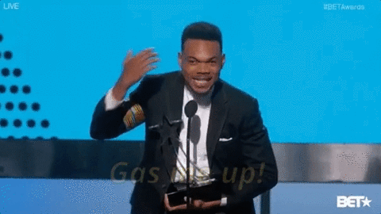
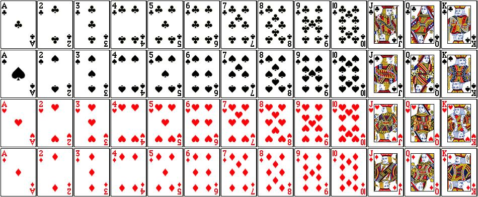
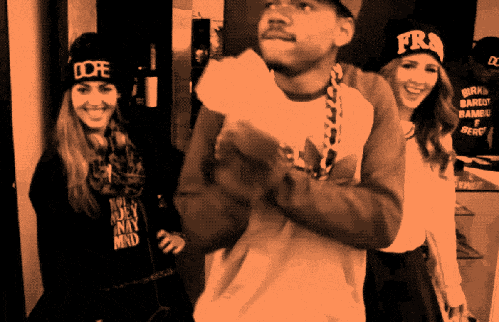
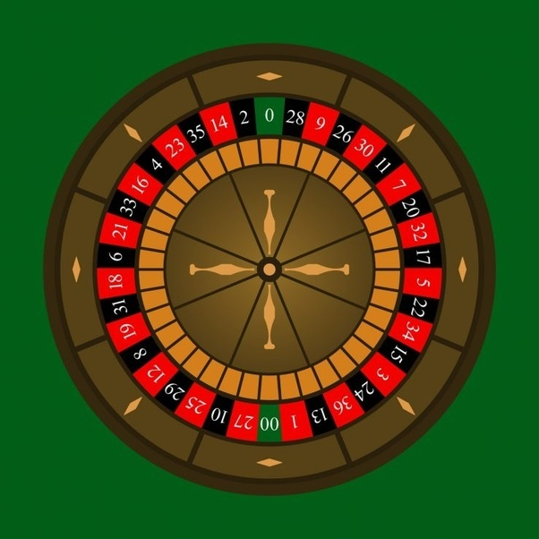

# (PART) Probability and Surveys {-}

```{r 20-setup, echo = FALSE}
knitr::opts_chunk$set(fig.align = "center", comment = '', warning = FALSE, message = FALSE, fig.height = 7, fig.width = 12, cache = TRUE)
library(ggplot2)
```

# Probability And Chance

In the last few chapters, we've been talking about how to make predictions using features in data, such as predicting weight from height, GPA from hours studied, or how many pairs of shoes you own based on how big your foot is. Now, let's change what we're predicting. Rather than predicting what a particular value is going to be, let's talk about chance.

```{r 20-chance-gif, echo = FALSE}
knitr::include_graphics('img/20-chance-what-up.gif')
```

No, not *that* Chance... We meant chance as in <span class = 'vocab'>probability</span>, or how likely we are to observe a particular number in our data. But maybe Chance the Rapper can still help us out. Whaddaya say, Chance?

```{r 20-chance-gas-me-up, echo = FALSE}

```

## Probability

We'll define probability according to this definition:

$$\text{Probability} = \frac{\text{Outcomes we want to happen}}{\text{All possible outcomes that could happen}}$$

One of the easiest probability scenarios to think about is a rolling a die. Let's pretend we're playing a game against each other with a fair, six-sided die. If we roll an odd number, we win the game. If we roll an even number, Chance wins the game. What's the probability, or what's the chance, that Chance wins the game?

Start by listing out all of the possible outcomes of our roll: 1, 2, 3, 4, 5, or a 6. Of those possible outcomes, if the die comes up a 2, a 4, or a 6, Chance wins. So that gives 3 outcomes out of 6 total outcomes. We write this as $P(\text{You win}) = \frac{3}{6} = \frac{1}{2}$. Simple stuff.

```{r 20-chance-simple, echo = FALSE}
knitr::include_graphics('img/20-chance-clapping.gif')
```

Let's move on to something a little more challenging: casino games. We'll start with a standard deck of 52 playing cards. For the unfamiliar, a deck of cards has 4 different suits, or pictures, and each suit is made up of 13 unique cards. They look like this:

```{r 20-cards, echo = FALSE}

```

We'll represent them in the following table to make them easier to visualize.

```{r 20-card-table, echo = FALSE}
card_vals = c('A', 2:10, 'J', 'Q', 'K')

cards = data.frame(
  Clubs = card_vals,
  Spades = card_vals,
  Hearts = card_vals,
  Diamonds = card_vals
)

knitr::kable(cards, format = 'html', align = 'c') %>% kableExtra::column_spec(1:4, bold = TRUE) %>% kableExtra::column_spec(3:4, color = '#ff0000')
```

Awesome, now let's start having some fun with them. We'll start with a simple example. Let's pretend that we want to know the probability of drawing randomly from our deck of cards and getting a card that's 9 or higher (we'll say the ace is the lowest card). No problem, we just count up how many cards are a 9 or higher.

```{r 20-9-or-higher, echo = FALSE}
knitr::kable(cards, format = 'html', align = 'c') %>% kableExtra::column_spec(1:4, bold = TRUE) %>% kableExtra::column_spec(3:4, color = '#ff0000') %>% kableExtra::row_spec(9:13, background = '#ffcb05')
```

If you count up how many numbers we highlighted, you'll see that there's 20 possible cards that are 9 or higher. This means that the probability of getting a card of 9 or higher is $P(\text{9 or higher}) = \frac{20}{52}$. So far, so good.

## Replacement

So far, we've only played our game or repeated our experiment one time and found the probability. But what about if we want to get the probability of a series of <span class = 'vocab'>events</span>, or repetitions? No problem! We'll cover that in just a minute, but before we do we need to talk about <span class = 'vocab'>replacement</span>. What we mean by replacement is what we do after each time we play the game. Do we put the card back in the deck? Is it possible to get the exact same outcome? If yes, we're doing our experiment *with* replacement. Otherwise, we say that we're doing it *without* replacement. When we do something with replacement, the total number of possible outcomes doesn't change. When we do the same thing without replacement, the number of possible outcomes decreases by one (since we made one of those outcomes happen).

## The Multiplication Rule

Now that we understand some basics about probability, we can start to talk about probability over multiple , or repetitions of our experiment/plays of our game. The idea here is that we need things to happen together, like drawing twice from our deck and getting a King and then getting a Queen. To do this, we find the probability of each and use the <span class = 'vocab'>multiplication rule</span>, where we multiply the probability of each event together. The key word that should trigger us to use it is ***and***.

If we wanted to play our die game twice and know what the chance is we win each time. Because of the multiplcation rule, this is easy!

$$P(\text{Win first time AND win second time}) = P(\text{Win first time}) \cdot P(\text{Win second time}) = \frac{1}{2} \cdot \frac{1}{2} = \frac{1}{4}$$

Notice that the game is played with replacement, since we can't get rid of a number on a die after it turns up on a roll.

If instead we wanted to draw two cards from a deck with replacement and get the probability we get a number bigger than 9 on our first draw and a Spade on our second draw, we could calculate it as follows:

$$P(\text{Bigger than 9 AND Spade}) = P(\text{Bigger than 9}) \cdot P(\text{Spade}) = \frac{20}{52} \cdot \frac{13}{52}$$

## The Addition Rule

The other rule to remember is the <span class = 'vocab'>addition rule</span>, which we use when we want the probability of event A ***OR*** event B, ***but not both***. We define the addition rule as

$$P(\text{Event A OR Event B}) = P(\text{Event A}) + P(\text{Event B}) - P(\text{Event A AND Event B})$$

That last term may seem confusing, but it should make sense with an example. Let's say we want the probability we draw one card out of our deck, and we want it to either be a King or a Spade.

Here's all of the cards that meet the criteria:

```{r 20-King-or-Spade, echo = FALSE}
knitr::kable(cards, format = 'html', align = 'c') %>% kableExtra::column_spec(1:4, bold = TRUE) %>% kableExtra::column_spec(3:4, color = '#ff0000') %>% kableExtra::row_spec(13, background = '#ffcb05') %>% kableExtra::column_spec(2, background = '#ffcb05')
```

We can see that there's 16 unique cards that are highlighted: 3 unique Kings, 12 unique Spades, and 1 King of Spades. This means that the probability of getting a King or a Spade is $\frac{16}{52}$. 

But let's see the addition rule in action! First, we know that the probability of a King is given by $P(\text{King}) = \frac{4}{52}$, and the probability of a spade is $P(\text{Spade}) = \frac{13}{52}$. Lastly, we know that there's one card that's both a King and a Spade: the King of Spades, which we can draw with probability $P(\text{King AND Spade}) = \frac{1}{52}$. All together, we have:

$$P(\text{King OR Spade}) = P(\text{King}) + P(\text{Spade}) - P(\text{King AND Spade}) = \frac{4}{52} + \frac{13}{52} - \frac{1}{52} = \frac{16}{52}$$

```{r 20-chance-money, echo = FALSE}

```

## All and None

One point we haven't explicitly made yet about probability is that the total probability, or the probability of events we want to have happen plus the probability of all the other possible events, needs to add up to 1, or 100%. This usually doesn't matter, but it's a really important fact that we'll take advantage of when we want to calculate the probability that *at least one* event is what we want, or the probability that *not all* events are what we want. The rules are as follows:

$$P(\text{All}) + P(\text{Not all}) = 1$$

$$P(\text{None}) + P(\text{At least one}) = 1$$

It's easier to find the probability that all events or no events meet our criteria than it is to calculate the probability that not all or at least one does. As an example, if we roll a die three times we can easily calculate the probability that all three rolls are a 2, since there's only one scenario in which all three rolls are a 2. If we wanted to calculate the probability that *not* all three rolls are 2s, we'd have to find the probability that 0 rolls, 1 roll, or 2 rolls were a 2 and combine them.

## Box Models

Another way (and a better way in terms of `R`) to conceptulaize probability is in the form of a <span class = 'vocab'>box model</span>. What's a box model, you ask? It's a way to represent *one* play of a game, or trial of an experiment, or roll of a die as if we were randomly picking a number written on a ticket out of a hat. Let's switch to roulette. Roulette is played by spinning a wheel with 38 spaces, dropping a ball into the wheel, and finding out where the ball lands. There are 18 red spaces, 18 black spaces, and 2 green spaces.

```{r 20-roulette, echo = FALSE, fig.height = 7, fig.width = 12}

```

What's the chance of the roulette ball landing on a red space? Let's use a box model to represent a single play of the game. There's 18 ways for the ball to land on a red space, and there's 20 ways for it to land on a black or green space. The box model looks like this.

<a name = 'roulette-box'></a>

```{r 20-box-model, echo = FALSE}
ggplot() + 
  theme_bw() + 
  theme(
    panel.background = element_blank(),
    panel.border = element_blank(),
    panel.grid.major = element_blank(),
    panel.grid.minor = element_blank(),
    axis.title = element_blank(),
    axis.text = element_blank(),
    axis.ticks = element_blank()
  ) +
  geom_rect(aes(xmin = 0, xmax = 20, ymin = 0, ymax = 20), col = '#000000', fill = '#ffffff') + 
  geom_rect(aes(xmin = 2, xmax = 8, ymin = 2, ymax = 15), col = '#000000', fill = '#ffffff') +
  geom_rect(aes(xmin = 12, xmax = 18, ymin = 2, ymax = 15), col = '#000000', fill = '#ffffff') +
  geom_segment(aes(x = 2, xend = 8, y = 17, yend = 17), col = '#000000') +
  geom_segment(aes(x = 12, xend = 18, y = 17, yend = 17), col = '#000000') +
  annotate('text', label = '18', x = 5, y = 18.2, size = 13) +
  annotate('text', label = '20', x = 15, y = 18.2, size = 13) + 
  annotate('text', label = 'Win', x = 5, y = 8.5, size = 13) + 
  annotate('text', label = 'Lose', x = 15, y = 8.5, size = 13)

```

Now it's easy to find the probability of the ball landing on a red space! There's 18 tickets that are red, and there's 38 tickets overall. Any time we play the game, we'd have to *replace* the ticket in the box (see why it's called "with/without replacement" now?), and it's easy to conceptualize the scenario graphically. $P(\text{Red}) = \frac{18}{38}$.

Want the probability of landing on red twice in a row? Easy! Pick a red on your first draw, replace the ticket, and then pick a red on your next draw. Use the multiplication rule to combine them together. $P(\text{Red AND Red}) = \frac{18}{38} \cdot \frac{18}{38}$. Your thoughts, Chance the Rapper?

```{r 20-thats-whats-up, echo = FALSE}

```

## `sample()`

Now, why is this a better way to think about probability for `R`? It's because of the way that `R` can randomly sample things for you. To do this, you want to use the `sample()` function. The first argument you should pass to it (it's called `x` in the help file) should be the vector of things you'd like to sample, whether that's numbers, colors, `TRUE/FALSE` values, or whatever else it may be. The second argument, `n`, is the number of items to pull out, or the number of times to draw out of the box. `replace` is the third argument, which can be either `TRUE` or `FALSE`, indicating whether or not to do the draws with replacement. Lastly, you can change how likely each item you passed to `x` is via the `prob` argument, but usually you'll want to leave this argument alone. It defaults to have each item be equally likely.

A few examples before we move on to sampling.

```{r 20-sample-examples}
set.seed(42) # Set seed for reproducibility

# Rolling a die 3 times
sample(1:6, 3, replace = TRUE)

# Draw 5 cards without replacement
# 1-13 is A-K of Clubs
# 14-26 is A-K of Spades
# 27-39 is A-K of Hearts
# 40-52 is A-K of Diamonds
sample(1:52, 5, replace = FALSE)

# Help me decide what to eat for dinner
sample(c('Hot Dog', 'Hamburger', 'Quesadilla', 'Ribs', 'Soup'), 1)
```
