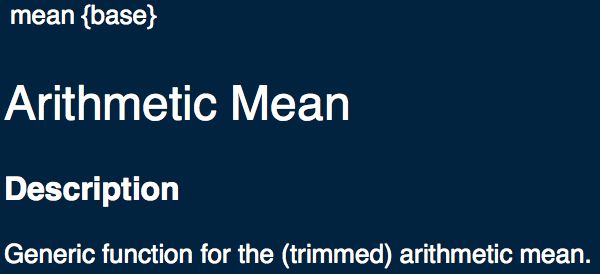
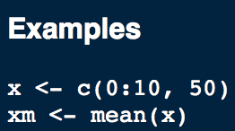
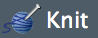

# Intro {-}

```{r index-setup, echo = FALSE}
knitr::opts_chunk$set(fig.align = "center", warning = FALSE, message = FALSE, fig.height = 7, fig.width = 12, cache = TRUE)
library(magrittr)
```


**The who**: This project is available to James Scholars interested in learning the statistical computing language `R`. Please sign up ASAP because this is a pilot project and enrollment is limited to 50 students.

**The what**: Our James Scholar Honors Project teaches you to use the statistical software, `R`. Be prepared to spend approximately 2 hours per week on this project.

**The when**: Sign up ASAP by getting a HCLA form from your dean/advisor. As soon as the paperwork goes through, you're ready to go! The deadline to sign up is **Monday, January 29^th^ at 11:59pm**.

**The how**: The project consists of weekly notes to read ($\approx$ 1 hour) and weekly assignments to do on Lon-Capa ($\approx$ 1 hour). You need to complete all the assignments and turn them in before the due date each week. Late assignments will not be accepted on Lon-Capa, so make sure to keep a close eye on the calendar. All assignments are due on Sundays at 11:59pm. The first one is due **Sunday February 4^th^, 2018**. It will be posted on Friday January 19th.

**The where**: No need to leave home and get out of your PJs for this one. All notes and assignments can be found online!

**The why**: Why not!? It's a great way to get your James Scholar credit, as well as to learn a useful program in the process. Knowledge of `R` is a very marketable skill. Also, the project is in sync with class. You'll be able to see how what you learn in class can be done in `R`. This will help reinforce the concepts that you need to know to succeed in Stat 100 and give you an introduction to programming

## About This Book {-}

This book is meant to run parallel to the [STAT 100](http://courses.las.illinois.edu/stat/stat100/) course notes. The hope is that STAT 100 students learn how the concepts they learned are put to use in modern statistical settings. Throughout, students will not only gain familiarity with the concepts in the notebook, but will also gain an understanding on how to use the `R` programming language to solve every-day problems in the real world.

## Conventions For This Book {-}

A few things to note throughout this book:

- Code that is written in `monospace` font refers to either RStudio keyboard shortcuts or R code, and it will be syntax-highlighted when appropriate

```{r index-test, eval = FALSE}
1 + 1
a = 1
b = 2
a + b
sqrt(4)
```

- Output will begin with `##` on the side

- Vocab words will appear like <span class = 'vocab'>this</span> throughout the text

- <span class = 'tip'>Helpful hints ("Pro tips") will appear in this color and be in italics. They are usually shortcuts to use in</span> <span style = 'color: #00ce45'>`R`</span> <span class = 'tip'>to help make code writing and editing easier to do</span>

- <span class = 'note'>Things to keep in mind or pay attention to will look like this. They'll usually begin "Note:"</span>

<!--chapter:end:index.Rmd-->

# Syllabus {-}

**Coordinator**: Ross Drucker

**Email**: ross.a.drucker@gmail.com

**Email Policy**: Start your subject with [STAT 100 Honors Project]. Also provide a quick synopsis of what you're emailing about. For example, a few subject lines could look like:

- [STAT 100 Honors Project] Homework 1 Problem 2

- [STAT 100 Honors Project] Question about histograms

Bad subject lines can look like this:

- HELP ME PLZ

- idk wut i'm doing 4 hw1

In your email, please include a description of the problem you're having and any relevant code and/or error messages in the form of scripts or screenshots. Failure to do so may result in longer response times and/or no response altogether. You can send emails from any email address you have. Allow up to 24 hours for a response if you send an email Monday through Thursday. Over the weekend, response times may be longer. Please be patient. 

**Office Hours**: MWF from 2:00pm-5:00pm, TR from 3:30pm-5:00pm in 23 Illini Hall (CITES Computer Lab), or by appointment

**Website(s)**: General information about the project will be posted on [Compass2g](https://compass2g.illinois.edu/webapps/login/). Assignments will be posted on [Lon-Capa](lon-capa.illinois.edu) under the James Scholar folder. The textbook can be found at https://rossdrucker.github.io/STAT-100-Honors-Project/

**Project Objective**: The goal of this project is to make students comfortable using the R programming language for a variety of uses. By the end, students should be able to perform basic calculations in R for both STAT 100 concepts and personal use.

**HCLA**: In order to receive credit for this project, you must get an HCLA (either paper form or electronic) signed no later than **Monday, January 29th at 11:59pm**. Since the project is meant to run alongside class material, signups after this date will not be accepted.

**Topics** (not in order; these may be updated throughout the semester):

1)	R's interface and using R as a calculator

2)	Data types

3)	Descriptive statistics

4)	Regression and model creation

5)	Plotting, histograms, and visualization

6)	Functions and control structures

7)	Document rendering and scripting

8)	Coding Style

9)	Hypothesis testing

10)	Probability

**Grading Policy**: 
-	Since this is the first semester for this version of the honors project, there's not a set number of assignments. There will most likely be around 8-12 assignments (due every 1 to 1.5 weeks)

-	Each week, students should expect to spend 2-3 hours on readings and assignments

-	All assignments will be posted on (and therefore submitted to) Lon-Capa. 

-	Point values will vary by assignment

-	In order to receive credit for the project, you must complete all assignments with an (combined) average of 80% or higher

-	Assignments will be available for one week after posting. No late assignments will be accepted

**Academic Integrity**: All students are expected to abide by the campus regulations on academic integrity, which can be found [here](http://studentcode.illinois.edu/article1_part4_1-401.html). These standards will be enforced and infractions of these rules will not be tolerated in this course. Such behavior includes sharing or copying any part of another student's assignment or allowing another student to copy any part of your assignment.

**Changes**: The coordinator reserves the right to change any of the information in this syllabus. It is the student's responsibility to refer back to the syllabus to see pending changes.

<!--chapter:end:00-syllabus.Rmd-->

# (PART) The Basics {-}

```{r 01-setup, echo = FALSE}
knitr::opts_chunk$set(warning = FALSE, message = FALSE, fig.height = 7, fig.width = 12, cache = TRUE)
```

# Downloading `R` and RStudio

The first thing you'll need to do in order to begin using `R` is to actually download `R` itself. You can do this [from this link](https://cran.r-project.org/). It's <span class = 'vocab'>open-source</span>, which means anyone can access and use it for free!

```{r 01-free-gif, echo = FALSE}
knitr::include_graphics('img/01-free-dance.gif')
```

Make sure that you install it for the type of operating system you have. That is, if you have a Windows computer, don't download the Mac or Linux versions. This downloads what's called a <span class = 'vocab'>terminal</span>, or the bare minimum interface that you need to write and run code in R. You're not encouraged to use this terminal when writing code.

> "Wait, I thought you just said that this is how to write and run my code, and that's what this project is."
>
> <div style = "text-align: right"> --- You (probably) </div>

This is because you should use RStudio to write, edit, and run your code. RStudio is what's called an <span class = 'vocab'>IDE</span> (Integrated Development Environment), and it relies on what you just downloaded to run in the background to run properly. You can download RStudio [here](https://www.rstudio.com/products/RStudio/). It makes *everything* in `R` --  from importing, manipulating, vizualizing, and analyzing data, to writing and debugging code, to creating documents (like this book!) -- significantly easier to do.

## Getting Familiar with RStudio

Once you've got `R` and RStudio downloaded, open RStudio up and click `RStudio` in the menu across the top. Click `Preferences` and then click `Pane layout` so you can see what each pane in RStudio is. On my computer, I've got `Source` on the top left, `Console` on the top right, `Environment, History, Build, VCS, Presentation` on the bottom left, and `Files, Plots, Packages, Help, Viewer` on the bottom right. To me, this layout is easy to follow and understand, but you can set yours up however you want and can always change it around. Here's what each of these panels actually does for you:

## `Console`

Remember that terminal you downloaded before downloading RStudio? This is what that looks like. Any time you see a `>` symbol, you can enter commands. `R` will then run the command, and if output is produced, it will be displayed here. Do a few simple math problems here to see an example:

```{r 01-console-examples, eval = FALSE}
1 + 1
2 * 9
sqrt(4)
```

While this may seem like a good place to write your code, it's a better practice to do it in the `Source` pane in a script (more on that in approximately 2 sentences). Doing quick computations or installing and loading packages in your console is totally fine, but the more code you run, the harder it will be to find earlier lines of code (and more importantly, the harder it will be to edit should you make a mistake). At the end of the day, all of the code you write, whether it be in the `Source` pane or the `Console` pane will run in the `Console`, but for the purposes of legibility and editing you should do everything in your `Source` pane.

## `Source` {#src}

This pane is where you will do a majority of your work in what's called a <span class = 'vocab'>script</span>. Think of a script like a Microsoft Word document, but instead of writing essays, you're writing code. To open a new script, go to `File`, then select `New File`, then `New R Script`. On a Mac, you can press `Cmd + Shift + N`, or on a Windows/Linux computer, you can press `Ctrl + Shift + N`. The beauty of using a script is that you can save what you do and easily edit it later, whereas writing directly into the console will be much more difficult to save, edit, or view later. To run code that you write in a script, highlight the line(s) that you'd like to run and click `Run` at the top of the script. You can also hold `Cmd + Enter` (Mac) or `Ctrl + Enter` (PC).

In addition to a script, you can also create a <span class = 'vocab'>markdown document</span>. Markdown documents allow you to combine plain text, code, and equations. We'll cover this in more detail later, but these allow you to explain your analysis as you do it. Just to give you an idea of how powerful markdown documents are, this entire book was made using markdown documents.

Lastly, this pane will be where the results from the `View()` command will display, and where you can view the actual contents of the datasets you're working with. Again, more on this in a little bit.

<a name = 'env'></a>

## `Environment, History, Build, VCS, Presentation`

This pane is where you'll be able to see all of the datasets that you've imported, variables that you've created, and functions that you've written. They are stored in something called your <span class = 'vocab'>global environment</span>, or environment for short. Think of your environment as a folder on your computer that keeps track of all of the files you've created.

While none of that will probably mean much to you at the moment, they will in the span of a few chapters. The more code you write and the more variables you create, the harder it will be to remember all of these components. This pane keeps track of them, as well as basic information that you may find useful later.

## `Files, Plots, Packages, Help, Viewer`

Lastly, the `Files, Plots, Packages, Help, Viewer` pane will display any plots, graphs, or other images you create in R. Plots will display in this pane under the `Plots` tab. If they don't pop up right away, try to increase the size of the pane by dragging the boundaries (like you'd resize your web browser). Markdown documents will be available in the `Viewer` tab, and help files will be in the `Help` tab. The `Files` tab shows the files in the <span class = 'vocab'>directory</span> (folder on your computer) that you're working in. We'll cover these in more detail later, but it's good to become familiar with this pane as well.

<!--chapter:end:01-setup.Rmd-->

# Functions and Data Types

```{r 02-setup, echo = FALSE}
knitr::opts_chunk$set(fig.align = "center", warning = FALSE, message = FALSE, fig.height = 7, fig.width = 12, cache = TRUE)
```

<a name = 'functions'></a>

## Functions

A <span class = 'vocab'>function</span> in `R` is a set of steps, operations, and procedures that are done to data in a specific order. `R` has some functions that are built into the language (many of which we'll go through in this book), but you are also able to write your own functions as well.

Functions take <span class = 'vocab'>arguments</span>, which are data points and other items that the function needs to do its job. Think of them like a variable, where you can change the value that they take each time you need to run the function. These can be anything from data points themselves, to colors and sizes for plots, to even other functions if necessary. After performing the steps and calculations that they're supposed to do, they <span class = 'vocab'>return</span>, or give out, the information.

<a name = 'default-argument-note'></a>

<span class = 'note'>Note: in </span><span style = 'color: #a21bd7'>`R`</span><span class = 'note'>, arguments of functions may have pre-defined values. In this case, unless you specify differently when you</span> <span class = 'vocab'>call</span> <span class = 'note'>(use) the function, this pre-defined, or </span><span class = 'vocab'>default</span><span class = 'note'>, value will be used instead.

To write your own functions, you need to make use of the `function()` function. You give your function a name, then specify its arguments as the arguments in `function()`, and include your steps inside of a set of curly braces (`{}`). To tell `R` what to return as the output of your new function, you have two options: you can either just leave it as the last line inside of the curly braces, or you can explicitly state it inside the parenthesis of `return()`.

We'll put a simple example of a <span class = 'vocab'>user-defined function</span> here to illustrate how simple and useful writing a function can be, although you may not completely understand what's going on right now. And **that's okay, and honestly that's *expected* at this point.** We haven't covered what's going on here (it's only Chapter 2!), but if we don't introduce functions conceptually, we can't refer to and/or write and teach them them as we go through the book. They're helpful tools that can save you a *ton* of time as you get better in `R`.

The function we're going to build is called `doubler`. It will take one argument, `x`, and return whatever the double of `x` is. See if you can match the parts in this function to the process we just outlined and with the information about `doubler()` that we just gave you!

```{r 02-doubler-function}
doubler = function(x){
  2 * x
}
```

Then, to call the function, you simply put the name of the function, then without a space, put a set of parenthesis. Inside of these parenthesis, specify the arguments required to make the function run properly. Here's an example of how to call the `doubler()` function we just wrote:

```{r 02-doubler-examples}
doubler(x = 2)
doubler(4)
doubler(100)
```

As you can see, `x` can be any number, and `doubler()` just takes the number (`x`) and doubles it.

<span class = 'tip'>*Pro tip: you don't always need to specify the name of an argument. In the second example of using*</span> <span style = 'color: #00ce45'>`doubler()`</span><span class = 'tip'>,</span> <span style = 'color: #00ce45'>`R`</span> <span class = 'tip'>*interprets*</span> <span style = 'color: #00ce45'>`4`</span> <span class = 'tip'>*to be what*</span> <span style = 'color: #00ce45'>`x`</span> <span class = 'tip'>*is supposed to be. When there's more than one argument needed for a function, you can either give them in the same order the function looks for them (which you'll learn about [here](#helpfiles)), or you can specify them by name.*</span>

## The Types {#types}

Not all data is of the same <span class = 'vocab'>type</span>, or usage format. What this means is that different kinds of information from a dataset get evaluated differently in `R`. To check what type a piece of data is, you can use the `class()` function. Let's go through a few of the most common types of data:

- `numeric`: Numeric data is data that is *only* numbers. These can be positive, negative, 0, decimals, or even infinity ($\infty$)

<a name = '02-character'></a>

- `character`: Character data is anything that involves a letter or special character. These will be denoted by `''` (single quotation marks) or `""` (double quotation marks). Characters are also called <span class = 'vocab'>strings</span>. It's important to note that `2` is of type `numeric`, while `'2'` is of type `character`. A quick check using the `class()` function:

```{r 02-type-check}
class(2)
class('2')
```

<a name = 'logical'></a>

- `logical`: Logical data, also known as <span class = 'vocab'>boolean data</span>, is just a series of `TRUE` or `FALSE` values. While this may not necessarily seem like the most useful form of data right now, it's important to know that this type of data exists. `R` evaluates `T` to be `TRUE` and `F` to be `FALSE`, so it's equally valid to use `T` and `F` in place of `TRUE` and `FALSE`, but it's better practice to use `TRUE` and `FALSE` since we may want to use `T` and `F` as variables. More on this in a little

- `factor`: Factor data is simply categories. This type of data is really useful for later when we want to split the information on variables such as gender, location, or a variety of other categorical features in the data

<a name = 'na'></a>

- `NA`: This isn't actually its own type of data, but it represents a missing value. These can become pesky, but there are ways to work around them. We can choose to replace them with `0` or any other value we want, we can ignore them in our computations, or we can do something completely different with them altogether. The important thing to remember about `NA` values is that they exist and should be acknowledged.

## Vectors, Lists, and Data Frames

Each of the data types listed [above](#types) describes a single point of data, called a <span class = 'vocab'>scalar</span>. However, we usually we don't have data given to us as one-by-one pieces of information. We're normally given whole datasets at a time, or at least groups of related data, and they're much easier to work with.

### Vectors {-}

<a name = 'vectors'></a>

A <span class = 'vocab'>vector</span> is a grouped set of data. Think about it as if it were the answer to a *single* question from a survey from all students in the class, or the heights of all basketball players in the NBA. We've actually been working with vectors all along! We'll discuss it more in [chapter 4](#Vectorization).

`R` actually treats every value as a vector. That's why, as you may have noticed, lines of output begin with `[1]`. This indicates the <span class = 'vocab'>index</span> (position) in the vector that is at the start of the line. Any time we've had any type of data, `R` has just treated it as a vector of length 1.

One important thing to note about vectors is that all members of the vector must be of the same type. If they aren't, they will be <span class = 'vocab'>coerced</span> (changed) to be of the same type. To create a vector, we can use the `c()` function. This function combines the <span class = 'vocab'>elements</span> (individual data points) and turns them into a vector. Separate the parts with a comma (`,`). Here's a few examples:

```{r 02-vector-examples}
c(1, 2, 3, 4, 5, 6, 7, 8, 9, 10)

c(TRUE, FALSE, T, F, T, FALSE)

c('R', 'is', 'fun')

c(1, 'apple', 2, 'banana')
```

Note how in the last example, everything appears inside of double quotation marks. This is an example of coersion in action. `1` and `2` are recognized as type `integer`, and `'apple'` and `'banana'` are recognized as type `character`. Since it's easier to change a number to a character than it is to go the other way, `1` and `2` become characters.

It may seem cumbersome, time-consuming, and tedious to type out numbers in order as we did in the first vector. `:` to the rescue! Another way that we can create that vector is by putting the first number we'd like in our vector on the left side of the `:`, and the last number on the right.

```{r 02-colon}
c(1, 2, 3, 4, 5, 6, 7, 8, 9, 10)

1:10
```

As you can see, they both produce the same output. Let's say we wanted to only include even numbers. Luckily, there's a function that allows us to do that as well, and that's the `seq()` function. To use it, we start by putting the first number in our vector, then the last number we want in the vector, and finally the amount we want to increment by in each place. To get the even numbers between 1 and 10, we want the following sequence:

```{r 02-seq}
seq(2, 10, 2)
```

Now, let's say that we want to actually get at the contents of a part of a vector. We can accesss it by using its index. Unlike some other languages (Python, for example), `R` starts its indexing at 1, not 0. If we want to access the 3$^{\text{rd}}$ element of the vector we just created, use the index of the part we're interested in (3) and put it inside of a single set of square brackets (`[]`) next to the vector. This will return the element in that location.

```{r 02-index}
seq(2, 10, 2)[3]
```

To figure out how many elements are contained in a vector, we can use the `length()` function. This information is also displayed in the `Environment` tab we configured in [chapter 1](#env), assuming that the vector is stored as something in the global environment.

The last function we should mention here is the `rep()` function. Similar to `seq()`, this function allows you to create a vector of the same number, repeated any number of times. Want the number 10 to be repeated 30 times? `rep()` makes this easy, as you can write `rep(10, 30)`. The first argument is the number or vector you'd like to repeat, and the second is the number of times you'd like to repeat it. If the first argument is a vector, and you'd like to repeat each element a certain number of times, include the `each = ` argument, with the number of times that you'd like each element to repeat. Let's see `rep()` in action:

```{r 02-rep-examples}
rep(2, 10)
rep(c(1, 2, 3), 3)
rep(c(1, 2, 3), 3, each = 2)
```

### Lists {-}

<a name = 'lists'></a>

On the surface, there's not much difference between a list and a vector. The biggest difference is that a list can contain different types of data, whereas a vector cannot. To create a list, we can simply use the `list()` function, again putting all the different parts we want included inside the parenthesis, separated by a comma.

```{r 02-list-ex}
list(1:10)

list(1, 'apple', 2, 'banana')
```

Lists can be made up of vectors as well. That is, each element of a list is able to be a vector, since a list doesn't care what type of data each of its elements is. To access a list's elements, we want to use a double set of square brackets (`[[]]`) with the index we'd like to access.

```{r 02-list-ex-2}
list(c('apple', 'banana'), c(1.25, 2.50), 3)[[2]]
```

The above example also illustrates that lists don't need all list elements to be of the same length. Note that the third element of the list is only of length 1 (it's just the number 3), but the other two elements are of length 2.

Lastly, lists are able to have named elements. To name an element, all you have to do is type `NAME OF ELEMENT = ` before each element, where `NAME OF ELEMENT` is whatever name you'd like to assign it. In the above example, let's say we wanted to call the first element `fruits`, the second element `prices`, and the third element `aisle`. Then, our list would look like this:

```{r 02-list-named}
list(fruits = c('apple', 'banana'), prices = c(1.25, 2.50), aisle = 3)
```

We can then use a `$` to go into the list and "pull out" that element (the vector with the corresponding name). We can then use vector indexing rules to get a particular element from the vector. If we wanted to get `'banana'` from our list above, we have two options.

```{r 02-get-banana}
list(fruits = c('apple', 'banana'), prices = c(1.25, 2.50), aisle = 3)$fruits[2]
list(fruits = c('apple', 'banana'), prices = c(1.25, 2.50), aisle = 3)[[1]][2]
```

As you can see, both options return `'banana'`, so these options are equivalent.

### Data Frames {-}

The last major type of combined data storing we need to talk about is a <span class = 'vocab'>data frame</span>. You can think of a data frame as a big table with the data you'd like. Each row of data is called an <span class = 'vocab'>observation</span>, and each column represents a <span class = 'vocab'>feature</span> or a variable. We'll use a few of our own data frames throughout the semester, but it's good to know that `R` comes with some of its own data frames already. This data comes from the `crabs` data frame in the `MASS` package (see <a href = 'packages-and-getting-help.html#Packages'>chapter 3</a> for more information on packages). The first 6 rows are shown below.

```{r 02-data-frame-example, echo = FALSE}
library(MASS)
knitr::kable(head(crabs), format = 'html', align = 'c')
```

To see a data frame, you'll want to use the `View()` command. This will open the data frame in the [`Source`](#src) pane.

A few things about data frames:

- They're really just an easy-to-see list. You can access any column (feature) by using the `$` operator. The <span class = 'vocab'>syntax</span> (way to write the code) is: `df_name$column_name`, where `df_name` and `column_name` are the data frame name and column name respectively

- All columns (or list elements) must be of the same length. They may contain `NA` values, but their lengths *must* be the same

- To get the number of rows of a data frame, use the `nrow()` function. To get the number of columns, you can either use `length()` (since, as stated before, it's just a list of vectors), or `ncol()`. This information is also in the `Environment` tab.

- You can make your own with the `data.frame()` function. Just put the vectors you'd like to include, separated by commas, inside of the parenthesis. Just like with lists, you can name the columns of a data frame as you create it. As long as the vectors are of the same length, you'll be making data frames in no time!

<a name = 'coercion'></a>

## Coercing To Other Types

The last point we'll make about different kinds of data is that you can coerce it yourself to be of another type. There are a lot of functions, the `as._()` functions, that are helpful here. Have a character string that's just a number? No problem! we saw before that `class('2')` was of type `character`. What about if we wanted it to be of type `numeric`?

```{r 02-coersion-ex}
class(as.numeric('2'))
```

Awesome.

## `identical()`

This is as good a time as any to introduce the `identical()` function. What this does is checks if the things supplied to it are the identical. It returns `TRUE` if the arguments are identical, and `FALSE` if they're different. Examples, with some of the syntax described above, are as follows:

```{r 02-identical-examples}
identical(1, 1)
x = 1:10 # This has length 10
y = 2:10 # This has length 9
identical(x, y)
identical(x[10], y[9])
```

This function is very helpful when you want to check if two vectors or lists have the same information. It's also particularly useful when you want to check if the outputs or results of different functions are the same if you're reorganizing/rewriting code.

<!--chapter:end:02-data-types.Rmd-->

# Variables

```{r 03-setup, echo = FALSE}
knitr::opts_chunk$set(fig.align = "center", warning = FALSE, message = FALSE, fig.height = 7, fig.width = 12, cache = TRUE)
```

Pretend that you have a number that you don't want to keep typing over and over and want `R` to remember what it means. You can store that value as a <span class = 'vocab'>variable</span> in `R` by declaring it (giving it a name) and assigning it a value. To make the assignment, you can use either `=` or `<-`. It's really personal preference as to which one you'd like to use, but for the duration of the book we'll use `=` (mostly out of habit). To assign a variable a value, we put the variable name on the left side of the assignment operator, and we put the value on the right side. As an example, if we want `R` to remember that some variable that we'll call $x$ should have the value 5, you can do it like this:

```{r 03-variable-ex1}
x = 5
```

To see what a variable contains, simply type the name of the variable.

```{r 03-variable-print1}
x
```

Variables don't only correspond to numeric data, however. We can have variables store [any valid type of data](#types).

```{r 03-variable-ex2}
numVar1 = 18
numVar1
numVar2 = 3.14
numVar2
stringVar1 = 'This is a string'
stringVar1
stringVar2 = "I'm learning what a string variable is"
stringVar2
boolVar1 = TRUE
boolVar1
boolVar2 = F
boolVar2
boolVar3 = 3 < 5
boolVar3
```

## Naming

You can name any variable you create whatever you'd like, but with this freedom comes great responsibility. Variable names *must* begin with either a letter. Often times, it's much more useful to name a variable what it represents, rather than just calling it `x`. For example, if you're dealing with a data set of attendance at Cubs games and you'd like to specify the attendance on July 12, you can name a variable `attendanceJuly12` and it's totally valid. You don't just have to name your variables as a single letter. That's a relief, because otherwise we'd only have 52 possible names!

> "52 possible names? I thought there's only 26 letters in the alphabet..."
>
> <div style = "text-align: right"> --- You, Again (probably) </div>

We'd have 52 possible names since in `R`, variable names are *case sensitive*. This means that naming one variable `x` and another `X` are interpereted differently. Going back to our example above, we could store `x` as 5 and `X` as 9. This is what it looks like:

```{r 03-case-dec-ex}
x = 5
X = 9
```
```{r 03-case-dec-out}
x
X
```

Typically, variables are named in camel case and begin with a lowercase letter (i.e. `myFirstVariable` as opposed to `myfirstvariable`, although both are totally valid). Get in the habit of naming variables this way. It'll make it much easier to identify what variable you're talking about when you need to access it in your code.

Variables can also be operated on together. If you have a variable `x` and it's equal to 10 and a variable `y` that's equal to 6, and you want to sum them, you can do so like this:

```{r 03-var-addition}
x = 10
y = 6
x + y
```

The last thing to beware of when naming variables is overwriting the name of another variable. If you have a variable that's already been declared, and then you want to declare a new variable, you will want to declare it with a new name. Continuing with our example from above, `x` currently holds value 10. If we now write

```{r 03-var-overwrite}
x = 100
x
```

We can see that `x` now holds the value 100, not 10 anymore. This is why we cautioned you <a href = 'functions-and-data-types.html#logical'>earlier</a> about using `T` and `F` in place of `TRUE` or `FALSE`. If you create a variable named `T`, or even do something like `T = FALSE`, that will be used instead of the shorthand `T` for `TRUE`.

The bottom line of names is this: they're important, useful, and completely up to you. Make the name short, sweet, and to the point: they shouldn't be full sentences, but should be more than a letter. A good rule of thumb is the KISS rule: Keep It Simple, Silly. 

## Vectors, Lists and Data Frame Names

Variables aren't just useful for one data point, but they're useful for vectors, lists, and data frames as well. Just as we just saw, you can assign a name to a vector, a list, or a data frame so that you can call on them later. In fact, it's a *really good idea* to name all of these types of things, as they're frequently how you'll have your data organized anyways. The naming procedures and conventions are exactly the same as described above.

<a name = 'naming-lists-and-data-frames'></a>

### Naming List Elements and Data Frame Columns {-}

As we saw earlier, it's possible to name elements of a list or columns in a data frame as you create it. It's also possible to change the names of already-named parts of these data types by making use of the `names()` function. Put the name of the list/data frame in the parenthesis, and then assign new names by supplying them as a `character` vector like we've done <a href = 'functions-and-data-types.html#lists'>before</a>.

The example we had before was a short list of fruits, prices, and aisles. We'll save it as a list called `groceries`:

```{r 03-renaming-ex1}
groceries = list(c('apple', 'banana'), c(1.25, 2.50), 3)
```

Now, we want to rename the elements as `fruits`, `prices`, and `aisle`. Rather than redeclaring our list, we'll just use the `names()` function:

```{r 03-renaming-ex2}
names(groceries) = c('fruits', 'prices', 'aisle')
```

We can also use the `names()` function to see what the names of the elements are:

```{r 03-check-names}
names(groceries)
```

Lastly, we can change individual names so we don't have to retype/rename every element when we only want to change one. If we wanted to change `prices` to `cost` to save a keystroke each time we type it, we can do this:

```{r 03-renaming-element}
names(groceries)[2] = 'cost'
```

As you can see, we did exactly what we wanted to do. Since data frames are really just lists, the same type of renaming applies.

<span class = 'note'>Note: </span><span style = 'color: #a21bd7'>`R`</span> <span class = 'note'>will treat a single value as a vector, even without using the </span><span style = 'color: #a21bd7'>`c()`</span><span class = 'note'>function. It's <a href = 'functions-and-data-types.html#coercion'>coercion</a> and <a href = 'operators.html#vectorization'>vectorization</a> in action.</span>

<!--chapter:end:03-variables.Rmd-->

# Operators

<a name = 'operators'></a>

```{r 04-setup, echo = FALSE}
knitr::opts_chunk$set(fig.align = "center", warning = FALSE, message = FALSE, fig.height = 7, fig.width = 12, cache = TRUE)
```

```{r 04-operators-gif, echo = FALSE}
knitr::include_graphics('img/04-operators.gif')
```

## Mathematical Operators

One thing that `R` is really good at doing is mathematical computations. Here's a few of the basic math operations that you'll want to get familiar with and be very comfortable comfortable using.

```{r 04-math-ops-tbl, echo = FALSE}
symbs = c('`+`', '`-`', '`*`', '`/`', '`**` or `^`', '`exp()`', '`log()`', '`log10()`', '`pi`', '`sqrt()`', '`abs()`')
meaning = c(
  'addition',
  'subtraction',
  'multiplication',
  'division',
  'exponent',
  '$e$',
  'natural log',
  'log$_{10}$',
  '$\\pi$',
  'square root',
  'absolute value ( $|x|$ )'
)
examples = c(
  '`3 + 3` = $1 + 1$',
  '`10 - 1` = $10 - 1$',
  '`23 * 3` = $23 \\cdot 3$',
  '`276 / 4` = $\\frac{276}{4}$',
  '`2 ** 3` = `2 ^ 3` = $2^3$',
  '`exp(2)` = $\\exp \\left( 2 \\right)$',
  '`log(2.71)` = $\\ln{2.71} = e$',
  '`log10(100)` = $\\log_{10} 100$',
  '`2 * pi` = $2 \\cdot \\pi$',
  '`sqrt(4)` = $\\sqrt{4}$',
  '`abs(-6)` = |-6| = 6'
)

mathsymbs = data.frame(symbs, meaning, examples)
names(mathsymbs) = c('Symbol', 'Meaning', 'Example')

knitr::kable(mathsymbs, align = 'c', format = 'html', booktabs = TRUE)
```

`R` also works in the correct mathematical order of operations: PEMDAS. This stands for

- **P**arentheses/brackets
- **E**xponents
- **M**ultiplication
- **D**ivision
- **A**ddition
- **S**ubtraction

Because of this, using exra parenthesis is ***never*** a bad idea. `R` also automatically closes a set of brackets, parenthesis, or braces (`{}`) when you open them, but if you're debugging and deleting make sure that you delete with caution. `R` will highlight the corresponding parenthesis when you highlight a different one, but these minor details can become major pains. Coder have caution!

<a name = 'boolops'></a>

## Logical (Boolean) Operators

As we talked about before, `R` can evaluate logical statements in addition to performing math operations. Here's how this part works:

```{r 04-bools-tbl, echo = FALSE}
symbs = c('>', '<', '>=', '<=', '==', '!=', '&', '|')
meaning = c(
  'greater than',
  'less than',
  'greater than or equal to ($\\geq$)',
  'less than or equal to ($\\leq$)',
  'is ***exactly equal*** to',
  'is ***not*** equal to ($\\ne$)',
  'logical AND (used in conjunction with one of the above)',
  'logical OR (used in conjunction with one of the above)'
)
examples = c(
  '3 > 4 $\\implies$ `FALSE`',
  '2 < 9 $\\implies$ `TRUE`',
  '13 <= 13 $\\implies$ `TRUE`',
  '14 >= 12 $\\implies$ `FALSE`',
  '60 == 61 $\\implies$ `FALSE`',
  '69 != 818 $\\implies$ `TRUE`',
  'x > 12 & y == `TRUE` $\\implies$ `x` is `TRUE` and `y` is `TRUE` ',
  'x == TRUE | y == `TRUE` $\\implies$ `x` is `TRUE` or `y` is `TRUE`'
)

boolsymbs = data.frame(symbs, meaning, examples)
names(boolsymbs) = c('Symbol', 'Meaning', 'Example')

knitr::kable(boolsymbs, format = 'html', align = 'c', booktabs = TRUE)
```

## Vectorization

<a name = 'vectorization'></a>

Now it's time to talk about one of the most useful features of `R`: the fact that it's a <span class = 'vocab'>vectorized language</span>. This sounds very complex, but what it really means is that you can operate on entire vectors at a time using the operators we just went through. Let's see a few examples using a vector of length 25. We'll create a vector `v1` that has the numbers 1 through 25, and we'll do a few operations on it to really see how powerful vectorized operations are.

```{r 04-vectorization-ex-setup}
v1 = 1:25
```

<a name = '04-vectorization-ex1'></a>

First, let's see what simple addition does to the vector. Pretend we want to add 5 to each element?

```{r 04-vectorization-ex1}
v1 + 5
```

What about doubling each element?

```{r 04-vectorization-ex2}
v1 * 2
```

Cool! But what about that boolean thing we were talking about? Well, let's try an example. What if we want to find where all the values are greater than 12?

```{r 04-vectorization-ex3}
v1 > 12
```

This is the power of vectorization: you can do things to really large amounts of data in a relatively short amount of time. Obviously, the more complex the operation is, the longer it will take, but it still beats the alternative of having to do the manipulations and calculations by hand.

There's one last important point to make about vectorization, and that's what happens when you add vectors of unequal length. We've actually already seen [examples](#04-vectorization-ex1) of this, but we just didn't realize it. What's happening is that `R` is treating the numbers that we've supplied above (5, 2, and 12 respectively) as vectors of length 1, and <span class = 'vocab'>recycling</span> them over and over in its calculations. If instead we had tried to do `v1 + c(5, 10)`, we'd wind up with something different.

```{r 04-recycling-vectors}
v1 + c(5, 10)
```

This is something that we need to be aware of: even though `R` can do a vectorized calculation, we need to make sure that it's performing the calculation we actually want it to do. Again, the `length()` function is your friend here!

<!--chapter:end:04-operators.Rmd-->

# Packages and Getting Help

```{r 05-setup, echo = FALSE}
knitr::opts_chunk$set(fig.align = "center", warning = FALSE, message = FALSE, cache = TRUE)
```

## Packages

A <span class = 'vocab'>package</span> is just a collection of functions, data, and already-written code that is in a well-defined format. We'll introduce a few packages as we go, but a lot of what we'll cover will rely on the `base` package, which is just the functions that `R` already comes with. They're the *base* of most analyses and other operations you'll want to do in R, hence the name of the package. To install a new package, you want to use the `install.packages()` function, with the name of the package quoted and inside of the parenthesis. 

One package that you'll want to install is the `swirl` package, which was developed as a self-guided class to help you learn R. To install this package, copy and paste the following line into your `Console`.

```{r 05-install-swirl, eval = FALSE}
install.packages('swirl')
```

Once the package is installed, you'll want to <span class = 'vocab'>load</span> the package (tell `R` that you'll be using commands, data, and other information from the package). Copy/paste or type the following into your console to do so, and follow the prompts:

```{r 05-load-swirl, eval = FALSE}
library(swirl)
```

## Help Files {#helpfiles}

Another great aspect of `R` is how well-documented the language is. If you don't know how to use a particular function, there are a lot of ways to learn how to use it and see it in action. The help files provide the <span class = 'vocab'>syntax</span> (what order to put things into the function), an explanation of the arguments, as well as information about the <span class = 'vocab'>output</span> (what the function gives back to you), and examples of the function in use.

### An Example {-}

Let's say you wanted to learn more about the `mean()` function. You can type `?mean` into your console, and the help file will pull up in the `Help` tab. From there, you can learn all about the function.

<div style = 'text-align: center'>The header of the `mean()` documentation</div>

```{r 05-help-head, echo = FALSE}

```

As you can see, the top of the help function starts with the name of the function, with the package it comes from in brackets. Then it provides a brief description of what the function does. This one gets the mean (average) of a list of numbers.

<div style = 'text-align: center'>Syntax for `mean()`</div>

```{r 05-help-usage, echo = FALSE}
knitr::include_graphics('img/05-help2.png')
```

This part tells us that all the function looks for is an object `x`, which is just the numbers you'd like to take the average of. Something to note: the `trim` argument has a default value of `0`, and `na.rm` is set to `FALSE`. As you hopefully remember from <a href = 'functions-and-data-types.html#default-argument-note'>chapter 2</a>, these will be the values that the function uses unless you specify differently. Then it explains the arguments it's looking for as it does its job in the **Arguments** section:

<div style = 'text-align: center'>Arguments for `mean()`</div>

```{r 05-help-args, echo = FALSE}
knitr::include_graphics('img/05-help3.png')
```

Next is the **Value** section, which explains what the output of the function actually is.

<div style = 'text-align: center'>Value for `mean()`</div>

```{r 05-help-value, echo = FALSE}
knitr::include_graphics('img/05-help4.png')
```

Lastly, the documentation provides examples of it in use. You'll understand this code by the end of the chapter, but for now trust that it's doing its job appropriately.

<div style = 'text-align: center'>Examples of `mean()`</div>

```{r 05-help-examples, echo = FALSE}

```

## Other Helpful Resources

If the help file isn't much help in solving your problem, there's a plethora of other helpful resources available to you. What do you do when you don't understand something? What about if you get an error message and your code doesn't run properly?

One of the most important things to remember is that you're not the first person to struggle with wherever you're stuck, or get the error message you just got. There may not always be a TA that's available to help right when you need them, so it's a good idea to start learning how to help yourself solve your problems.

[StackOverflow](https://stackoverflow.com/questions/tagged/r) is one of the best resources available to you in terms of help. It's an open, online forum for people to post and answer questions. Think of it like reddit, but for code. This is a fantastic place to start your search, and the questions range from the very simple beginner questions to incredibly technical and advanced concepts. If a post is too technical for you to understand, there's almost always another one (or more!) that can help.

It may seem odd, but Googling is also a great way to learn. Because of how powerful Google is, copying and pasting error messages will usually result in a good explanation of the error message, why you're getting it, and multiple ways to correct it. **[<span style = 'color:#4885ed'>G</span><span style = 'color:#db3236'>o</span><span style = 'color:#f4c20d'>o</span><span style = 'color:#4885ed'>g</span><span style = 'color:#3cba54'>l</span><span style = 'color:#db3236'>e</span>](www.google.com) is your friend.**

There's also plenty of resources online to help you learn `R` programming as well. In addition to the `swirl` library we talked about earlier, there are some websites, like [codeschool](http://tryr.codeschool.com/levels/1/challenges/1), that allow you to practice writing `R` code. Feel free to use this one as much or as little as you'd like, but the best way to get better at programming is to practice as much as possible.

Lastly, there's also a variety of books that you can make use of to help learn and understand `R`, like [this book](https://leanpub.com/rprogramming) It's based off a Coursera course, and the author made videos that are linked in the book. You can download it for free by just sliding the price slider to 0 (or you can pay if you want).

<!--chapter:end:05-packages-and-help.Rmd-->

# Loading Data

Like we learned <a href = 'downloading-r-and-rstudio.html#env'>before</a>, you'll be able to see what data, variables, and other things you've loaded and stored in `R` by checking your `Environment` tab. Right now, yours is most likely empty, and that's okay! We've learned a lot, but haven't started doing a ton yet. We will soon, but first we need to learn how to get data into `R` so that we can start exploring it.

## Data Files

Most of the time, you'll want to work with something called a <span class = 'vocab'>CSV</span> file. CSV stands for **C**omma **S**eparated **V**alue, which means that all of the data within an observation is separated by a comma [Here's an example CSV file](data/Combined Fall 2017 Survey 1.csv) that you can download. To see the raw file, you can open it in a program like TextEdit on a Mac or Notepad on PC. Usually, a CSV file will default to open in a spreadsheet program like Excel since it's easy to <span class = 'vocab'>parse</span> (read in and break up) into columns -- this is because of the commas!

## Reading in CSV Files

To read a CSV into `R`, there's a great function called `read.csv()`. It will read in your file as a data frame. To read in the file, you just need to put the name of the file as a charachter string (remember your <a href = 'functions-and-data-types.html#02-character'>data types</a>?) in between the parenthesis. This is the only required <span class = 'vocab'>argument</span>, or input to a function, that you need to supply, however there are a few others to note:

- The `stringsAsFactors` argument can be either a `TRUE` or `FALSE` value. When `TRUE` (this argument's default value), it takes any character strings in the data and coerces them to be factors. Sometimes this may be okay, sometimes not

- The `header` argument. This indicates whether or not a header row is present in the CSV file, which would contain names for all of the columns. It defaults to `TRUE`, but it's a good idea to double check your data and make sure that one's present. You can check the names and rename if you wish by using the `names()` function discussed in <a href = 'variables.html#naming-lists-and-data-frames'>chapter 3</a>

### Directories {-}

One common issue is the location on your computer where the CSV is located. If you just type the name of the file as the argument for `read.csv()`, `R` will look for it in your <span class = 'vocab'>working directory</span>, or default file lookup location. However, if your file isn't present in the working directory, you'll likely get an error message. If this is the case, you have a few options:

1) You can supply the full filepath to the data as the string. Watch [this video](https://www.youtube.com/watch?v=kIhGavBqXYc) to find how to find the full filepath for Mac or [this one](https://www.youtube.com/watch?v=th23yuZ9fOw) for PC. While it may be more work to find, it'll guarantee that you import the right file.

2) You can change your working directory with the `setwd()` function, supplying the path to the directory as a `character` string argument. This still requires knowing where your file is located, but if you plan to work with multiple files, this isn't a bad option. You can check your current working directory with the `getwd()` function without any arguments.

<a name = 'loading-example'></a>

### Loading Example {-}

Now let's import that example CSV file. It's the combined results from Survey 1 of STAT 100 and STAT 200. Remember, we should name the new data frame so that we can look at it and refer back to it. We'll use the CSV file `'Combined Fall 2017 Survey 1.csv'`, which does have a header row, and is located in a subdirectory of our working directory called `data` (this is the directory that holds all of our data files for the book). It's in a directory called `data`, has a header row, and we'll keep `character` variables as `characters`. When we import it, we'll call it `survey1`:

```{r 06-import-ex}
survey1 = read.csv('data/Combined Fall 2017 Survey 1.csv', header = TRUE, stringsAsFactors = FALSE)
```

To see the first few observations, you can use the `head()` function, passing the data frame's name (in our case, `survey1`). This will display the observations in your `Console`, and will look like this:

```{r 06-head-loaded-data}
head(survey1)
```

Use the `View()` function, again passing the name of the data frame as the argument. It'll display much cleaner and clearer in your `Source` pane, looking more like this:

```{r 06-preview-loaded-data, echo = FALSE}
knitr::kable(head(survey1), align = 'c', format = 'html', booktabs = TRUE)
```

Much better.

## Writing Files

After you finish with your analysis, you may wish to save the data frame(s) that you've created. Similar to the `read.csv()` function that allows you to import a CSV, the `write.csv()` function will allow you to write your own CSV files to your computer to save and send as needed.

<!--chapter:end:06-loading-data.Rmd-->

# Coding Style

```{r 07-setup, echo = FALSE}
knitr::opts_chunk$set(fig.align = "center", warning = FALSE, message = FALSE, fig.height = 7, fig.width = 12, cache = TRUE)
```

It's almost time to start applying what you've learned, but before we get into writing code, we should take a minute to start talking about more good coding practices. It's often said that the best way to break bad habits is to not fall into them in the first place, so we'll try to get into good habits right from the get-go.

The code that you write will be read by `R`, which will ignore extra spaces, correct for indentation, and for all intents and purposes run properly, assuming that it's syntactically correct. However, you will *also* be reading through your code, both as you write and debug it. That means that it should be easy for you -- or anyone else for that matter -- to read as well as `R`. This chapter's whole purpose is to make this as easy as possible for you to do.

## Comments

There's one important symbol/operator that we left out in <a href = 'operators.html#operators'>chapter 5</a>, and that's the comment symbol. A <span class = 'vocab'>comment</span> is just a note for yourself so that you can explain what a block of code does, why you wrote the code a particular way, or really just anything else that you'd like to note at that point in the code. They won't be evaluated by `R` as commands, so it may be useful to even <span class = 'vocab'>comment out</span> parts of your code (make line(s) of code into comments to prevent them from running but save yourself from retyping). To make a comment in `R`, use `#`.

<span class = 'tip'>Pro tip: You can highlight whole lines of code, then go to the</span> <span style = 'color: #00ce45'>`Code`</span> <span class = 'tip'>menu at the top and select</span> <span style = 'color: #00ce45'>`Comment/Uncomment Lines`</span> <span class = 'tip'>to comment out (or uncomment) sections of code at a time. The shortcut on a Mac is</span> <span style = 'color: #00ce45'>`Cmd + Shift + C`</span><span class = 'tip'>, and on a PC it's</span> <span style = 'color: #00ce45'>`Ctrl + Shift + C`</span><span class = 'tip'>.</span>

Get in the habit of commenting frequently as you code. As we said before, these are ways for you to remember what you did so that when you revisit your code, you remember what your thought process was.

## Spacing

One really good practice is to put a single space before and after any operator you use. While it does lengthen the line of code itself, it makes it much easier to debug. You may find that you've used a `=` to check a condition when you should have used a `==`, or you may see that you only put one `*` when you meant to use the right side as an exponent.

Spacing also refers to spacing lines of code out within your script. Have a line that actually takes up 3 lines? No problem, `R` can handle that, but it'll be a pain to read. Just find a good breaking point in the line (usually after a comma) and go to the next line. It allows you to see more of your code in an easier format. You may even wish to put each individual argument of a function on its own line in some cases, and that's encouraged! Keeping with our "script-is-a-MS-Word-Doc" analogy from earlier, related code lines should be grouped together, and separated from other grouped lines of code, just like you'd separate ideas in your essay into paragraphs. They should follow a logical order, be organized into groups, and after each group, you should skip a line to signal the next group is beginning. As we said before, `R` will ignore empty lines of code, so there's no harm in skipping a line to organize your thoughts.

## Indentation

If you were an absolutely perfect code-writer, this part would take care of itself. However, there's no such thing as a perfect code-writer, therefore this is worth mentioning. In languages such as Python, **indentation. Is. Everything.** In `R`, it's not *as* imperative in terms of functionality, but it's equally imperative in terms of legibility. Once we get to <a href = 'for-loops.html#nested-for-loops'>control structures</a>, you'll be able to see these with much more clarity, but it's a good idea that any time your code takes up more than one line and you're working inside of parenthesis, braces, or brackets, you indent your code one tab (four spaces) to the right. Open a new set of parenthesis/braces/brackets after you've indented once? Indent again! No harm, only help!

## Consistency

In an essay, you wouldn't switch fonts, colors, or page layouts in the middle, would you? You shouldn't change much in your code scripts either. Your code should be consistent in as many ways as you can find. This comes up a lot with naming and assignment, so those will be where we'll turn our focus for now. 

Name variables in the same way every time you name a variable in a script. If you usually use camel case to name your variables, make sure *all* of your variables (where applicable) are named with camel case. If you use underscores (`_`) in names, don't switch to naming things with periods instead. (Example: if you name something `my_variable`, don't name another variable `my.new.variable`). Names should be unique, concise, and descriptive.

In terms of assignment, pick either `=` or `<-` and stick with it. It's good to realize that they do the same thing, and it's even better to practice using both, but within a script, you should stick to just one. That way, anyone that reads it can clearly identify where you've named a variable.

## Simplifying Coding Style

This may seem like a lot of very specific things to keep in mind. Luckily, RStudio has a built-in capability to handle this for you and make your life *much* easier. Simply highlight all of your code that you'd like formatted (it should be all of it), go to the `Code` menu, and select `Reformat Code` (Mac: `Cmd + Shift + A`. PC: `Ctrl + Shift + A`). Then, go back into the `Code` menu (with the code still highlighted) and select `Reindent Lines` (Mac: `Cmd + I`. PC: `Ctrl + I`.) While this won't be necessary right away, this is an excellent, powerful tool to keep in your back pocket for when you do end up needing it.

<!--chapter:end:07-style.Rmd-->

# (PART) Exploring Data {-}

```{r 08-setup, echo = FALSE}
knitr::opts_chunk$set(fig.align = "center", warning = FALSE, message = FALSE, fig.height = 7, fig.width = 12, cache = TRUE)
library(magrittr)
```

# Bar Graphs vs. Histograms {#hists}

## Drawing Bar Graphs and Histograms in `R` {-}
One way to explore data in `R` is by creating quick vizualizations. We'll use `survey1`, the STAT 100 and 200 combined survey data from <a href = 'loading-data.html#loading-example'>before</a>, to demonstrate. The dataset has `r nrow(survey1)` observations of `r length(survey1)` variables, and a description of the variables in the dataset is available [here](http://courses.las.illinois.edu/stat/stat100/survey/archive/Stat100_200_2017fall_survey01.html).

<div style = "text-align: center">Preview of `survey1`</div>
```{r 08-survey1-preview, echo = FALSE}
knitr::kable(head(survey1),
             format = 'html',
             align = 'c',
             booktabs = TRUE) %>% kableExtra::kable_styling() %>% kableExtra::scroll_box(height = 7, width = 12)
```

Let's explore the `height` variable a little bit. One way that we can do it is by breaking up, or <span class = 'vocab'>**binning**</span>, the data into different groups, then plotting what percentage of the data is in each group. This creates what's called a <span class = 'vocab'>**histogram**</span>. To make a histogram in `R`, we can use the `hist()` function (see `?hist` for more information). All that `hist()` needs is an argument `x`, which is what you'd like to make a histogram of. Since we want the densities, we'll add in the `freq = FALSE` argument. This results with a histogram that looks like this:

```{r 08-hist-ex1, fig.cap = 'A basic histogram'}
hist(
  survey1$height,
  freq = FALSE
)
```

Let's add a few extra arguments to make the plot a little clearer:

- `main` and `xlab` create a title and an $x$-axis label respectively

- `ylim` sets the range of $y$-values that are shown on the $y$-axis <span class = 'note'>*(Note:*</span> <span style = 'color: #a21bd7'>`xlim`</span> <span class = 'note'>*does the same for the $x$-axis)*</span>
 
- `breaks` controls what numbers are used as part of the binning process. The first number is the smallest value in the data, and the last value is the largest. You can find these by employing `min()` and `max()` individually, or you can use the `range()` function and get both at the same time. <span class = 'note'>*Note: the break points we used were arbitrarily selected*</span>
 
- `col` changes the colors of the bars. We change these to make them a little easier to identify, but it's purely cosmetic. Supplying a single value, which can be [any named color that `R` already recognizes](http://www.stat.columbia.edu/~tzheng/files/Rcolor.pdf), an [RGB value](https://www.thoughtco.com/color-models-rgb-1697461) while using the `rgb()` function, or a [hexadecimal color value supplied as a `character`](http://www.color-hex.com/), preceded by a `#`. We'll leave it to you to learn about these color formats on your own, but kow that they're available to you. Supplying a single value will change the color for each bar, making all the bars the same color, while supplying a vecotr of the same length as the number of bars will change each color individually

```{r 08-histogram-height, fig.height = 7, fig.width = 10, fig.cap = 'Well-formatted histogram (left) and density plot (right)'}
par(mfrow = c(1, 2)) # Puts plots side-by-side

# Histogram
hist(
  survey1$height,
  main = 'Histogram of Heights',
  xlab = 'Heights in Inches',
  ylim = c(0, .1),
  freq = FALSE,
  breaks = c(49, 62, 65, 68, 70, 73, 95),
  axes = FALSE, # Removes default axis numbers
  labels = TRUE, # Put decimals above each bar
  col = '#0088ce',
  border = '#939598'
)
axis(2) # Puts y-axis numbers back
axis(1, at = c(49, 62, 65, 68, 70, 73, 95)) # Puts x-axis numbers back

# Bar plot
hist(
  survey1$height,
  main = 'Bar Plot of Heights',
  xlab = 'Heights in Inches',
  ylim = c(0, 500),
  freq = TRUE,
  breaks = c(49, 62, 65, 68, 70, 73, 95),
  labels = TRUE, # Put counts above each bar
  axes = FALSE, # Removes default axis numbers
  col = '#0088ce',
  border = '#939598'
)
axis(2) # Puts y-axis numbers back
axis(1, at = c(49, 62, 65, 68, 70, 73, 95)) # Puts x-axis numbers back
```

While the overall shapes of the two plots seem the same, there are a few important differences to take note of. The biggest one is the significance of each block's width and height. With a histogram, the height shows the percentage per unit inside of each block, while on a bar graph the heights have no meaning whatsoever. The numbers displayed on top show the total number of people inside each interval. The widths (and the $x$-axis altogether) of each plot also carry different meanings: barplots just show an interval, while a histogram represents unique heights. That is, even if a number doesn't appear on the $x$-axis in a histogram, that height is still represented. Since the heights and widths of each kind of plot differ, so too do the areas, since the areas are the width of the interval times the height of the interval. Histogram areas show percentages within each block, while bar plot areas are -- you guessed it -- irrelevant.

We could also summarize our data as the following table:

```{r 08-hist-summary, echo = FALSE, fig.show = 'hide'}
hist1 = hist(
  survey1$height,
  main = 'Histogram of Heights',
  xlab = 'Heights in Inches',
  ylim = c(0, .1),
  freq = FALSE,
  breaks = c(49, 62, 65, 68, 70, 73, 95),
  axes = FALSE, # Removes default axis numbers
  labels = TRUE, # Put decimals above each bar
  col = '#0088ce',
  border = '#939598'
)

range = c('49-62', '62-65', '65-68', '68-70', '70-73', '73-95')
area = c(
  paste(round((hist1$density[1] * (hist1$breaks[2] - hist1$breaks[1])) * 100, 2), '%', sep = ''),
  paste(round((hist1$density[2] * (hist1$breaks[3] - hist1$breaks[2])) * 100, 2), '%', sep = ''),
  paste(round((hist1$density[3] * (hist1$breaks[4] - hist1$breaks[3])) * 100, 2), '%', sep = ''),
  paste(round((hist1$density[4] * (hist1$breaks[5] - hist1$breaks[4])) * 100, 2), '%', sep = ''),
  paste(round((hist1$density[5] * (hist1$breaks[6] - hist1$breaks[5])) * 100, 2), '%', sep = ''),
  paste(round((hist1$density[6] * (hist1$breaks[7] - hist1$breaks[6])) * 100, 2), '%', sep = '')
)
count = hist1$counts

hist_table = data.frame(range, area, count)
names(hist_table) = c('Range', 'Area', 'Count')

knitr::kable(hist_table, align = 'c', format = 'html', booktabs = TRUE)
```

<span class = 'note'>*Note: the areas of the blocks on the histogram sum to 100%*</span>

This isn't to say that bar plots don't have their place, this just isn't it. Sorry bar graphs, you'll just have to wait until it's analysis time. We'll focus on histograms for the rest of this chapter.

## Extracting Information From Histograms {-}

In addition to being able to do visual analysis of a histogram, it may be more useful to use some of the information that the `hist()` function generates. Usually what we care about is the plot itself, but `hist()` calculates and stores a lot of information in addition to generating the plot. We'll store the results from histogram as something called `hist1`.

```{r 08-hist-extraction, eval = FALSE}
hist1 = hist(
  survey1$height,
  main = 'Histogram of Heights',
  xlab = 'Heights in Inches',
  ylim = c(0, .1),
  freq = FALSE,
  breaks = c(49, 62, 65, 68, 70, 73, 95),
  axes = FALSE, # Removes default axis numbers
  labels = TRUE, # Put decimals above each bar
  col = '#0088ce',
  border = '#939598'
)
```

In addition to the plot, `hist1` contains a list with elements `breaks`, `counts`, `density`, `mids`, `xname`, and `equidist`. Check the help file for what these mean, but we should note that the total count of observations and the density of observations in a given range can be accessed by `hist1$counts` and `hist1$density` respectively. Check out the use of list element extraction using `$` here! These are vectors, and you can use the components as you need to.

<!--chapter:end:08-histograms.Rmd-->

# Measures of Central Tendency

```{r 09-setup, echo = FALSE}
knitr::opts_chunk$set(fig.align = "center", warning = FALSE, message = FALSE, fig.height = 7, fig.width = 12, cache = TRUE)
```

A <span class = 'vocab'>**measure of central tendency**</span> is a way of talking about the common values from a set of data points. In this section, we'll talk about two: the mean and the median.

## The Mean and `mean()`

The most common measure of central tendency is the <span class = 'vocab'>**average**</span>, which is often referred to as the <span class = 'vocab'>**mean**</span>. Sometimes, you'll see it represented as the greek letter mu $\left( \mu \right)$, or as $\bar{x}$. If we have a set of numbers -- let's say those numbers are 0, 5, -5, 10, -10, 40, and 100 -- we compute the average as follows:

$$
\bar{x} = \frac{0 + 5 + \left( -5 \right) + 10 + \left( -10 \right) + 40 + 100}{7} = \frac{140}{7} = 20
$$

This may seem trivial, so let's get to the fun part of doing it in `R`. First thing is first: we need our numbers to get loaded into `R`. Aha! A perfect time for a vector. Since we called the average $\bar{x}$, let's name this vector `x`.

```{r 09-mean-step1}
x = c(0, 5, -5, 10, -10, 40, 100)
```

Now we need to go and actually *calculate* $\bar{x}$. Well we're calculating the *mean*, so we should try the `mean()` function.

```{r 09-mean-calculation}
mean(x)
```

This <span class = 'vocab'>**returns**</span> (gives back) the mean of `x`, and we can see that it is, in fact, 20. Another way that we could have done this is more like we would have done by hand: first we would have to *sum* the numbers, then we'd have to *divide* them by the number of numbers we just added together. Luckily, the `sum()` and `length()` functions save us a lot of time and energy.

```{r 09-mean-alt-calc}
sum(x) / length(x)
```

Again, we get that the average is 20, thus both methods are valid.

### Handling `NA` Values {-}

What would happen in functions like `mean()`, `sum()`, `length()`, `min()`, or `max()` when `NA`s are present? Well let's find out. We've inserted a few `NA`s into the same vector as above, but we've called it `y` now so as not to confuse the two.

```{r 09-na-example}
y = c(0, 5, NA, -5, 10, -10, NA, 40, 100)
mean(y)
sum(y)
```

They return `NA`! You may be asking yourself, [why?](https://www.youtube.com/watch?v=sluHwh3hJhI) Well, the reason this happens is because you haven't told `R` how to deal with a non-existent value (<a href = 'functions-and-data-types.html#na'>We told you they'd be pesky!</a>). You most likely want `R` to ignore the `NA` altogether, so we can take advantage of an argument called `na.rm` and set it equal to `TRUE`.

```{r}
mean(y, na.rm = TRUE)
sum(y, na.rm = TRUE)
```

Great, everything is working again! Problem solved.

### `mean()` with `TRUE`/`FALSE` {-}

It's also good to note that `R` can take the mean of `logical` vectors. What happens is that `TRUE` is coerced to be 1, and `FALSE` is coerced to be 0. Then, the mean is taken just as before. This may seem boring, but it allows us to determine percentages quickly. Let's say we want to find the percentage of students that responded to Survey 1 that maintained at least a 3.0 GPA. How would we figure this out if we were doing it by hand? Probably like this:

1) Get an observation of data (that is, go to the first response)
2) Check the GPA for that responder
     - If the GPA is 3.0 or higher, we add 1 to our tally
     - Otherwise, add 0
3) After going through all observations, take the final tally and divide by the number of observations we observed (that had values)

Luckily, there's a very good way to do this in `R`, and it involves the `mean()` function. In addition to evaluating the mean of a vector of numbers, it can compute the percentage of observations that meet a certain condition, given by something called a <span class = 'vocab'>**conditional statement**</span>. We talked about them <a href = 'operators.html#booloops'>before</a>, so now it's time to see why we spent the time learning how to write them. We'll show the "complete" version of the process we just outlined, and then we'll go through and do it the short way.

```{r 09-bool-mean-long}
# Create TRUE/FALSE vector of places where students have GPAs above 3.0
bool_vec = survey1$GPA > 3.0
head(bool_vec)

# Coerce the TRUE/FALSE vector to be 1s and 0s
bool_as_binary = as.numeric(bool_vec)
head(bool_as_binary)

# Calculate the percentage
sum(bool_as_binary) / length(bool_as_binary)
```

This works, but there's a faster way to do it. We can see that the last step of summing and dividing by the length is the same as the `mean()` function, so we can just change that to be `mean(bool_as_binary)` and get the same result. But `bool_as_binary` is just the numeric coersions of `bool_vec`, and `R` knows to do this coersion automatically when using a function like `mean()` on a vector of type logical. So it's equally valid to say `mean(bool_vec)`, although we'll take it one step farther. We'll put the conditional statement that created `bool_vec` directly into the `mean()` function, and we *should* get the same result.

```{r 09-bool-mean-short}
mean(survey1$GPA > 3.0)
```

Not only did we save four lines of code to get the same result, but we saved a little <span class = 'vocab'>**memory**</span> (storage space) in the process. This is because we didn't need to store the result of the conditional or its coersion as vectors to be used later. `R` just handled it all internally. This exact procedure is very useful when you want to check how much data is above a threshhold in a quick way.

## The Median and `median()`

The <span class = 'vocab'>**median**</span><span class = 'vocab'>, or middle numb</span>er, is the other most common measure of central tendency. It's the point in which our data gets split in half. To determine the median by hand, we'd follow the following process:

1) Arrange data in numerical order from smallest to greatest
2) Cross off the two endpoints
3) Move in one data point from each end of the range of data
4) Repeat steps 2 and 3 until either:
    - One number remains in the middle, or
    - Two numbers remain in the middle
5) If one number remains, we've found our median. If two numbers remain, take the mean of the last two remaining data points.

Let's find the median of this list of numbers: 

<div style = "text-align: center">6, 5, 0, 12, 10, 11</div>

By hand, we'd put them in the following order:

<div style = "text-align: center">0, 5, 6, 10, 11, 12</div>

Then we'd cross them off, endpoint pair by endpoint pair, until we reach the middle:

<div style = "text-align: center"><strike>0</strike>, 5, 6, 10, 11,<strike>12</strike></div>

<div style = "text-align: center"><strike>0</strike>, <strike>5</strike>, 6, 10, <strike>11</strike>, <strike>12</strike></div>

We're down to two numbers, so we just take the average of the remaining numbers, which are 6 and 10. We get **`r mean(c(6, 10))`**, so this is our median.

As was the case with `mean()`, `R` comes with a great function -- the `median()` function -- to calculate the median of a list of numbers. We can supply the vector directly to `median()` and immediately get the median.

```{r 09-calc-median}
median(c(6, 5, 0, 12, 10, 11))
```

### Skewed Histograms {-}

Sometimes, you'll get data that's heavily skewed one way or another. This means that the mean and the median are not in the same place. Let's take a quick look:

```{r 09-skew-img, echo = FALSE, fig.cap = 'Skewed and Symmetric Distributions'}

```

The plot on the left shows a histogram that's <span class = 'vocab'>**right-skewed**</span>. This means that the mean is *greater than* $\left( \gt \right)$ the median.

The middle plot shows a <span class = 'vocab'>**symmetric distribution**</span>. This means that the mean is *equal to* the median.

The plot on the right shows a histogram that's <span class = 'vocab'>**left-skewed**</span>. This means that the mean is *less than* $\left( \lt \right)$ the median.

## Standard Deviation and `sd()`

Lastly, we should talk about the <span class = 'vocab'>**standard deviation**</span>. This is how spread out around our average the data is. The standard deviation applies to the whole vector, not just an individual point. We'll talk about how to use the concept of a standard deviation for just a single data point in the next chapter.

Breaking the term down, we can understand a little bit more intuitively what exactly a standard deviation is. A deviation is how far a particular point is from another point (in our case, the average), and standard typically means the average, or divided by how many points there are. So really, a standard deviation is a way to look at the average difference of any data point from the average of the data. <span class = 'note'>*Note: The standard deviation can **never** be negative, since it doesn't make sense to be a negative distance from the average.*</span>

The standard deviation is calculated as

$$ \sqrt{\frac{1}{n} \sum_{i = 1}^n \left( x_i - \bar{x} \right)^2} $$

Now that the scary math is out of the way, let's make it make sense. We'll define a process to calculate the standard deviation, and rebuild that equation as we go.

1) Calculate the average, $\bar{x}$, of all of the data points
2) Take each point in the data, which we'll call $x_i$ (think of $i$ as the $i^{th}$ element of the vector of data points), and subtract off the average. These are the <span class = 'vocab'>**deviations**</span>
    - <span class = 'tip'>*Pro tip: These deviations should always add to 0*</span>
3) Square the difference in step 2. Mathematically, we've got $$\left( x_i - \bar{x} \right)^2$$
4) Take the average of the squared differences in step 3. That's where the $\frac{1}{n} \sum_{i = 1}^n$ comes from, and it gives us what's called the <span class = 'vocab'>**variance**</span>, and it's a single number: $$ \frac{1}{n} \sum_{i = 1}^n \left( x_i - \bar{x} \right)^2 $$
5) Take the square root of the variance we just found in step 4. This is the standard deviation, and it's given by $$ \sqrt{\frac{1}{n} \sum_{i = 1}^n \left( x_i - \bar{x} \right)^2} $$

We'll do a quick example as a table with this list of numbers:

<div style = "text-align: center">0, 1, 2, 3, 4, 5, 6</div>.

The average of the list is `r mean(c(0, 1, 2, 3, 4, 5, 6))`.

<a name = 'sd-by-hand'></a>

```{r 09-sd-table, echo = FALSE}
nums = c(0, 1, 2, 3, 4, 5, 6)
difs = nums - mean(nums)
sqdf = difs ^ 2

sddf = data.frame(nums, difs, sqdf)
names(sddf) = c('$x_i$', '$x_i - \\bar{x}$', '$\\left( x_i - \\bar{x} \\right)^2$')

knitr::kable(sddf, align = 'c', format = 'html')
```

We then average the last column to get `r mean(sqdf)`, and take the square root to get a standard deviation of `r sqrt(mean(sqdf))`.

Now that we see how the process works and can do it by hand, we're ready to use the `R` function `sd()` to speed the process along. Just pass the vector of values to `sd()` and the standard deviation will be computed.

```{r 09-sd-wrong}
sd(c(0, 1, 2, 3, 4, 5, 6))
```

```{r 09-what-happened-gif, echo = FALSE}
knitr::include_graphics('img/09-surprise.gif')
```

Hmmm... That's not quite right. By hand, we got 2, but with `sd()`, we got `r sd(c(0, 1, 2, 3, 4, 5, 6))`. This is where we need to start being a little careful. Earlier, we defined standard deviation as the standard deviation of the *population* (frequently referred to as $\sigma$), which is given by

$$ \sigma = \sqrt{\frac{1}{n} \sum_{i = 1}^n \left(x_i - \bar{x} \right)^2} $$

However, in `R`, the `sd()` function computes the *sample* standard deviation, which is slightly different. (We'll cover it later on in the class, but to help you understand what `R` is doing, we need to introduce the difference now.) The sample standard deviation, $s$, is given by

$$ s = \sqrt{\frac{1}{n-1} \sum_{i = 1}^n \left(x_i - \bar{x} \right)^2} $$

The the `sd()` function is actually computing $s$ and not $\sigma$. That's okay though! A quick bit of algebra helps us to make the conversion between the sample and the population.

```{r 09-do-the-math-gif, echo = FALSE}
knitr::include_graphics('img/09-do-the-math.gif')
```


To get from $s$ to $\sigma$, we just need to multiply by $\sqrt{\frac{n - 1}{n}}$. The $n - 1$ in the numerator cancels the $n - 1$ in the denominator of $s$, and then the $n$ in the denominator is the $n$ in $\sigma$. So, to get the *population* standard deviation, we need to do this:

```{r 09-sd-pop-short}
sd(c(0, 1, 2, 3, 4, 5, 6)) * sqrt((length(c(0, 1, 2, 3, 4, 5, 6)) - 1) / length(c(0, 1, 2, 3, 4, 5, 6)))
```

All fixed! Let's put this into a function so that we can do it on any data set we'd like. We'll call the function `stdv()`, which takes one argument (the `numeric` vector `x`), and returns the population standard deviation.

<a name = 'stdv-function'></a>

```{r 09-stdv-function}
stdv = function(x){
  sd(x) * sqrt((length(x) - 1) / length(x))
}
```

The larger the standard deviation is, the more spread out our data is. The smaller the standard deviation, the less spread the deviation is. As an extreme case, a standard deviation of 0 means that there is no spread whatsoever. This is because all of the data would be located at the average.

## Mean and Standard Deviation After Changing The Data

The mean and median change if we add, subtract, multiply, or divide the *same* number to *every* point in our data. They will change by the exact amount that we've added or subtracted (i.e. if we add 4 to every number, the average and median increase by 4. Dividing by 12 will divide the average and median by 12).

The standard deviation changes differently under addition, subtraction, multiplication, and division. Addition and subtraction don't have any impact on the standard deviation, while multiplication and division change the standard deviation by the same value (i.e. if we multiply every point by 6, the standard deviation is multiplied by 6 as well) If the factor that the data points are multiplied by is negative, the standard deviation is multiplied/divided by the absolute value of the factor.

<span class = 'note'>*Note: We don't immediately know how the average, median, or standard deviation change by doing any of these operations to just a **single** point in our data, but*</span> <span style = 'color: #a21bd7'>`R`</span> <span class = 'note'>*makes these computations easy.*</span>

<!--chapter:end:09-average-and-sd.Rmd-->

# The Normal Approximation

```{r 10-setup, echo = FALSE}
knitr::opts_chunk$set(fig.align = "center", warning = FALSE, message = FALSE, fig.height = 7, fig.width = 12, cache = TRUE)
```

```{r 10-normal-curve-printout, echo = FALSE}
curve(dnorm(x), xlim = c(-3, 3), col = '#939598', xlab = 'Standard Deviations Away From Average', ylab = '', yaxt = 'n', bty = 'n')
polygon(c(-3, seq(-3, 3, .01), 3), c(0, dnorm(seq(-3, 3, .01)), 0), col = '#0088ce')
```

The ideal histogram will have a bell shape like the one you see above. While not all histograms will have this shape, many will roughly approximate it. This shape is called a <span class = 'vocab'>**normal curve**</span>, also referred to as the <span class = 'vocab'>**normal approximation**</span>. There's two major facts that we need to keep in mind about the normal curve:

1) It's a symmetric distribution about the center (the average). This fact allows us to apply the logic that whatever we do to one side of the curve, we can safely do to another. We'll keep coming back to this fact, so it's really important to keep this in the back of your head.

2) Just like a histogram, the total area underneath the curve adds to 100%. Again, this is something that we'll keep coming back to. Burn this fact into your brain too.

A few more things to note about the normal curve:

- While on the plot the range of the $x$-axis goes from -3 to 3, the curve really extends out forever. It's <span class = 'vocab'>**asymptotic**</span>

- It's a density plot and not a frequency plot (this is what allows the total area to be 100%)

- The highest point on our curve occurs at 0. Since the $x$-axis is how many standard deviations away from the average a point is, we know then that the curve's highest point (we say "it's centered") around 0

## The SD 1-2-3 Rule

```{r 10-sd-1-2-3-rule, echo = FALSE}
curve(dnorm(x), xlim = c(-3, 3), col = '#939598', xlab = 'Standard Deviations Away From Average', ylab = '', yaxt = 'n', bty = 'n')
polygon(c(-3, seq(-3, 3, .01), 3), c(0, dnorm(seq(-3, 3, .01)), 0), col = '#a5acaf')
polygon(c(-2, seq(-2, 2, .01), 2), c(0, dnorm(seq(-2, 2, .01)), 0), col = '#13294b')
polygon(c(-1, seq(-1, 1, .01), 1), c(0, dnorm(seq(-1, 1, .01)), 0), col = '#e04e39')
```

The <span class = 'vocab'>**SD 1-2-3 Rule**</span> tells us how much data is within 1, 2, and 3 standard deviations of the average. The <span style = 'color: #e04e39; font-weight: bold'>orange</span> area of the above normal curve is <span style = 'color: #e04e39; font-weight: bold'>1 standard deviation</span> of the average, or roughly <span style = 'color: #e04e39; font-weight: bold'>68%</span>. Within 2 standard deviations of the average (the <span style = 'color: #13294b; font-weight: bold'>blue</span> area, plus the middle <span style = 'color: #e04e39; font-weight: bold'>orange</span> area), gives us approximately <span style = 'color: #13294b; font-weight: bold'>95%</span> of the data, and the <span style = 'color: #a5acaf; font-weight: bold'>grey</span> area, plus the <span style = 'color: #e04e39; font-weight: bold'>orange</span> and <span style = 'color: #13294b; font-weight: bold'>blue</span> areas, give <span style = '#a5acaf; font-weight: bold'>99.7%</span> of the data.

Quick summary:

<div style = 'text-align: center'>

<span style = 'color: #e04e39; font-weight: bold'>orange</span> = <span style = 'color: #e04e39; font-weight: bold'>68%</span>

<span style = 'color: #e04e39; font-weight: bold'>orange</span> + <span style = 'color: #13294b; font-weight: bold'>blue</span> = <span style = 'color: #13294b; font-weight: bold'>95%</span>

<span style = 'color: #e04e39; font-weight: bold'>orange</span> + <span style = 'color: #13294b; font-weight: bold'>blue</span> + <span style = 'color: #a5acaf; font-weight: bold'>grey</span> = <span style = 'color: #a5acaf; font-weight: bold'>99%</span>

</div>

In other words, <span style = 'color: #e04e39; font-weight: bold'>68%</span> of the data is between <span style = 'color: #e04e39; font-weight: bold'>-1</span> and <span style = 'color: #e04e39; font-weight: bold'>1</span>, <span style = 'color: #13294b; font-weight: bold'>95%</span> of the data is between <span style = 'color: #13294b; font-weight: bold'>-2</span> and <span style = 'color: #13294b; font-weight: bold'>2</span>, and <span style = 'color: #a5acaf; font-weight: bold'>99%</span> of the data is between <span style = 'color: #a5acaf; font-weight: bold'>-3</span> and <span style = 'color: #a5acaf; font-weight: bold'>3</span>.

Now this is great and all, but what about if the data isn't exactly 1, 2, or 3 standard deviations away from the average? Glad you asked. That's where Z-scores make their money.

## Z-scores

A <span class = 'vocab'>**Z-score**</span>, also known as <span class = 'vocab'>**standard units**</span>, is a measure of how many standard deviations away from the average a particular point of data is. Like we just said, every point of data in the data set will correspond to a Z-score. If we want to know how many standard deviations away from the average a point of data is, we should start by figuring out how far the point itself is from the average in whatever units the data's in (i.e. if we're talking height, how many inches away from the average is this particular data point?).

$$ \text{Distance from average} = \text{Value} - \text{Average} $$

Then, if we want to figure out how many standard deviations the point (sometimes called $x$) is away from the average (occasionally called $\mu$), we just need to divide by the standard deviation (SD, AKA $\sigma$) is. This is how we get the formula for a Z-score.

<a name = 'z-score-formula'></a>

$$ Z = \frac{\text{Distance from average}}{SD} = \frac{\text{Value} - \text{Average}}{\text{SD}} = \frac{x - \mu}{\sigma} $$

So, all we need to calculate a Z-score is the data point, the average, and the standard deviation. But then how do we know what the corresponding area is? Luckily, we have [this handy chart](img/10-z-chart.png) that tells us the <span class = 'vocab'>**middle area**</span>, which is the area between -Z and +Z. What a lifesaver! Just be sure that before you go to that chart, you've converted everything to a Z-score. We can then compute the middle areas -- and therefore the remaining <span class = 'vocab'>**tails**</span> (remember our "area under the curve = 100%" fact?) -- for *any* point in our data set. 

By hand, we can get the middle area from the chart, subtract it from 100% to get the remaining area in *both* tails, and divide by 2 (thank you curve symmetry!) to get the area of each tail. But that's not what we're here to learn: how do we do it in `R`?

## The `_norm()` Functions {#norms}

There are four distinct functions that involve the normal approximation in `R`:

- `dnorm()` returns the output of something called a <span class = 'vocab'>**density function**</span>, which is the equation that produces the normal curve. It needs one argument (`x`), and plugs it into the density equation. By default, the function's `mean` and `sd` arguments are set to be 0 and 1 respectively, however you can override these defaults to be accurate to your data as needed. If `x` is a vector of numbers (i.e. `-3:3`), it will return the density function's output for each number in the vector (thank you <a href = 'operators.html#vectorization'>vectorization</a>!). This function isn't incredibly useful in computations, but it's *really* useful when you need to plot a normal curve in `R`.

<a name = 'pnorm'></a>

- `pnorm()` returns the cumulative probability of the normal curve at a given Z-score (It's the area to the left of Z). Graphically, at an arbitrary Z-value, it returns the <span style = 'color: #0088ce'>blue shaded area</span> seen here:

<div style = 'text-align: center'>Graphical Example of `pnorm()` Output</div>
```{r 10-pnorm, echo = FALSE}
curve(dnorm(x), xlim = c(-3, 3), col = '#939598', xlab = 'Z', ylab = '', yaxt = 'n', bty = 'n')
polygon(c(-3, seq(-3, 3, .01), 3), c(0, dnorm(seq(-3, 3, .01)), 0), col = '#ffffff')
polygon(c(-3, seq(-3, 1.65, .01), 1.65), c(0, dnorm(seq(-3, 1.65, .01)), 0), col = '#0088ce')
```

This is the one that we're going to want to use the most, but we have to modify it a little bit to reproduce both what we've learned in class and from the chart. This will appear later (and make your life easier too), but for now we need to adapt it to find middle areas. Luckily, it's not a hard conversion, and we'll make use of our two facts from before.

To get the middle area, we first need to realize that the upper bound of it (the right side on the normal curve) will *always* have a positive Z-score. Consequently, the lower bound will always have a negative Z-score. The symmetry of the curve tells us that Z-score on the right has to be the same (but opposite sign) as the Z-score on the left. This makes our calculation of the middle area easy: `pnorm(positive z-score) - pnorm(negative z-score)`. If you want this value to be a percentage and exactly match the chart, take this output and multiply it by 100. Then, to get the tails, you simply take 100% (or 1 if you're using the direct output) and subtract away the middle area, divide by two, and you've got everything you need.

- `qnorm()` does the opposite of `pnorm()`: you supply it an area-to-the-left (out of 1) for which you'd like to know the corresponding Z-score, and it tells you what that Z-score is. For example, if we wanted to know what area gave us 95% to the left (or a 5% tail) quickly, we can find it with one line of code.

```{r 10-qnorm-ex1}
qnorm(.95)
```

Do a quick check by hand with the chart, and you should see that the middle area of 1.65 does in fact give us an upper (and lower) tail of 5%.

- `rnorm()` is basically a random number generator. (The numbers are actually pseudo-random, but the patterns that they come from are not obvious, so we consider them random.) For this class, it won't be particularly useful, but the more you learn in statistics and `R` the more useful this function will become. We may use it from time to time going forward to help us do a few things, so it's worth mentioning now. Also worth mentioning is that this function won't produce the same output every time you run it since, after all, it *is* a random number generator. To ensure <span class = 'vocab'>reproducability</span> of your code, it's a good habit to set the <span class = 'vocab'>seed</span>, or starting value, of the random number generator with `set.seed()`. By supplying it an argument of any integer, it generates that many random numbers from a normal distribution. `mean` and `sd` again default to 0 and 1 respectively, but you can override these if you'd like.

```{r 10-rnorm-ex-noseed}
rnorm(3)
rnorm(3)
rnorm(3)
```

Now, if we set a seed, we should get the same results every time *as long as we set the seed every time we want the same numbers*.

```{r 10-rnorm-ex-seed}
set.seed(123456789)
rnorm(3)

# This one should give different numbers
rnorm(3)

# Back to the same numbers
set.seed(123456789)
rnorm(3)

# One more time
set.seed(123456789)
rnorm(3)
```


<!--chapter:end:10-normal-approximation.Rmd-->

# Percentiles and Box Plots

```{r 11-setup, echo = FALSE}
knitr::opts_chunk$set(fig.align = "center", warning = FALSE, message = FALSE, fig.height = 7, fig.width = 12, cache = TRUE)
```

## Percentiles

Normal curves, averages, standard deviations, and Z-scores may seem like they provide all the information needed to understand a simple set of data. But what about when it doesn't? Take for example a standardized test. We may not necessarily care what percentage a particular student got on the exam, but we're more likely concerned with comparing that student with the rest of their peers. Are they ahead? Are they behind? Luckily, we can make use of <span class = 'vocab'>**percentiles**</span> to help answer these types of questions.

What is a percentile? It's the area to the left of a given Z-score, or the percentage of data *less* than the one you're examining. In other words, being in the $n$^th^ percentile means having a Z-score such that $n$% of the area is to our left. In our standardized test example, it's the percentage of people you scored better than. To calculate a percentile by hand, we'd first find the Z-score, then get the corresponding middle areas from our [chart](img/10-z-chart.png), compute the tails, and add the area to the left of our calculated Z-score.

Graphically, it looks something like this:

```{r 11-percentile, echo = FALSE}
curve(dnorm(x), xlim = c(-3, 3), col = '#939598', xlab = 'Z', ylab = '', yaxt = 'n', bty = 'n')
polygon(c(-3, seq(-3, 3, .01), 3), c(0, dnorm(seq(-3, 3, .01)), 0), col = '#ffffff')
polygon(c(-3, seq(-3, 1.65, .01), 1.65), c(0, dnorm(seq(-3, 1.65, .01)), 0), col = '#0088ce')
```

Wait a second... We've seen this graph before! Where? Oh right, when we talked about the <a href = 'the-normal-approximation.html#pnorm'>`pnorm()`</a> function and its output. In fact, this *is* the output of `pnorm()`, so appropriately using the `pnorm()` function will quickly calculate the percentile for us.

<span class = 'tip'>*Pro tip about percentiles: the Z-scores for opposite percentiles (i.e. for the 5^th^ and 95^th^ percentiles) are the same sign but opposite magnitude.*</span>

To check this, we can pick an arbitrary Z-score (say, 1.7), calculate that percentile, and add the percentile of Z = -1.7, and the results should be 100%. Let's check:

```{r 11-pnorm-examples}
100 * (pnorm(1.7) + pnorm(-1.7))
```


## Quartiles

There's a few "special" percentiles that we like to use a lot: the 25^th^, 50^th^, and 75^th^ percentiles. These are what we call <span class = 'vocab'>**quartiles**</span>. As you can see, these quartiles are each *quarter* of the way across the normal curve. We usually refer to them as Q1, Q2, and Q3 respectively. The <span class = 'vocab'>**interquartile range**</span>, or <span class = 'vocab'>**IQR**</span> for short, is defined to be Q3 - Q1.

We use the IQR to determine if a data point is an <span class = 'vocab'>**outlier**</span>. Outliers come in two forms: lower outliers and upper outliers. To check if a point is a lower outlier, it must have a value that is less than Q1 - 1.5 $\cdot$ IQR. For upper outliers, a point must have a value of Q3 + 1.5 $\cdot$ IQR.

## Box Plots and `boxplot()` {#boxplot}

Quartiles are especially useful when we want to visualize our data in a different way than a histogram or normal curve. We can employ something called a <span class = 'vocab'>**box plot**</span>, which visually shows us a summary of our data. Let's take a look at one and how all its parts fit together. We'll use the combined survey results from Survey 2 from Fall 2017 to make a histogram of the `texts` variable. You can download the data [here](data/Combined Fall 2017 Survey 2.csv) and find the data description [here](http://courses.las.illinois.edu/stat/stat100/survey/archive/Stat100_200_2017fall_survey02.html).

```{r 11-vert-box-plot-example, echo = FALSE}
survey2 = read.csv('data/Combined Fall 2017 Survey 2.csv', stringsAsFactors = FALSE)
boxplot(survey2$socialMedia, xlab = '', ylab = 'Hours Spent on Social Media')
abline(
  h = c(0, 2, 3, 4, 7, 8),
  lty = 2,
  col = c(
    '#000000',
    '#122a5e',
    '#1c0a8a',
    '#0a308a',
    '#2563f4',
    '#ead031'
  )
)
text(x = 1.35,
     y = 0.5,
     labels = 'Minimum',
     col = '#000000')
text(x = 1.35,
     y = 2.5,
     labels = 'Q1 (25th percentile)',
     col = '#122a5e')
text(x = 1.35,
     y = 3.5,
     labels = 'Q2 (Median)',
     col = '#1c0a8a')
text(x = 1.35,
     y = 4.5,
     labels = 'Q3 (75th percentile)',
     col = '#0a308a')
text(x = 1.35,
     y = 7.5,
     labels = 'Maximum',
     col = '#2563f4')
text(x = 1.35,
     y = 8.5,
     labels = 'Outliers above here',
     col = '#ead031')
```

We could also draw the same plot horizontally. It's good to be able to analyze a box plot in both ways.

```{r 11-horiz-box-plot-example, echo = FALSE}
boxplot(survey2$socialMedia, ylab = '', xlab = 'Hours Spent on Social Media', horizontal = TRUE)
abline(
  v = c(0, 2, 3, 4, 7, 8),
  lty = 2,
  col = c(
    '#000000',
    '#122a5e',
    '#1c0a8a',
    '#0a308a',
    '#2563f4',
    '#ead031'
  )
)
text(y = 1,
     x = 0.2,
     labels = 'Minimum',
     col = '#000000',
     srt = 90)
text(y = 1,
     x = 2.2,
     labels = 'Q1 (25th percentile)',
     col = '#122a5e',
     srt = 90)
text(y = 1,
     x = 3.2,
     labels = 'Q2 (Median)',
     col = '#1c0a8a',
     srt = 90)
text(y = 1,
     x = 4.2,
     labels = 'Q3 (75th percentile)',
     col = '#0a308a',
     srt = 90)
text(y = 1,
     x = 7.2,
     labels = 'Maximum',
     col = '#2563f4',
     srt = 90)
text(y = 1,
     x = 8.2,
     labels = 'Outliers to the right of here',
     col = '#ead031',
     srt = 90)
```

To draw these box plots, we just make use of the `boxplot()` function. If you only wish to view a box plot for a given set of numbers (like we did above), you just need to supply the name of the vector that the data is contained in. `R` takes care of all of the computations and plotting for you, but you're more than welcome to play with the colors and labels as you see fit. 

Box plots, however, are also useful at comparing groups. For example, if we wanted to split our data up according to the `gender` variable in the dataset, box plots will easily illustrate the differences between the genders. The `boxplot()` function handles this easily by making use of something called <a name = '11-formula-syntax'></a><span class = 'vocab'>**formula syntax**</span>. It reads as `y ~ x`, where `y` is the variable you want on the $y$-axis, the `~` means "on" or "versus", and the `x` is the variable you'd like on the $x$-axis. <span class = 'note'>*Note: the survey data has been imported as a data frame called*</span> <span style = 'color: #a21bd7'>`survey2`</span><span class = 'note'>.</span>

```{r 11-box-plot-gender-split}
boxplot(
  survey2$socialMedia ~ survey2$gender,
  xlab = 'Gender',
  ylab = 'Hours Spent on Social Media',
  main = 'Male vs. Female Social Media Usage'
)
```

As you can see from this plot, females tend to spend more time on social media than males (see the higher Q2 bar?), although the middle 50% -- our good friend the IQR -- of each gender is within 3 hours of each other. For females, the IQR goes from 2 to 5, and for males, it goes from 1 to 4.

## Summary and `summary()` {#sum}

We've now got a wide variety of statistics -- mean, median, minimum, maximum, Q1 and Q3 -- we know how to use and calculate both in `R` and by hand, but [wouldn't it be nice](https://www.youtube.com/watch?v=lD4sxxoJGkA) if there was a way to quickly calculate *all* of these functions for multiple (numeric) variables in our data frames all at once? Well, guess what? There is! It's the `summary()` command, and it does exactly that: provides a summary of the data. Here's the summary of `survey2`.

```{r 11-survey-example}
summary(survey2)
```

There you have it! A quick, easy way to get the information you need about the data that you care about.

<!--chapter:end:11-percentiles-and-boxplots.Rmd-->

# (PART) Linear Regression {-}

```{r 12-setup, echo = FALSE}
knitr::opts_chunk$set(fig.align = "center", warning = FALSE, message = FALSE, fig.height = 7, fig.width = 12, cache = TRUE)
```

# Scatter Plots and Correlation

## Scatter Plots

Everything we've done to this point has examined one variable of a data set, or things that could be represented by a single vector. While this helps us to understand that one particular variable, it's much more interesting to us to examine how variables relate to one another. One way to visualize how they relate is through a <span class = 'vocab'>**scatter plot**</span>. A scatter plot puts one variable -- an <span class = 'vocab'>**independent variable**</span>, or <span class = 'vocab'>**predictor**</span>, on the $x$-axis, and a second variable -- the <span class = 'vocab'>**response**</span>, or <span class = 'vocab'>**dependent variable**</span>, on the $y$-axis. Usually, we're trying to show how the independent variable explains the dependent variable.

Say, for example, we're trying to find a relationship between a student's midterm exam score and their final exam score. Let's have a small class of seven students, with midterm and final scores according to the following table.

```{r 12-scatterplot-example-table, echo = FALSE}
Midterm = c(55, 60, 70, 80, 85, 90, 100)
Final   = c(62, 50, 65, 70, 95, 80, 90)
test_scores = data.frame(Midterm, Final)
row.names(test_scores) = c('Student 1',
                          'Student 2',
                          'Student 3',
                          'Student 4',
                          'Student 5',
                          'Student 6',
                          'Student 7')
knitr::kable(test_scores,
             format = 'html',
             align = 'c',
             booktabs = TRUE) %>% kableExtra::kable_styling(full_width = FALSE)
```

It's kind of hard to tell the general trend of the data from just looking at the table, so let's plot the points. We'll make the $x$-axis the midterm scores and the $y$-axis as the final scores. <span class = 'note'>*Note: we have the midterm and final scores stored in a data frame called*</span> <span style = 'color: #a21bd7'>`test_scores`.</span>

<span class = 'tip'>*Pro tip: If you're ever not sure which variable goes where, think about which variable you'd try in predict. In this example, we're trying to predict a final score from a midterm score, so the final should go on the $y$-axis.*</span>

To make the scatter plot, we'll use the `plot` function (see `?plot` for more information) and make use of the <a href = 'percentiles-and-box-plots.html#formula-syntax'>forumla syntax</a> we discussed before. Now, however, we can write it as `Dependent variable ~ independent variable`.

```{r 12-scatterplot-example}
plot(Final ~ Midterm,
     data = test_scores,
     pch = 16, # Makes points into closed dots
     col = '#0088ce',
     xlab = 'Midterm',
     ylab = 'Final',
     main = 'Final vs. Midterm',
     cex.axis = 1.5, # Controls font size of axis numbers
     cex.main = 1.5, # Controls font size of title labels
     cex.lab  = 1.5, # Controls font size of axis label labels
     cex = 1.5 # Controls size of points
)
```

Now it's much easier to see! Typically, the better a student did on the midterm (further to the right on the $x$), the better they did on the final (higher up on the $y$-axis). We can conclude that an increase in midterm scores is then *associated* with an increased final score. This is called a <span class = 'vocab'>**positive association**</span>. If instead increasing $x$ meant *decreasing* $y$, we'd call this a <span class = 'vocab'>**negative association**</span>.

<a name = 'correlation'></a>

## Correlation

This is great, but it's kind of general to just talk about associations. How do we tell if an association is strong or not? This is where the idea of <span class = 'vocab'>**correlation**</span> comes in. Correlation measures how closely the points follow a line, and they can be summarized by the <span class = 'vocab'>**correlation coefficient, $r$**</span>. It does **not** measure points that are clustered around a curve. A good rule of thumb is that if the data is roughly football shaped, you can use $r$.

If the points fall perfectly on a line and are negatively associated, $r$ = -1. If the points fall perfectly on a line and are positively associated, $r$ = +1. If there's no association between the independent and dependent variables, the correlation is 0.

In other words, a correlation of $r$ = $\pm$ 1 means that you can know *exactly* what $y$ is for any given $x$ value. Examples are converting units (i.e. temperature from Fahrenheit to Celsius or vice versa) or anything that's described by a line (i.e. the $x$ and $y$ values from the equation $y = 6x + 9$). Things that aren't related, such as weight of college freshmen and ACT scores or class attendance and number of pets you own, have a correlation coefficient of $r$ = 0.

```{r 12-correlation-plot-examples, echo = FALSE}
set.seed(696969696)
inches = seq(48, 76, by = 2)
cm     = 2.54 * inches
x = 1:100
y = 100 - x
random_x = 10 * rnorm(100)
random_y = 10 * rnorm(100)

par(mfrow = c(1, 2))
plot(
  inches,
  cm,
  pch = 16,
  col = '#e04e39',
  xlab = 'Inches',
  ylab = 'Centimeters',
  main = 'Correlation of +1'
)
abline(lm(cm ~ inches),
       col = '#13294b',
       lwd = 2,
       lty = 3)
points(x = inches,
       y = cm,
       col = '#e04e39',
       pch = 16)

plot(
  x,
  y,
  pch = 16,
  cex = .8,
  col = '#e04e39',
  xlab = 'Number',
  ylab = '100 - Number',
  main = 'Correlation of -1'
)
abline(lm(y ~ x),
       col = '#13294b',
       lwd = 1,
       lty = 3)
points(x = x,
       y = y,
       col = '#e04e39',
       pch = 16)

par(mfrow  = c(1, 1))
plot(
  random_x,
  random_y,
  pch = 16,
  col = '#e04e39',
  xlab = 'Independent Variable',
  ylab = 'Dependent Variable',
  main = 'Correlation of 0'
)
abline(h = 0,
       col = '#13294b',
       lwd = 2,
       lty = 3)
points(x = random_x,
       y = random_y,
       col = '#e04e39',
       pch = 16)
```

## Calculating $r$ and `cor()`

To calculate the correlation coefficient, just follow a simple 3-step process.

1) Convert both $x$ and $y$ to Z-scores

2) Multiply the Z-scores of $x$ and $y$ together

3) Take the average of the products you just found in step 2

Like <a href = 'measures-of-central-tendency.html#sd-by-hand'>calculating a standard deviation by hand</a>, it's easy to see (and do) the calculation of a $r$ in a table. Let's make a small data set of 4 students' scores on quiz 1 and quiz 2.

```{r 12-cor-by-hand, echo = FALSE}
quiz1 = c(10, 9, 5, 4)
quiz2 = c(10, 7, 9, 6)
zq1 = (quiz1 - mean(quiz1)) / stdv(quiz1)
zq2 = (quiz2 - mean(quiz2)) / stdv(quiz2)
prods = zq1 * zq2

cordf = data.frame(quiz1, quiz2, zq1, zq2, prods)
names(cordf) = c('Quiz 1', 'Quiz 2', 'Z$_\\text{Quiz 1}$', 'Z$_\\text{Quiz 2}$', 'Z$_\\text{Quiz 1} \\cdot$ Z$_\\text{Quiz 2}$')
row.names(cordf) = c('Student 1', 'Student 2', 'Student 3', 'Student 4')

knitr::kable(cordf, format = 'html', align = 'c', digits = 1)
```

Averaging the last column, Z$_\text{Quiz 1} \cdot$ Z$_\text{Quiz 2}$, we get that the correlation coefficient is `r round(mean(prods), 1)`.

Of course, `R` can calculate this for us. We can get $r$ through the `cor()` function, which just needs the two vectors for which you'd like to calculate the correlation.

```{r 12-cor-demo-code, eval = FALSE}
quiz1 = c(10, 9, 5, 4)
quiz2 = c(10, 7, 9, 6)
cor(quiz1, quiz2)
```

```{r 12-cor-demo-eval, echo = FALSE}
quiz1 = c(10, 9, 5, 4)
quiz2 = c(10, 7, 9, 6)
round(cor(quiz1, quiz2), 1)
```

## Statistics of the "Cloud" Scatter Plot

When our data is roughly football-shaped (like we see below), there are five statistics, called the <span class = 'vocab'>**summary statistics**</span>, that we'll want to pay attention to.

- The <span class = 'vocab'>**Avg$_x$**</span> is the average (mean) of the variable on the $x$-axis

- The <span class = 'vocab'>**Avg$_y$**</span> is the average of the variable on the $y$-axis

    - The point (Avg$_x$, Avg$_y$) is referred to as the <span class = 'vocab'>**point of averages**</span>

- The <span class = 'vocab'>**SD$_x$**</span> is the standard deviation of the variable on the $x$-axis

- The <span class = 'vocab'>**SD$_y$**</span> is the standard deviation of the variable on the $y$-axis

- The correlation coefficient, $r$, which describes how closely $x$ and $y$ follow a line

These statistics are usually given to you in class, but you'll have to calculate them yourself or have `R` calculate them on any data set in practice! We'll use the data from Survey 1 (loaded as `survey1`) as we did before, and focus on the `height` and `weight` variables, since these are probably correlated. We'll make use of the `stdv()` function we wrote <a href = 'measures-of-central-tendency.html#stdv-function'>before</a>.

```{r 12-summary-statistics-calculation}
(means = c(mean(survey1$height), mean(survey1$weight)))
(stdvs = c(stdv(survey1$height), stdv(survey1$weight)))
(cor = cor(survey1$height, survey1$weight))
```

<span class = 'tip'>*Pro tip: enclosing code in* `()` *while making an assignment both assigns the variable and displays the calculation*</span>

Reformatting this information into a table, we'd summarize it as

<div style = 'text-align: center'>Summary Statistics for `height` and `weight` from `survey1`</div>

```{r 12-summary-statistics-table, echo = FALSE}
cors = rep(paste('$r$ =', round(cor, 1)), 2)
summary_stats = data.frame(means, stdvs, cors)
names(summary_stats) = c('Average', 'Standard Deviation', '')
row.names(summary_stats) = c('`height`', '`weight`')
knitr::kable(summary_stats,
             format = 'html',
             align = 'c',
             digits = 1) %>% kableExtra::column_spec(4, bold = TRUE) %>% kableExtra::collapse_rows(columns = 4)
```

One last step before we start using this information: let's plot what this looks like so we can see what the data looks like. Let's let our $x$-axis be `height` and our $y$-axis be `weight`.

```{r 12-summary-statistics-plot}
plot(
  weight ~ height,
  data = survey1,
  pch = 16,
  xlab = 'Height in Inches',
  ylab = 'Weight in Pounds',
  main = 'Height vs. Weight',
  col = '#0088ce'
)
```

The data is shaped roughly like a football, so we can continue!

First, let's add in the point of averages that we talked about before. We'll make that point <span style = 'color: #939598'>grey</span>, and show the intersecting lines on the plot with <span style = 'color: #ffcc33>gold</span> and <span style = 'color: #7a0019'>maroon</span>.

```{r 12-summary-statistics-plot-point-of-averages, echo = FALSE}
plot(
  weight ~ height,
  data = survey1,
  pch = 16,
  xlab = 'Height in Inches',
  ylab = 'Weight in Pounds',
  main = 'Height vs. Weight',
  col = '#0088ce'
)
abline(h = mean(survey1$weight), col = '#ffcc33', lwd = 1.5, lty = 2)
abline(v = mean(survey1$height), col = '#7a0019', lwd = 1.5, lty = 2)
points(x = mean(survey1$height), y = mean(survey1$weight), col = '#939598', pch = 16)
```

<a name = 'sd-line'></a>

## The SD Line

The <span class = 'vocab'>**SD line**</span> is the line that goes through the tips of the football, passing through the point of averages. Its slope is defined by

$$
\text{Slope of SD Line} = \begin{cases}
  \frac{\text{SD}_\text{y}}{\text{SD}_\text{x}} & r > 0 \\
  -\frac{\text{SD}_\text{y}}{\text{SD}_\text{x}} & r < 0
\end{cases}
$$

In our example, the slope of the SD line is thus $\frac{`r round(stdvs[2], 1)`}{`r round(stdvs[1], 1)`} =$ `r round(round(stdvs[2], 1)/round(stdvs[1], 1), 1)`. We can add this line to our plot with `abline()` function. `abline()` looks for arguments `a` (the intercept of the line) and `b` (the slope of the line). We've got the slope, but we just need to find the intercept.

Some quick algebra gives us the following, assuming we know the slope, average in $x$, and average in $y$.

<div style = 'text-align: center'>

y = slope $\cdot$ x + intercept

</div>

Plugging in the fact that the SD line *has* to go through the point of averages (i.e. the point (Avg$_\text{x}$, Avg$_\text{y}$) has to satisfy the equation we're looking for), we can plug in (Avg$_\text{x}$, Avg$_\text{y}$) for x and y respectively.

<div style = 'text-align: center'>

Avg$_\text{y}$ = slope $\cdot$ Avg$_\text{x}$ + intercept

Avg$_\text{y}$ - slope $\cdot$ Avg$_\text{x}$ = intercept

</div>

In our case, this gives that `r round(mean(survey1$weight), 1)` - (`r round(round(stdvs[2], 1)/round(stdvs[1], 1), 1)` $\cdot$ `r round(mean(survey1$weight, 1))`) = **`r round(round(mean(survey1$weight), 1) - ((round(stdvs[2], 1)/round(stdvs[1], 2)) * round(mean(survey1$height, 1))), 1)`**. So adding the following line to our plot

```{r 12-add-abline-code-display, eval = FALSE}
abline(a = -404.9, b = 8.2)
```

will add the SD line to our plot.

```{r 12-actually-add-abline, echo = FALSE}
plot(
  weight ~ height,
  data = survey1,
  pch = 16,
  xlab = 'Height in Inches',
  ylab = 'Weight in Pounds',
  main = 'Height vs. Weight',
  col = '#0088ce'
)

abline(
  h = mean(survey1$weight),
  col = '#ffcc33',
  lwd = 1.5,
  lty = 2
)

abline(
  v = mean(survey1$height),
  col = '#7a0019',
  lwd = 1.5,
  lty = 2
)

sd_line_slope = stdvs[2] / stdvs[1]

abline(a = means[2] - (sd_line_slope * means[1]),
       b = sd_line_slope,
       col = '#000000',
       lwd = 1.5,
       lty = 2)

points(
  x = mean(survey1$height),
  y = mean(survey1$weight),
  col = '#939598',
  pch = 16
)
```

## Subsetting and Ecological Correlations

### Subsetting {-}
Sometimes, we may think that it's useful to summarize data into groups, then talk about the statistics of that group. For example, we may want to compare how different ethnicities in class scored on their midterms. In this case, we don't necessarily care about how well each student did, but we're interested in how groups of them did. This is easy to see with [this data](data/Combined Fall 2017 Survey 4.csv) from Bonus Survey 4. We'll import it as `survey4`, and you can find the description of the dataset [here](http://courses.las.illinois.edu/stat/stat100/survey/archive/Stat100_200_2017fall_survey04.html).

```{r 12-load-survey-4}
survey4 = read.csv('data/Combined Fall 2017 Survey 4.csv')
```

The `ethnicity` variable is the one that we'd like to group our data by. `ethnicity` in this data set can be any one of the following:

- Black

- East Asian

- Hispanic

- South Asian

- White

- Other

We have a few options of how to group, or <span class = 'vocab'>**subset**</span>, the data, some of which are more memory-intensive than others. Method one is to use the `subset()` function. If, for example, we wanted to only look at East Asian students' performance on exam 1, we could write something like

```{r 12-subset-function-example}
east_asian = subset(survey4, survey4$ethnicity == 'East Asian')
mean(east_asian$Exam1)
```

<span class = 'note'>*Note: We used a double equals (*</span><span style = 'color: #a21bd7'> `==` </span><span class = 'note'>*) to evaluate the condition, and we passed the condition we were looking for as a string.*

This takes all of the data from `survey4`, finds which rows have `ethnicity` of `'East Asian'` (again, matching case), and puts them into their own data frame called `east_asian`. One great perk of this method is that it's very easy to keep track of things, since you can then call on parts of the new, subsetted data frame just like you would have on the bigger data frame. Even the names of the features stay the same. However, this method can get fairly memory-intensive since it takes memory to store the data frame we created. The more subsets you'd like to have, the more memory you start to use up, and the slower your code may run.

Method 2 is to take advantage of <a href = 'operators.html#vectorization'>vectorization</a> again. We can subset the data here by using `[]`, `$`, and even do calculations, all in one step. Let's try to get the same result as above, but this time we use vectorization.

```{r 12-subset-vectorization-example}
mean(survey4$Exam1[survey4$ethnicity == 'East Asian'])
```

If this is confusing, start from the inside and work your way out. First, we found the rows where `ethnicity` was `'East Asian'`. Then, from these row numbers (indexes), we took the `exam1` numbers, and lastly took the mean of them. As you can see, they produce the same result, but this one uses less memory and less lines of code. Pretty cool!

The last point we should make about subsetting is that using `[]` is equivalent to `subset()`. If we wanted to make the same subset using `[]`, we could do something like this. Just so we don't overwrite `east_asian`, we'll call this one `e_a`, and use the `identical()` function to check if they're the same.

```{r 12-subset-bracket-proof}
east_asian = subset(survey4, survey4$ethnicity == 'East Asian')
e_a = survey4[survey4$ethnicity == 'East Asian', ]
identical(east_asian, e_a)
```

<span class = 'note'>*Note: in creating*</span><span style = 'color: #a21bd7'> `e_a` </span><span class = 'note'>*, we had to include the*</span><span style = 'color: #a21bd7'> `,` </span><span class = 'note'>*so that we could get all rows. If you wanted only certain columns, you could put something after the*</span><span style = 'color: #a21bd7'> `,` </span><span class = 'note'> *to get only those columns.*</span>

### Ecological Correrlations {-}

Now that we know how to restrict data by conditions, we can go back to our original question of representing a bunch of data by the groups they belong to. If we wanted to visualize the original data by ethnicity, one option we have is to color the points accordingly. Remember, we're interested in the relationship between scores on exams 1 and 2. If we treat each student as a unique data point, the data has correlation `r round(cor(survey4$Exam1, survey4$Exam2), 1)`

```{r 12-set-temp-palette, echo = FALSE}
palette(c('#023f57', '#067b97', '#c7d6a0', '#571d02', '#973106', '#d6a0c7'))
```

```{r 12-plot-color-by-factor-code}
plot(Exam2 ~ Exam1, data = survey4,
     xlab = 'Exam 1 Score',
     ylab = 'Exam 2 Score',
     main = 'Exam 1 and 2 Scores for All Students',
     col = survey4$ethnicity,
     pch = 16,
     cex = .8
)
legend(x = 60, y = 35,
       legend = unique(survey4$ethnicity),
       col = unique(survey4$ethnicity),
       pch = 16
)
```

Another option we have, however, is to condense the plot to be the averages of each ethnicity for each exam.

```{r 12-get-means}
exam_1_means = c(mean(survey4$Exam1[survey4$ethnicity == 'Black']),
                 mean(survey4$Exam1[survey4$ethnicity == 'East Asian']),
                 mean(survey4$Exam1[survey4$ethnicity == 'Hispanic']),
                 mean(survey4$Exam1[survey4$ethnicity == 'South Asian']),
                 mean(survey4$Exam1[survey4$ethnicity == 'White']),
                 mean(survey4$Exam1[survey4$ethnicity == 'Other']))

exam_2_means = c(mean(survey4$Exam2[survey4$ethnicity == 'Black']),
                 mean(survey4$Exam2[survey4$ethnicity == 'East Asian']),
                 mean(survey4$Exam2[survey4$ethnicity == 'Hispanic']),
                 mean(survey4$Exam2[survey4$ethnicity == 'South Asian']),
                 mean(survey4$Exam2[survey4$ethnicity == 'White']),
                 mean(survey4$Exam2[survey4$ethnicity == 'Other']))
```

```{r 12-ecological-correlation-plot, echo = FALSE}
plot(
  exam_1_means,
  exam_2_means,
  xlab = 'Exam 1 Score',
  ylab = 'Exam 2 Score',
  main = 'Exam 1 and 2 Scores by Ethnicity',
  col = c('#023f57', '#067b97', '#c7d6a0', '#571d02', '#973106', '#d6a0c7'),
  pch = 16
)
legend(
  82,
  86,
  legend = c(
    'White',
    'Hispanic',
    'East Asian',
    'South Asian',
    'Other',
    'Black'
  ),
  col = c(
    '#d6a0c7',
    '#973106',
    '#571d02',
    '#c7d6a0',
    '#067b97',
    '#023f57'
  ),
  pch = 16
)
```

These have a higher correlation ($r$ = `r round(cor(exam_1_means, exam_2_means), 1)`) and visually look like they follow a line much closer. This makes sense: it takes two points to determine a line. The more points we have, the less they'll fall on a line unless we know that they were generated by some rule or equation that directly ties them together. In subsetting our data, we went from `r nrow(survey4)` data points to only 6. It's much easier for 6 data points to fall on a line than it is for `r nrow(survey4)`. This is the effect of an <span class = 'vocab'>**ecological correlation**</span>.

Higher correlation may seem better, but that's not always true. By reducing each student to their ethnicity, we have lost a lot of data points from our data set (`r nrow(survey4) - 6` to be exact). This makes it easy to talk about ethnicities, but we may lose the understanding of the performance of an individual in the class.

## Summary of Correlation

Some facts about $r$ to keep in mind:

1) **Correlation *is not* causation**

2) $r$ is unitless, since when switching to Z-scores, the data loses its units

3) $r$ does *not* change by doing any of the following:

    - Adding/subtracting the same number from *all* values of $x$ and/or $y$
    - Multiplying *all* values of $x$ and/or $y$ by the same number. <span class = 'note'>*Note: multiplying either $x$ or $y$ (but not both) by a negative number changes the sign of*</span> <span style = 'color: #a21bd7'>$r$</span>
    - Changing units of the original data (see fact 2)
    - Switching all of the $x$ values with all of the $y$ values
    
If you don't believe any of these facts, go ahead and prove them to yourself, or come in to office hours and ask a TA to help you!

<!--chapter:end:12-correlation.Rmd-->

# Linear Regression

```{r 13-setup, echo = FALSE}
knitr::opts_chunk$set(fig.align = "center", warning = FALSE, message = FALSE, fig.height = 7, fig.width = 12, cache = TRUE)
```

Statistics tries to do two things:

1) Explain the trends we observe within data

2) Make predictions on new data based on the trends we see

So far, much of what we've covered goes to objective #1. Let's start working on the second part and using the trends we've observed to make predictions.

<a name = 'reg-line'></a>

## Regression

<span class = 'vocab'>**Regression**</span> is the process of using a relationship between two or more variables (the predictor(s) and response variables) to make a better prediction of the response than guessing. We're focused on what's called <span class = 'vocab'>**simple linear regression (SLR)**</span>, which just means doing regression with one predictor. Knowing the <a href = 'correlation.html#correlation'>correlation</a> between two variables definitely helps make a better prediction since we know the trend between the two variables, but it doesn't really help us make a prediction... Yet.

Now it's time to put $r$ to use. What the correlation coefficient *really* tells us is how much, on average, how many standard deviations of the response we move up (or down) when we increase by one standard deviation in the predictor. Admittedly, that's confusing to type and involves a lot of math words, and it's probably easier to understand with an example anyways, so we'll go right to one.

Pretend we're looking at the relationship between your height and your shoe size. This has a positive correlation (think about it: an NBA player will have a bigger foot than a toddler), and since we're making this example up, let's say that the correlation is $r$ = .7. The average shoe size (Avg$_\text{y}$) is 10, with standard deviation of .5, and the average height (Avg$_\text{x}$) in our data set is 69" with standard deviation 3".

```{r 13-regression-example, echo = FALSE}
cors = rep(paste('$r$ =', .7), 2)
summary_stats = data.frame(c(10, 69), c(.5, 4), cors)
names(summary_stats) = c('Average', 'Standard Deviation', '')
row.names(summary_stats) = c('Shoe Size', 'Height')
knitr::kable(summary_stats,
             format = 'html',
             align = 'c',
             digits = 1) %>% kableExtra::column_spec(4, bold = TRUE) %>% kableExtra::collapse_rows(columns = 4)
```

What $r$ tells us here is that, for every 4 additional inches taller someone is, we'd expect their feet to be .7 $\cdot$ .5 sizes bigger on average. This should make some sense with other things we know too: if $r$ was $\pm$ 1, we know *exactly* what size shoe you'd wear based on your height every time. If the correlation were 0, we'd have no idea what your shoe size would be so we'd guess the average shoe size. When it's in between, we don't know for sure, so we can use $r$ to improve our guess to be somewhere in the middle.

As you may have noticed, our guess is *always* going to be moving closer to the average. This effect, where bottom groups are expected to perform better and top groups are expected to perform worse, is called the <span class = 'vocab'>**regression effect**</span>.

> "This is all great, but I just want to know how to use it to make predictions."
>
> <div style = 'text-align: right'>You (we're guessing)</div>

```{r 13-scroll-down-gif, echo = FALSE, out.height = '20%',out.width = '20%'}
knitr::include_graphics('img/13-scroll-down.gif')
```

## Using $r$ to Make Predictions

One way to make a regression prediction is to start by converting the $x$ value at which you're trying to predict be a Z-score. Take this Z-score, multiply it by $r$, and boom! You've got your Z-score for $y$. Finally, rearrange the <a href = 'the-normal-approximation.html#z-score-formula'>Z-score formula</a> to solve for the Value. This is your regression estimate. Going back to our example above, we can illustrate in a table. We'll see what the predicted shoe size is for someone that's 73" tall.

```{r 13-make-predictions-process, echo = FALSE}
out = data.frame(73, (73 - 69) / 4, .7, .7 * (73 - 69) / 4, ((.7 * (73 - 69) / 4) * .5) + 10)
names(out) = c('Height', 'Z$_\\text{Height}$', '$r$', 'Z$_\\text{Shoe Size}$', 'Shoe Size')
knitr::kable(out, format = 'html', align = 'c', booktabs = TRUE)
```

Like we outlined above: take the first column and convert to a Z-score, then put it in column 2. Multiply the Z-score in column 2 and multiply by $r$, which is in column 3. The product is the new Z-score, which we put in column 4, and then we convert back to a value. We'd predict that someone that's 73" tall would have a size 10.35 shoe.

This process does take a while to complete, however. It's a multi-step procedure with a lot of switching back and forth between Z-scores and values. It's pretty easy to make a mistake doing this, so let's introduce another way to do regression.

## The Regression Line

Like we said above, $r$ tells us how much $y$ changes (in terms of standard deviations) for a 1-SD change in $x$. Hopefully, this is screaming "IT'S A SLOPE!" loud and in your face, but in case it isn't, this is the definition of a slope! Slopes are a characteristic of a line, so we can create a <span class = 'vocab'>**regression line**</span> to make predictions quickly and easily for every point we could want.

We typically describe lines as taking the form

$$ y = m \cdot x + b $$

where $x$ is the value we're making the prediction at, $m$ is the <span class = 'vocab'>slope</span> of the line (how much $y$ changes for each 1-unit increase in $x$), and $b$ is the <span class = 'vocab'>intercept</span> (the predicted $y$ value when $x$ is 0). With what we just realized about $r$, we can define the slope of our new friend -- the regression line -- to be

$$ r \cdot \frac{\text{SD}_\text{y}}{\text{SD}_\text{x}} $$

Great! Now all we need to do is figure out the intercept of the equation, and we'll be on auto-pilot for predictions. Luckily, this isn't hard to do. Just like the <a href = 'correlation.html#sd-line'>SD line</a>, the regression line also has to go through the point of averages. Since this point falls on the line, its $x$ and $y$ values are great to plug in. We then know $y$, $m$, and $x$, which leaves us with one equation with one unknown variable. Thus, we can solve for $b$ and be on our merry way.

Let's try it with the example from above. We're trying to predict shoe size from height, so our equation should take the form

$$ \text{Shoe size} = \left( r \cdot \frac{\text{SD}_\text{Shoe size}}{\text{SD}_\text{Height}} \right) \cdot \text{Height} + \text{intercept} $$

$r$ was .7, and the SDs for shoe size and height were 4 and .5 respectively. $.7 \cdot \frac{.5}{4} = `r .7*.5/4`$, so this is our slope. We can get the intercept by plugging in 10 for shoe size and 69 for height.

$$ 10 = .0875 \cdot 69 + \text{intercept} \\ 10 - \left( .0875 \cdot 69 \right) = \text{intercept} \\ \implies \text{intercept} = 3.9625 $$

Awesome! Now, let's make our prediction for a 73" tall person. If everything worked out correctly, we should get `r ((.7 * (73 - 69) / 4) * .5) + 10` just like before.

```{r 13-make-prediction-hand-numbers}
(.0875 * 73) + 3.9625
```

```{r 13-booyah-gif, echo = FALSE}
knitr::include_graphics('img/13-booyah.gif')
```

## `lm()`

While `R` does make computing the summary statistics for a data set very easy with `mean()`, `sd()` (with our modification, of course), and `cor()`, these can get frustrating to keep typing over and over to get regression equations. This is where the `lm()` function comes up clutch. `lm()` stands for <span class = 'vocab'>**linear model**</span>, which is exactly what we've just created. Essentially, this function allows us to create regression equations quickly and easily, while having additional functionality as well.

Part of the reason that we create a model is to be able to use it to make predictions. In order to use it, however, it's probably a good idea to store the model as a variable. Assignment works the same way it always has. To create a linear model, use formula syntax to specify which variables you'd like as your predictor and response. 

<span class = 'note'>Note: you could create the model by specifying the predictor (i.e. a variable called</span> <span style = 'color: #a21bd7'>`predictor`</span><span class = 'note'>) and response (i.e. a variable called </span><span style = 'color: #a21bd7'>`response`</span><span class = 'note'> from a data frame called </span><span style = 'color: #a21bd7'> `df` </span><span class = 'note'> as </span><span style = 'color: #a21bd7'>`lm(df$response ~ df$predictor)`</span>, <span class = 'note'>however it's much cleaner and clearer to specify the same thing as</span> <span style = 'color: #a21bd7'> `lm(response ~ predictor, data = df)` </span><span class = 'note'>.</span>

Let's take our example that we did last chapter one step further. As a refresher, here's what we were dealing with.

```{r 13-height-weight-table, echo = FALSE}
cors = rep(paste('$r$ =', round(cor, 1)), 2)
summary_stats = data.frame(means, stdvs, cors)
names(summary_stats) = c('Average', 'Standard Deviation', '')
row.names(summary_stats) = c('`height`', '`weight`')
knitr::kable(summary_stats,
             format = 'html',
             align = 'c',
             digits = 1) %>% kableExtra::column_spec(4, bold = TRUE) %>% kableExtra::collapse_rows(columns = 4)
```

Graphically, we had the following going on. The black line is the SD line, the vertical and horizontal lines are the averages in `height` and `weight` respectively, and the grey dot where the lines overlap is the point of averages.

```{r 13-height-weight-plot, echo = FALSE}
plot(
  weight ~ height,
  data = survey1,
  pch = 16,
  xlab = 'Height in Inches',
  ylab = 'Weight in Pounds',
  main = 'Height vs. Weight',
  col = '#0088ce'
)

abline(
  h = mean(survey1$weight),
  col = '#ffcc33',
  lwd = 1.5,
  lty = 2
)

abline(
  v = mean(survey1$height),
  col = '#7a0019',
  lwd = 1.5,
  lty = 2
)

sd_line_slope = stdvs[2] / stdvs[1]

abline(a = means[2] - (sd_line_slope * means[1]),
       b = sd_line_slope,
       col = '#000000',
       lwd = 1.5,
       lty = 2)

points(
  x = mean(survey1$height),
  y = mean(survey1$weight),
  col = '#939598',
  pch = 16
)
```

As a quick practice round, let's get the slope and intercept by hand first.

$$
r \cdot \frac{\text{SD}_\text{weight}}{\text{SD}_\text{height}} = 5.00 \\
147.2 = \left( 5.00 \cdot 66.9 \right) + \text{intercept} \implies \text{intercept} = -187.63
$$

Awesome, but annoying to calculate by hand. Let's make use of `lm()` and get the same results straight away. We'll store our model as `mod1` so we can refer back to it, and we'll follow the good coding style we just outlined a minute ago. 

```{r 13-height-weight-model}
mod1 = lm(weight ~ height, data = survey1)
```

To see what the model determined for the slope and intercept, we can use the `coef()` function, and just supply the name of our model to it.

```{r 13-mod1-output}
coef(mod1)
```

Hmmm... this is close to what we got, but it's not exactly the same. Why is that? Easy: rounding. We've hidden some unecessary code throughout the book that's rounded many results for us, but if we wanted to really calculate what the values would be, we'd do this. <span class = 'note'>Note: The</span> <span style = 'color: #a21bd7'>`stdv()`</span> <span class = 'note'>is the user-defined function for standard deviation we wrote in <a href = 'measures-of-central-tendency.html#stdv-function'>chapter 9</a>.</span>

```{r 13-get-same-params}
# Get summary statistics
average_weight = mean(survey1$weight)
average_height = mean(survey1$height)
sd_weight = stdv(survey1$weight)
sd_height = stdv(survey1$height)
r = cor(survey1$weight, survey1$height)

# Get slope and intercept
slope = r * (sd_weight / sd_height)
intercept = average_weight - (slope * average_height)
c(intercept, slope)
```

Since we know now that we'll get the same result, let's just keep going with `mod1`. We can add it to our plot with the `abline()` function. `coef` returns a vector, so we can use `[]` to access its elements.

```{r 13-reg-line-display-code, eval = FALSE}
plot(weight ~ height,
     data = survey1,
     pch = 16,
     xlab = 'Height in Inches',
     ylab = 'Weight in Pounds',
     main = 'Height vs. Weight'
)

abline(a = coef(mod1)[1],
       b = coef(mod1)[2],
       col = '#e04e39',
       lwd = 1.5,
       lty = 2
)
```

```{r 13-reg-line-plot-code, echo = FALSE}
plot(weight ~ height,
     data = survey1,
     pch = 16,
     xlab = 'Height in Inches',
     ylab = 'Weight in Pounds',
     main = 'Height vs. Weight',
     col = '#0088ce'
)

abline(h = mean(survey1$weight),
       col = '#ffcc33',
       lwd = 1.5,
       lty = 2
)

abline(v = mean(survey1$height),
       col = '#7a0019',
       lwd = 1.5,
       lty = 2
)

sd_line_slope = stdvs[2] / stdvs[1]

abline(a = means[2] - (sd_line_slope * means[1]),
       b = sd_line_slope,
       col = '#000000',
       lwd = 1.5,
       lty = 2)

abline(a = coef(mod1)[1],
       b = coef(mod1)[2],
       col = '#e04e39',
       lwd = 1.5,
       lty = 2
)

legend(x = 87, y = 250,
       legend = c('SD Line', 'Regression Line', 'Avg Height', 'Avg Weight'),
       col = c('#000000', '#e04e39', '#7a0019', '#ffcc33'),
       lwd = rep(1.5, 4),
       lty = rep(2, 4)
)

points(
  x = mean(survey1$height),
  y = mean(survey1$weight),
  col = '#939598',
  pch = 16
)
```

<a name = 'predict-function'></a>

## Using `predict()` to Make Predictions

Rather than having to convert to Z-scores to make predictions, we can use the regression line to make predictions. By hand, we'd take our value for $x$ (`height` in our example), multiply by the slope, add the intercept, and then we'd have our predicted value of $y$. 

<span class = 'note'>Note: To distinguish the original values in our dataset from our predictions, we often call our predictions $\hat{y}$. </span>

In `R`, the `predict()` function allows us to make predictions quickly and easily. To use it, start with the model you'd like to use, followed by passing a data frame of the predictor(s) to `predict()`'s `newdata` argument. In the `newdata` argument, we can either create a data frame with `data.frame()`, or we can put the name of an already existing data frame. If you're going to make your own data frame, however, make sure that you specify the names of the values you're putting in as they were when the model was fit.

If we wanted to use `mod1` to make a prediction for the weight of a 72" person, we can make use of `predict()` like this:

```{r 13-predict-example}
predict(mod1, newdata = data.frame(height = 72))
```

<span class = 'note'>Note: With SLR like we're doing, it may seem a little annoying to put it into a data frame, but when the problem involves multiple predictors, this can be much easier than typing out the whole calculation by hand. Don't worry about that case though; that's a problem for another day.</span>

## Switching the Predictions

In the example above, we predicted someone's weight from their height using two different methods: by using $r$, and by finding the regression equation. Instead, what if we wanted to predict someone's height from their weight? Would these methods still apply? In short, kind of.

Method 1 (using $r$) works identically, since it's just based off of the Z-scores of each variable. Just do the exact same process backwards: convert the weight to a Z-score, multiply by $r$ to get the Z-score for height, then convert back to a value. Easy peasy.

However, for Method 2, your $x$ and $y$ variables changed. This means that your slope changed, and your intercept changed as well. We would have to repeat the entire process of finding the slope and intercept, then plug in new values to make our predictions. The thing to remember here is that an equation to predict $y$ from $x$ is ***not*** the same as the equation to predict $x$ from $y$.

<!--chapter:end:13-regression.Rmd-->

# Evaluating Predictions

## Residuals

```{r 14-setup, echo = FALSE}
knitr::opts_chunk$set(fig.align = "center", warning = FALSE, message = FALSE, fig.height = 7, fig.width = 12, cache = TRUE)
```

Not every prediction is going to be perfect. That's actually built into the fabric of regression! What regression is *really* doing is predicting the average $y$ for each value of $x$. Have a quick look at the plot from the last chapter.

```{r 14-regression-with-average, echo = FALSE}
cuts = seq(from = min(survey1$height) - .5, to = max(survey1$height) + 1.5, by = 3)
height_weight_df = survey1[, c('height', 'weight')]
height_weight_df = height_weight_df[order(height_weight_df$height), ]

for(i in 1:nrow(height_weight_df)){
  for(j in 2:length(cuts)){
    if((height_weight_df$height[i] >= cuts[j-1]) & (height_weight_df$height[i] <= cuts[j])){
      height_weight_df[['Group']][i] = j-1
    }
  }
}

means_at_cuts = aggregate(height_weight_df$weight, list(height_weight_df$Group), mean)

x0 = c(cuts[1],
       cuts[3],
       cuts[4],
       cuts[5],
       cuts[6],
       cuts[7],
       cuts[8],
       cuts[9],
       cuts[10],
       cuts[11],
       cuts[12],
       cuts[13],
       cuts[16])
y0 = means_at_cuts$x
x1 = c(cuts[2],
       cuts[4],
       cuts[5],
       cuts[6],
       cuts[7],
       cuts[8],
       cuts[9],
       cuts[10],
       cuts[11],
       cuts[12],
       cuts[13],
       cuts[14],
       cuts[17])
y1 = means_at_cuts$x

plot(weight ~ height,
     data = survey1,
     pch = 16,
     xlab = 'Height in Inches',
     ylab = 'Weight in Pounds',
     main = 'Height vs. Weight',
     col = '#0088ce'
)

abline(v = cuts, lty = 'dotted', lwd = .5)

segments(x0 = x0, y0 = y0, x1 = x1, y1 = y1, lwd = 1.5, col = '#000000')

abline(a = coef(mod1)[1],
       b = coef(mod1)[2],
       col = '#939598',
       lwd = 2,
       lty = 1
)
```

Each of the horizontal lines represents the average of the bin (defined by the dotted, vertical lines) and the regression line is plotted in <span style = 'color: #939895'>grey</span>. As you can see, the line predicts the average value for a group of data (for the majority of it, anyways).

However, obviously not every point is located right at that group's average value. This means we'll have some error in our prediction, called a <span class = 'vocab'>residual</span>. We calculate a residual to be the actual value minus the predicted value. Points that are above their predicted value (i.e. people that are heavier than we predict them to be) have positive residuals. Points that are below their predicted value have negative residuals. Points that fall on the line, or are exactly their predicted value, have no residual.

Under the hood, when we fit the regression line with `lm()`, `R` knows to try and minimize the residual value of each point. In fact, the line finds a way to make the residuals sum (and therefore average) to be 0.

## Root Mean Squared Error (RMSE)

So, if the average of each $x$ value is really what the regression line is predicting, there's probably some spread around that prediction. Exactly right! The <span class = 'vocab'>standard deviation of the prediction errors</span>, or <span class = 'vocab'>root mean squared error (RMSE)</span> is what you're thinking of.

Just like a standard deviation does with a normal curve, the RMSE lets us talk about a range of prediction errors and attach wiggle room to our predictions. To get the formula for this new RMSE thing, reverse the order of the words in the name. Start by finding the prediction **error**. That is, for each $y$ value in our data (we'll call it $y_i$), subtract off the predicted value. We called a prediction $\hat{y}$ earlier, so we'll call each individual prediction $\hat{y}_i$ now.

$$ \text{Prediction Error} = \text{Actual} - \text{Predicted} = y_i - \hat{y}_i $$

Then, **square** each prediction error:

$$ \left( y_i - \hat{y}_i \right) ^ 2 $$

Take the **mean** of these squared errors. We'll assume that there's $n$ predictions (read: observations) in our data.

$$ \frac{1}{n} \sum_{i = 1} ^ n \left( y_i - \hat{y}_i \right) ^ 2 $$

Finally, to get the RMSE, take the **square root** of this.

$$ \text{RMSE} = \sqrt{\frac{1}{n} \sum_{i = 1} ^ n \left( y_i - \hat{y}_i \right) ^ 2} $$

While this may seem daunting, this is one way to calculate the RMSE. It's easy to remember as long as you read the name in reverse order. However, there's another way to calculate the RMSE that we talk about in class.

$$ \text{RMSE} = \sqrt{1 - r ^ 2} \cdot \text{SD}_y $$

They should give us the same number, but do they? We'll find the RMSE of the data we've been working with to check. Remember, we're predicting `weight` from `height` in `survey1`, so `weight` is our $y$ variable. We'll make use of `R`'s vectorization again to do our calculations. Make sure that you pay attention to where the parentheses go!

```{r 14-RMSE-checks}
# Method 1
sqrt(mean((survey1$weight - predict(mod1, newdata = survey1)) ^ 2 ))

# Method 2
sqrt(1 - cor(survey1$weight, survey1$height) ^ 2) * stdv(survey1$weight)
```

Pam, your thoughts?

```{r 14-nice-gif, echo = FALSE}
knitr::include_graphics('img/14-nice.gif')
```

The same rules apply to the RMSE that applied to standard deviations. 68% of our data will fall within 1 RMSE of its predicted value, 95% will fall within 2 RMSEs of its predicted value, and 99% will fall within 3 RMSEs of what we predict. To see it graphically, look no further.

```{r 14-RMSE-on-graph, echo = FALSE}
RMSE = sqrt(mean((survey1$weight - predict(mod1, newdata = survey1)) ^ 2 ))

plot(weight ~ height,
     data = survey1,
     pch = 16,
     xlab = 'Height in Inches',
     ylab = 'Weight in Pounds',
     main = 'Height vs. Weight',
     col = '#0088ce'
)

abline(a = coef(mod1)[1],
       b = coef(mod1)[2],
       col = '#fb3640',
       lwd = 1.5,
       lty = 1
)

abline(a = coef(mod1)[1] - RMSE,
       b = coef(mod1)[2],
       col = '#605f5e',
       lwd = 1.5,
       lty = 2)

abline(a = coef(mod1)[1] + RMSE,
       b = coef(mod1)[2],
       col = '#605f5e',
       lwd = 1.5,
       lty = 2)

abline(a = coef(mod1)[1] - (2 * RMSE),
       b = coef(mod1)[2],
       col = '#247ba0',
       lwd = 1.5,
       lty = 3)

abline(a = coef(mod1)[1] + (2 * RMSE),
       b = coef(mod1)[2],
       col = '#247ba0',
       lwd = 1.5,
       lty = 3)

abline(a = coef(mod1)[1] - (3 * RMSE),
       b = coef(mod1)[2],
       col = '#0a2463',
       lwd = 1.5,
       lty = 4)

abline(a = coef(mod1)[1] + (3 * RMSE),
       b = coef(mod1)[2],
       col = '#0a2463',
       lwd = 1.5,
       lty = 4)

legend('bottomright',
       legend = c('Regression Line', '1 RMSE', '2 RMSEs', '3 RMSEs'),
       col = c('#fb3640', '#605f5e', '#247ba0', '#0a2463'),
       lwd = rep(1.5, 4),
       lty = 1:4
)
```


<!--chapter:end:14-evaluating-predictions.Rmd-->

# (PART) More on Programming {-}

```{r 15-setup, echo = FALSE}
knitr::opts_chunk$set(fig.align = "center", warning = FALSE, message = FALSE, fig.height = 7, fig.width = 12, cache = TRUE)
```

# Uses of `R`

Now's a good time to change gears for a little. While we've done a lot already, it may seem like `R` is just good at helping with homework, speeding up calculations involving data. But it's easy to make use of `R` when you're instructed on how to do it and see specific use cases.

At its core, `R` is great at computing statistics and making plots. After all, it was built by statisticians, for statisticians. But like any language, `R` has grown to be great for so much more than what you've seen. It has the power to manipulate entire datasets, create documents (like this entire book, your homework assignments, etc.), and even build websites and applications. We'll cover how to do some of this in this section of the book.

If you want to think of yourself as an `R` doctor, all of the patients (datasets) you've seen so far have come in healthy. You've learned how to find the information needed for their charts, and you should be very comfortable with how a healthy check-up should go. But what do you do when a patient comes in sick? They've got something wrong with them, and it's your job to figure out what it is and how to fix it. This diagnosing process, as well as what we do to cure the patient, is known as <span class = 'vocab'>data cleaning</span>.

What we mean is that, in practice, data sets that we'd like to analyze are rarely clean when we first get them. Values can be of the wrong type, be missing altogether, or not be in the formats we want them to be. No worries though! We'll see how to use `R` to do all of this for us!

Ready? Let's ride.

```{r 15-hit-it, echo = FALSE}
knitr::include_graphics('img/15-hit-it.gif')
```

<!--chapter:end:15-usefulness.Rmd-->

# `for` Loops

```{r 16-setup, echo = FALSE}
knitr::opts_chunk$set(fig.align = "center", warning = FALSE, message = FALSE, fig.height = 7, fig.width = 12, cache = TRUE)
```

In order to clean up our datasets, we'll have to make use of <span class = 'vocab'>control structures</span>. This sounds super technical, but really what they help us do is navigate our way through the data in an organized, controlled fashion. They can do anything from helping us perform a series of operations on each observation to doing different operations based on criteria that we determine. There's two main components to control structures: `for` loops and conditional statements.

<span style = 'color: #e04e39'>`for`</span> <span class = 'vocab'>loops</span> allow us to <span class = 'vocab'>iterate</span>, or cycle through, our data set. Inside of a `for` loop, we can create variables, do calculations, or even put other `for` loops (this is called nesting, and we'll come back to it in a little bit).

We'll do a few simple examples of `for` loops just to demonstrate their usefulness. Let's take a vector of numbers called `v1` and use a `for` loop to do something simple: add 1 to each of the numbers. 

## Algorithms

Now it's time to think like a computer and devise an <span class = 'vocab'>algorithm</span>, or set of strict steps. "Legal" operations are anything you'd be able to do by hand, such as:

- "Getting" a number, which just means seeing what the number is

- "Saving" a number, since you could write it down on a piece of paper to remember it

- "Repeating" any step, since this is what `for` loops allow us to do

- Any mathematical operation

- Checking a condition (but more on that later)

Our algorithm for this process looks like this:

1) Get the first number in the vector `v1`
2) Add 1 to this number
3) Save this new number in the same place as the original number
4) Repeat for all remaining numbers

<span class = 'note'>Note: While using <a href = 'operators.html#vectorization'>vectorization</a> is the faster, more elegant way to do this same task, this is still possible (and easy to understand) in a</span> <span style = 'color: #a21bd7'>`for`</span> <span class = 'note'>loop.</span>

```{r 16-create-v1}
(v1 = seq(1, 100, by = 7))
```

## Syntax

To <span class = 'vocab'>declare</span> or <span class = 'vocab'>initialize</span> (make use of) a `for` loop, start the line with the word `for`, followed immediately by parentheses (`()`).

```{r 16-for-loop-1, eval = FALSE}
for()
```

Inside of the parentheses, we need to make use of an <span class = 'vocab'>iterable index</span>. You should be familiar with indexes from <a href = 'functions-and-data-types.html#vectors'>before</a>, but as a refresher, the index is just the location in the vector/data frame of the point that we're talking about. We've been using indicies that we knew we wanted (i.e. the 3rd location we used `[3]`), but now we want this iterable index to be "generally specific." That is, we want it to be specific enough to know what location we're at, but general enough so we don't have to write the same line of code for each different index. Essentially, this iterable index is just a variable, and each time we go through the `for` loop, the variable will increase by 1. We'll call this iterable index `i`.

The other thing we need to supply is the boundaries (that are inclusive) we want to iterate over. If we want to go over all of the elements of `v1`, for example, we'd want to specify that by putting `in 1:15`, since there are 15 elements in `v1`. 

<span class = 'tip'>Pro tip: it's a better idea to fill in the boundries as</span> <span style = 'color: #00ce45'>`1:length(v1)`</span> <span class = 'tip'>in case we need to change the number of elements in</span> <span style = 'color: #00ce45'>`v1`</span><span class = 'tip'> (maybe we meant to put 10 or 1000 instead of 100?). Writing the boundaries in this way is more flexible in the code while still providing the same desired output, so that's what we'll do.</span>

To finish off this line and specify the exact operations we'd like to do to `v1`, we need to enclose the operations in curly braces (`{}`). Each time `R` hits that last, closing brace, it will increase `i` by 1 and go back to the top. As long as `i` stays within the boundaries, `R` will keep running the code inside the loop. All together, we've got this as our `for` loop declaration:

```{r 16-for-loop-2, eval = FALSE}
for(i in 1:length(v1)){}
```

Inside of the curly braces is where the metaphorical magic happens. We'll put our operations in there, and let `R` handle the rest. We want to add 1 to each element of `v1` and save it in its same location. Step-by-step, we're saying to replace the i^th^ element of `v1` with 1 + the i^th^ element of `v1`.

```{r 16-for-loop-bad}
for(i in 1:length(v1)){v1[i] = v1[i] + 1}
v1
```

This is gross-looking, so let's practice good coding style like we talked about <a href = 'coding-style.html'>earlier</a> and show good spacing and indentation. Since we just acted on the initial `v1` and made our replacements in-place, we need to recreate the original `v1` vector.

```{r 16-for-loop-good}
v1 = seq(1, 100, by = 7)

for(i in 1:length(v1)){
  v1[i] = v1[i] + 1
}

v1
```

Another quick example following: let's reverse the order of a set of numbers. We'll create a vector called `numbers`, which will have the numbers 1 through 10. Our goal is to reverse the order. Think like a computer and see if you agree with our algorithm:

1) Get the first number from `numbers`
2) Get the last number from `numbers` (since this is the value we want to switch the first value with) and save it in a variable called `temp` (since if we just put the first value in here, we'd lose the value it originally had)
3) Replace the last item with the first item
4) Put the value from `temp` into the current location
5) Repeat steps 1-4 until we get to the halfway point of `numbers` (since then we'd start switching everything back)

All together, this is the resulting `for` loop. Match it up to make sure you agree!

```{r 16-for-loop-example-2}
(numbers = 1:10)
for(i in 1:(length(numbers) / 2)){
  temp = numbers[length(numbers) - i + 1]
  numbers[length(numbers) - i + 1] = numbers[i]
  numbers[i] = temp
}
numbers
```

<span class = 'note'>Note: We used the index</span> <span style = 'color: #a21bd7'>`length(numbers) - i + 1`</span> <span class = 'note'>since the first element we wanted to replace was the last element, or at position</span> <span style = 'color: #a21bd7'>`length(numbers)`</span><span class = 'note'>. Since</span> <span style = 'color: #a21bd7'>`i`</span><span class = 'note'> started at 1, and we needed it to change each time, we subtracted</span> <span style = 'color: #a21bd7'>`i`</span><span class = 'note'> and then added the 1 back in to take care of the first case. You can</span> <span class = 'vocab'>trace</span> <span class = 'note'> (follow) it if you write out the values that</span> <span style = 'color: #a21bd7'>`i`</span> <span class = 'note'> takes in each iteration.</span>

<a name = 'nested-for-loops'></a>

## Nesting

The last point we'll make about loops is that you can <span class = 'vocab'>nest</span> them, or put a `for` loop inside of another `for` loop. Just be sure that your indexes are different! Some example of when you may want to nest two `for` loops would be if you wanted to count the number of matching values in two different vectors, or if you wanted to go through each feature of each observation (i.e. go through each row, and within each row, go through each value) of a data frame. Again, be careful with your indentation. Check out this example, where we check go through the rows and columns of a data frame and add the row number plus the column number to it. That is, the data in the `i`^th^ row and the `j`^th^ column will have `i` + `j` added to it.

First, we need to create all of the vectors and merge them together as a data frame:

```{r 16-multiplication-table-creation}
multiplication_table = data.frame(
  ones = seq(1, 12, by = 1),
  twos = seq(2, 24, by = 2),
  threes = seq(3, 36, by = 3),
  fours = seq(4, 48, by = 4),
  fives = seq(5, 60, by = 5),
  sixes = seq(6, 72, by = 6),
  sevens = seq(7, 84, by = 7),
  eights = seq(8, 96, by = 8),
  nines = seq(9, 108, by = 9),
  tens = seq(10, 120, by = 10),
  elevens = seq(11, 132, by = 11),
  twelves = seq(12, 144, by = 12)
)
```

<div style = 'text-align: center'>Multiplication Table for Numbers 1 through 12</div>

```{r 16-multiplication-table-view, echo = FALSE}
names(multiplication_table) = c('1', '2', '3', '4', '5', '6', '7', '8', '9', '10', '11', '12')
row.names(multiplication_table) = c('**1**', '**2**', '**3**', '**4**', '**5**', '**6**', '**7**', '**8**', '**9**', '**10**', '**11**', '**12**')
knitr::kable(multiplication_table, format = 'html', align = 'c', row.names = TRUE)
```

Now, our nested loops:

```{r 16-nested-for-loop}
for(i in 1:nrow(multiplication_table)){
  for(j in 1:ncol(multiplication_table)){
    multiplication_table[i, j] = multiplication_table[i, j] + i + j
  }
}
```

<div style = 'text-align: center'>After Nested `for` Loops</div>
```{r 16-multiplication-table-after-loops, echo = FALSE}
names(multiplication_table) = c('1', '2', '3', '4', '5', '6', '7', '8', '9', '10', '11', '12')
row.names(multiplication_table) = c('**1**', '**2**', '**3**', '**4**', '**5**', '**6**', '**7**', '**8**', '**9**', '**10**', '**11**', '**12**')
knitr::kable(multiplication_table, format = 'html', align = 'c', row.names = TRUE)
```

Great, everything worked! To check if it did, just take any number in the table, and subtract off the row and column numbers. This may seem like a silly example, and it admittedly is, but nested `for` loops work even better when we want to only operate on data that meet certain conditions. You'll learn about this in the next chapter.

<!--chapter:end:16-loops.Rmd-->

# Conditional Statements

> A programmer is going to the grocery store and his wife tells him, "Buy a gallon of milk, and if there are eggs, buy a dozen." So the programmer goes, buys everything, and drives back to his house. Upon arrival, his wife angrily asks him, "Why did you get 13 gallons of milk?" The programmer says, "There were eggs!"

## Simple Conditions

```{r 17-setup, echo = FALSE}
knitr::opts_chunk$set(fig.align = "center", warning = FALSE, message = FALSE, fig.height = 7, fig.width = 12, cache = TRUE)
```

Going hand in hand with `for` loops are what we call <span class = 'vocab'>conditional statements</span>, or statements that evaluate to `TRUE` or `FALSE`. These are really important, especially inside of `for` loops (and nested `for` loops too!), because what they allow us to do is operate only on certain observations of data that meet our criteria.

You can think of conditionals like flow charts, where the statement is the <span class = 'vocab'>node</span> (splitting point), and the operations and commands are what `R` does down the corresponding path. They're essentially a bunch of statements that say "If my condition is true, then do this set of operations."

We've been using a few conditional statements all along, we just didn't realize it. For example, after each iteration of our `for` loops, `R` checks the boundaries. If the next index is still within those boundaries, then `R` goes through the loop. Otherwise, it exits out of the loop and goes to the next line of code.

Conditional statements are very similar to `for` loops. One way to use a conditional statement is by using the `ifelse()` function. The three arguments you'll need (in order) are the condition you'd like to check, what to do if the condition is met, and what to do if the condition isn't met. As a quick vectorized example, let's say we have a vector `x` that has the numbers 1 through 10. We want to change all the numbers that are greater than (but not equal to) 6 to just be 6, otherwise we want to keep the value that's in `x`. `ifelse()` is great at this! Take a look.

```{r 17-ifelse-example}
x = 1:10
ifelse(x > 6, 6, x)
```

Another way to insert a conditional statementis to use `if()` and put your condition(s) inside the parenthesis. Then, to specify what to do when that condition is met, use a set of curly braces (`{}`) and put the code you'd like to run inside of those braces.

Let's go back to the example from the last chapter with that multiplication table.

```{r 17-multiplication-table, echo = FALSE}
multiplication_table = data.frame(
  ones = seq(1, 12, by = 1),
  twos = seq(2, 24, by = 2),
  threes = seq(3, 36, by = 3),
  fours = seq(4, 48, by = 4),
  fives = seq(5, 60, by = 5),
  sixes = seq(6, 72, by = 6),
  sevens = seq(7, 84, by = 7),
  eights = seq(8, 96, by = 8),
  nines = seq(9, 108, by = 9),
  tens = seq(10, 120, by = 10),
  elevens = seq(11, 132, by = 11),
  twelves = seq(12, 144, by = 12)
)

names(multiplication_table) = c('1', '2', '3', '4', '5', '6', '7', '8', '9', '10', '11', '12')
row.names(multiplication_table) = c('**1**', '**2**', '**3**', '**4**', '**5**', '**6**', '**7**', '**8**', '**9**', '**10**', '**11**', '**12**')
knitr::kable(multiplication_table, format = 'html', align = 'c', row.names = TRUE)
```

This time, however, let's get more creative with our operation. Let's replace the square numbers in the table with their square root. That is, if `i` and `j` are the same number, put `i` in that place instead of the squared value. We'll have to use a nested loop again, but now we can check the condition and act accordingly.

```{r 17-use-conditional-1}
for(i in 1:nrow(multiplication_table)){
  for(j in 1:ncol(multiplication_table)){
    if(i == j){
      multiplication_table[i, j] = i
    }
  }
}
```

```{r 17-updated-multiplication-table, echo = FALSE}
names(multiplication_table) = c('1', '2', '3', '4', '5', '6', '7', '8', '9', '10', '11', '12')
row.names(multiplication_table) = c('**1**', '**2**', '**3**', '**4**', '**5**', '**6**', '**7**', '**8**', '**9**', '**10**', '**11**', '**12**')
knitr::kable(multiplication_table, format = 'html', align = 'c', row.names = TRUE)
```

Cool, it worked flawlessly! Also, make sure you see how the code is styled. The closing braces all line up vertically with what they open, and after each opening brace, we went to the next line and indented one tab. This makes it easy to see what happens where in the code, and allows us to easily edit it as we need to.

Conditinoal statements are sometimes a little tricky though. For example, let's say you want to check if the $i$^th^ element of a vector called `x` is `NA`. You may think that you be tempted to write something like `if(x[i] == NA)`, but this is WRONG! Instead, you want to use the `is.na()` function. The line should read `if(is.na(x[i]))`.

## Compound Conditions

Compound conditions are just combining conditions with `&` or `|` ("and" and "or" in `R`). You can make conditions as compounded as you want, but just be careful that they don't get to be *too* complex. If you're trying to hone in on one particular point in your data, it may be a better idea to just manipulate that one point.

It's also a good idea to use parentheses extensively when writing your conditions, that way there's no confusion as to which compounds go together. As an example, if you want to execute code if condition `a` is met and either `b` *or* conditon `c` are also met, you should write this condition as `if(a & (b | c))` where `a`, `b`, and `c` are the conditions that you want to be met. 

Compounding conditions can help you to cover a lot of cases in your data, but the expressions can get confusing quick. Since conditional statements can be nested, it may be better to take the bigger conditions and then nest another conditional statement inside of the broader one.

One very important thing about conditional statements (and really all code in general) is that they're evaluated and executed in the exact order that you specify them in. That's why it's important to import a dataset before trying to do any kind of manipulation on it, or why you should have a variable declared before you try and use it. Conditional statements are no different. If we write the following <span class = 'vocab'>pseudocode</span> (code syntax but regular words),

```{r 17-conditional-order, eval = FALSE}
for(i in 1:10){
  if(condition A){
    Do something here
  }
  if(condition B){
    Do something different here
  }
}
```

`R` will start by evaluating condition A, and then move to condition B. If we flipped them, `R` would evaluate condition B first. Be careful when you specify the conditions! If what you want to do where it says `Do something different here` depends on something you did where condition A was met, you may not get the result you wanted at the end.

In this example, it's also entirely possible we could meet condition A and condition B, but really we'd like to handle those conditions differently. That's where `else if` comes in handy.

## `else` and `else if`

When we write these conditional statements, we may have more than two possible scenarios that we want to address. This is where `else if` makes itself useful. This basically says "If the condition we just checked isn't met, but this new condition is met, do this thing I'm going to tell you to do." `else` alone says "If none of the other conditions are met, do this last thing." We can deploy them (in pseudocode) as follows:

```{r 17-else-if-else, eval = FALSE}
for(i in 1:10){
  if(condition A){
    Do stuff
  }
  else if(condition B){
    Do other stuff
  }
  else if(condition C){
    Do something different
  }
  else{
    If conditions A, B, and C are not met, execute whatever is here
  }
}
```

## Extra Things for Conditionals

A few quick points things to remember:

- `!` is called the <span class = 'vocab'>negation operator</span>. It's the `R` equivalent of the word "not." That's why `!=` is "does not equal." However, it works with functions like `is.na()` as well. So if you wanted to do some calculations only if the $i$^th^ element of `x` is *not* `NA`, you can count on `if(!is.na(x[i]))` to do the job.

- `%in%` is a shortcut way to check if a value is in another vector. If we have a variable called `temp`, and we want to know if `temp` is in a vector `v1`, writing `if(temp %in% v1)` will do the trick. You can negate this by using `!` and enclosing your conditions 

<!--chapter:end:17-conditional-statements.Rmd-->

# Functions

```{r 18-setup, echo = FALSE}
knitr::opts_chunk$set(fig.align = "center", warning = FALSE, message = FALSE, fig.height = 7, fig.width = 12, cache = TRUE)
```

We've been using a ton of functions throughout the text, and we were very quickly introduced to them in <a href = 'functions-and-data-types.html#functions'>chapter 2</a>, but as promised, we're going to take a deep dive into functions so that we can write and use our own. We'll go into more depth about things that we've already talked about and show you how to combine everything to make a function to do anything you'd like it to.

## When to Write A Function

Functions are super useful whenever there's a calculation that we're going to want to repeat on a variety of different things. Remember that `stdv()` function we wrote <a href = 'measures-of-central-tendency.html#stdv-function'>before</a>? That's a perfect example of a time to write a function, since that equation/conversion is something that we're going to want to do over and over again.

The thing to be careful of, however, is that functions only work when they're either imported from a package or if you write them in the same file that you're working in. If you write a function in a file called `script1.R`, and you want to use it in `script2.R`, you have to redefine the function in `script2.R`.

## Parts of a Function

There's three main parts of a user-defined function. The first part we'll talk about is the function's <span class = 'vocab'>declaration</span>, or how specifically we create it. We do this by using the `function()` function, assiging the function a name (just like we do with variables and data frames), and declaring what its arguments will be. Just like a `for` loop or a conditional statement, end the line with a set of curly braces (`{}`)

The next part of a function is its <span class = 'vocab'>body</span>. It's what goes in the `{}` and is what you want the function to do. This is where you'll want to put any manipulations, calculations, loops, conditionals, or anything else that your function needs to do its job. It can be as long or short as you want it to be, but if you don't specify what you'd like the function to do in its body, you can bet that it won't do it.

The last thing that every function needs is something to <span class = 'vocab'>return</span>, or some kind of <span class = 'vocab'>output</span>. This may seem kind of obvious, but the reason we want to write functions is to give us something back. This can be anything: a list, a data frame, a plot, a model, or any number of other things we want it to give us.

## Scope

If you want to think of a function as a black box, the only things that the function can use are anything that's already inside of the box (the function's body), and anything that we add into the box (the function's arguments). Anything that's inside the box never gets to see anything outside the box, and anything that's outside the box never gets to see the inside of it. And unless we allow something to leave the box, anything inside of it will stay inside of it.

This is the idea of <span class = 'vocab'>scope</span> in a nutshell. It's important to realize that any variable you create inside of a function will only be accessible *outside* of it if you allow it to come out. And anything that you create outside the function will not be used *inside* the function unless you specifically tell the function to use it. This is true of `for` loops and conditional statements as well. Here's the brief pseudocoded skeleton so you can see it and not just read it:

```{r, eval = FALSE}
someVariable = Some variable is defined here

someFunction = function(arguments get put here){
  This is where the body of the function goes
  temp = Some temporary variable we wanted to create
  Now we decide what we want to return and put it here
}

temp is not accessible here
```

The variable `temp` is only accessible inside the body of `someFunction` since that's where it was declared. We say that it's *inside* the scope of `someFunction`, but unless we make reference to it inside of `someFunction`, we say that `someVariable` is *outside* the scope of `someFunction` (since it was declared outside of the body of `someFunction`).

## Arguments

We've been talking a lot about arguments throughout the book, but what exactly are they? And how can we use them to help us write our own functions? Well, arguments are the parts of the function that can change each time you run it, but the operations that you do to them will be the same. In a sense, they're their own variables. Each time you call the function, you'll most likely want to specify what some (if not all) of the arguments are. Everything about an argument in a function you write -- the name, the order, how they're used, what type of data it can be, etc. -- is completely up to you! Just make sure that they do what you want them to do.

## Return Statements

The easiest way to specify the return of your function is to simply make it the last line of the function's body. When you do this, you don't have to save it as a variable. Simply put whatever you want the output to be, followed by a closing brace `}`. (If you're using good coding style, that brace should be on the next line.)

Another option you have is to use `return()`. This just explicitly tells `R` to return whatever you put inside of the parenthesis. Most of the time, however, going with the first method will be easier and faster.

## Writing Your Own Functions

Woo! Now that we understand what a function is and what it's made up of, it's time to start writing your own functions. To write your own function, the procedure to follow is this:

1) **Write out your algorithm**. This will save you so much time if you have a clear roadmap of what your function needs to do, and the order in which it needs to do it.

2) Declare your function by giving it a name and using the `function()` function. If there's any arguments you know from the get-go you'll need, put those in.

3) Writing the body of the function. If you realize as you're writing that you need to add an argument, make sure you add it to your arguments inside of `function()`.

4) After you finish writing the body, make sure it returns what you'd like it to return (i.e. if you want it to return a number, make sure it's not returning a character)

5) **Test it out**. This step allows you to go through and find mistakes in your function. Functions are great because they can (or at least should) work on small and large sets of data, so using a handful of small testing scenarios to make sure there's no <span class = 'vocab'>bugs</span>, or problems, in your code is always a good idea. If there are, make sure you address them!

Let's start with a simple example: a function that takes a set of numbers and returns the average of those numbers. Sure, the `mean()` function does this already, but let's write a simple function that can do the same thing. First thing's first: we need to come up with our algorithm:

1) Get set of numbers

2) Add up all the numbers in the set

3) Divide the sum from step 2 by how many numbers there are in our set

4) Give back the result of step 3 as our answer.

Now, we need a name to make our declaration. How about `averageCalc()`? Great. Declare it.

```{r 18-averageCalc-dec}
averageCalc = function(){
  
}
```

Step 1 of our algorithm tells us we need to get a set of numbers to work with. This is going to be an argument of the function, since we want `averageCalc()` to work on any set of numbers we pass to it. Remember, names of arguments should be descriptive, but concise. Since it's just a set of numbers, why not call it `nums`? Sounds good to us!

```{r 18-averageCalc-args}
averageCalc = function(nums){
  
}
```

Step 2 says we need to add up the numbers in our set, `nums`. And we know that `R` has a function, `sum()` that adds up all of the numbers in a vector! We'll want to use this sum later (in step 3), so we should probably store it as something. We'll call it `total`, since it's the total sum of the numbers in `nums`.

```{r 18-averageCalc-sum}
averageCalc = function(nums){
  total = sum(nums)
}
```

Now, we need to divide `total` by how many numbers there are in `nums`, but how many numbers are in `nums`? We don't know, so we should be generally specific: general enough where we know that it will work whether there's 10 or 10,000 numbers in the set, but specific enough where we know what exactly what we're doing with it. Luckily, the `length()` function tells us how many numbers there are in a vector, so we can use it here. We'll store this length in a variable called `length_nums`.

```{r 18-averageCalc-length}
averageCalc = function(nums){
  total = sum(nums)
  length_nums = length(nums)
}
```

Lastly, we need to return `total` divided by `length_nums`. We know that if we want to return something, we can just put it as the last line of our function's body and not assign it a variable name. This gives us the complete function definition:

```{r 18-averageCalc-function}
averageCalc = function(nums){
  total = sum(nums)
  length_nums = length(nums)
  total / length_nums
}
```

Now let's make sure it worked. We'll use a vector of length 1 (`averageCalc` should just return the number) and the numbers 1, 2, and 3 (we should get 2, since 1 + 2 + 3 = 6, and 6 $\div$ 3 = 2). Just call your function, and pass the numbers in place of `nums`. To call your function, just type the name, immediately followed by a set of parentheses, and put the arguments you need inside the parentheses

```{r 18-averageCalc-examples}
averageCalc(12)
averageCalc(c(1, 2, 3))
```

The more variables you create inside of your function, however, the slower they run and the more memory they use up. That's not to say that you should never create variables inside of your functions. You should! That's what they're there for! But an equally good function we could have written would be `averageCalc2.0`:

```{r 18-averageCalc2.0}
averageCalc2.0 = function(nums){
  sum(nums) / length(nums)
}

averageCalc2.0(12)
averageCalc2.0(c(1, 2, 3))
```

Beautiful, it all works! Functions are meant to make your life a lot easier, so the better you get at writing functions, the more the world of `R` will open up for you. You'll get plenty of pratice writing functions in the homework for this section.

<!--chapter:end:18-functions.Rmd-->

# Document Creation

```{r 19-setup, echo = FALSE}
knitr::opts_chunk$set(fig.align = "center", warning = FALSE, message = FALSE, fig.height = 7, fig.width = 12, cache = TRUE)
```

Another great feature of `R` is the ability to make nicely-formatted documents through the use of the `rmarkdown` package. This allows you to become a literate programmer, where you can write code and explain what you're doing, why you're doing it, and explain the results all in the same place. Before we can really start showing how powerful these documents are, you need to install `rmarkdown`.

```{r 19-install-rmarkdown, eval = FALSE}
install.packages('rmarkdown')
```

This package allows you to create an <span class = 'vocab'>R markdown</span> document. (They'll have the file extension <span style = 'color: #e04e39'>`.Rmd`</span>). We'll refer to them as markdown documents since they make use of markdown syntax (we'll go over this; hang tight for now!). They allow you to weave together code and commentary/explanation into a single file, allowing you to explain your work as you go. To create a markdown document, go to `File > New File > R Markdown...`.

R Markdown documents can be <span class = 'vocab'>rendered</span>, or put together, into 3 formats: HTML, PDF, and Word. When you create your document, you'll be asked which format you'd like it to render as. For our purposes, we'll use HTML, since they open very nicely in a web browser. You'll be asked to pick a format when you create a new markdown file. You'll also be asked to title your document. Don't freak out about naming it; you can always change it later.

Just to give you an idea of how powerful R Markdown is, it's what was used to create this entire textbook. Seriously! If you want to see them, you can find the source files by clicking <a href = 'https://github.com/rossdrucker/STAT-100-Honors-Project'>this link</a>. To download them, click any file that ends in `.Rmd`, then right click the `Raw` button, and click `Save Link As...`. This will save the file for you to see how the whole document is put together.

<span class = 'note'>Note: the markdown files that make up this book are actually from a package called</span> <span style = 'color: #a21bd7'> `bookdown` </span><span class = 'note'>, which you can read more about [here](https://bookdown.org/yihui/bookdown/) if you want to learn more. While </span><span style = 'color: #a21bd7'> `bookdown` </span><span class = 'note'> is way beyond the focus of this project, it's a really cool way to combine markdown files.</span>

Since this *is* going to be one of the longer chapters in the book, we've provided a <a href = 'https://github.com/rossdrucker/STAT-100-Honors-Project/blob/master/R%20Markdown%20Example.zip?raw=true'>downloadable example</a> for you to look at as you go. While the content of the document itself doesn't exactly mean anything, we've tried to demonstrate as much of the formatting we cover and usefulness of R Markdown as we possibly can within it.

## Knitting

We're going to start a little bit backwards and teach you how to <span class = 'vocab'>knit</span> a document first before we teach you how to write them and make good use of them. In `R`, knitting a document means *knitting* together the code and the context that the document contains and rendering the document in the format that you specified when you created it. You can render it in other formats after you create it too! To knit your document, you can use the knit button .

<span class = 'tip'>Pro tip: you can also knit your documents using keyboard shortcuts. On a Mac, use</span> <span style = 'color: #00ce45'>`Cmd + Shift + K`</span><span class = 'tip'>, or on a PC, use</span> <span style = 'color: #00ce45'>`Ctrl + Shift + K`</span><span class = 'tip'>.</span>

We have one more point to make before we go and start with the components of a markdown document, and that is where the markdown file looks for files that it needs to run (like data files, images, etc.). When knitting your document, `R` will look for any files in the *same* directory that the document is contained in unless you tell it otherwise.

What this means is that if the markdown file is contained in the directory `/User/Desktop/STAT 100`, `R` will automatically look for any files just specified by name in the `/User/Desktop/STAT 100` directory. If inside of this directory, there's a folder called `data` that we want to get data from (the data is saved as `data-to-use.csv`), we can specify a <span class = 'vocab'>relative filepath</span>, or a filepath that's *relative* to the one that we're working in. We could say `data = read.csv('data/data-to-use.csv')` in our file, and it would work identically to `data = read.csv('User/Desktop/STAT 100/data/data-to-use.csv')`. It's preferred to use the relative filepath, since the full one may be more specific to your computer.

Now that we know how to create and render a markdown file, let's take a closer look at its parts and how to make the best use of them.

## Document Elements

When you create a document, the first thing that gets put at the top is what's called a <span class = 'vocab'>YAML header</span>. This header contains some very basic information about the document that follows, such as the author, the title of the document, the date it was created, and what kind of output should be created. You're welcome to edit this header as you need to. For example, if you'd like to change the title from the one you originally gave, just change what goes inside the quotation marks next to `title:` in the YAML header. This header is always enclosed by three dashes on each side of it (`---`). In your YAML header, you can also create a table of contents, like so:

```
---
title: "Your title here"
author: "Your name here"
output:
    html_document:
        toc: yes
---
```

Any first-level section headers (which you'll read about in a minute) will be used as the indexes, with second-level headers being nested inside of those, and so on.

Next, we can put <span class = 'vocab'>(section) headers</span> to create different sections of our document. To create a header, we start the line with a pound sign (`#`), then follow it with the header you'd like to use. Headers of the same level nest inside each other. Depending on the number of pound signs you use, your header will be a different <span class = 'vocab'>level</span>, or size. More `#`s means a smaller size header, or a lower header level. Play around with them to see what we mean!

```
# This is a first-level header
## This is a second-level header
## A nested second-level header here
### This is a third-level header
# Now we're back to a first-level header
```

After a header, we may want to give a little overview of what we're going to be talking about throughout the rest of the document. There's nothing really special about this body of text, but we *know* that it's not meant to be interpreted as a section header or as code. We can just type regular text in the section, skipping 2 lines to do so. For example, if our header is "Overview", we could put this into our markdown document and start writing our problem up.

```
# Overview

In this section, we'll provide a brief overview of the problem. 
We used methods x, y, and z to solve it, and we're having a lot 
of fun writing up this markdown document to explain what we did 
as we did it!
```

## Text Formatting, Lists Links, and Images

There's also a few special characters in markdown that you may find helpful as you write your documents. If you use [reddit](https://www.reddit.com/r/UIUC/), these should all be fairly familiar, as this is how you can create and format a text post.

One of the most common is the asterisk (`*`). Surrounding any regular text in a single set of asterisks italicizes the text. For example, `*this text will be italicized*` will appear as *this text will be italicized* in your final document. Using two asterisks will keep the text in a regular font, but will make it bold. `**Bolded Phrase**` will become **Bolded Phrase**. Using a triple set of asterisks will both italicize and bold the enclosed text: `***bolded and italicized***` becomes ***bolded and italicized***. Putting three (or more) asterisks on their own line will create a horizontal line on the page, like the one right below this paragraph.

***

<span class = 'note'>Note: instead of using asterisks, you could also use the same number of underscores</span> <span style = 'color: #a21bd7'> (`_`) </span><span class = 'note'> to accomplish the same stylization.

Another common markdown character is the caret (`^`). Enclosing text in a single set of carets will superscript the text. As an example, `i^th^` will become i^th^ when we're all done here.

The last common character is the tilde (`~`) character. A single set will subscript the enclosed text (`X~i~` will look like X~i~), and a double set of tildes strikes through whatever it encloses. To see an example, include `~~strikethrough~~` in your document and it should appear as ~~strikethrough~~.

> Starting a line with `>` will make it look like a block quote, and will appear like this line in your text.

Should you want to provide a hyperlink to something in your document, put the text you'd like displayed inside a single set of square brackets (`[]`), followed immediately by a set of parentheses that contain the link you'd like it to go to. If we wanted a link that says "Click Here" and have it take us to Google, for example, we'd put `[Click Here](www.google.com)` into our document. We can also link to files using the same syntax, but instead of putting a website in the parentheses, we'd put the filepath.

Images work the same way as links, we just lead with a `!`. So, if we have an image file called `image-to-use.png` in a subdirectory called `img` that's inside our working directory, we'd want to put `` in our text where we want the image to be displayed. If you want your image to have a caption, you can put it inside of the brackets.

Items in a bulleted, unnumbered/unordered list should begin with `-` and each be put on their own line. To create a sublisted item, move down two lines, tab twice, and put another `-`, like so:

```
- Main item

    - Sub-item 1
```

Numbered lists work the same way, but instead of starting the item with a `-`, start the item with the number it should take in the list.

## Code Chunks

Great! Now we can write as much text as we want, but how's that better than a Word document? Well, Word documents can't process `R` code like R markdown documents can. To include code, you need to make use of a <span class = 'vocab'>code chunk</span>. You can create them by creating a <span class = 'vocab'>fence</span>, which is just three backticks (`` ` ``) in a row.

Chunks need a <span class = 'vocab'>chunk header</span>, which just tells the document that whatever's inside the fence should be processed as `R` code. The header goes next to the opening fence and inside a set of curly braces (`{}`), and should begin with `r`. Inside this header, you can include a <span class = 'vocab'>chunk label</span> and other <span class = 'vocab'>chunk options</span> that help control output (these should be separated by a comma). While only the `r` is necessary, the chunk label helps you to remember what that chunk does, and the chunk options allow you to format the code and output accordingly. You can learn more about chunk options <a href = 'https://yihui.name/knitr/options/'>here</a>.

<div style = 'text-align: center'>A template of a code chunk with a label and chunk options</div>
```{r 19-chunk-example, echo = FALSE}
knitr::include_graphics('img/19-chunk-example.png')
```

While chunks can contain as much or as little code as you'd like them to, it's a better practice to keep chunks short in your document and explain the parts as you go. Part of the beauty of R Markdown documents is that the code/results from a previous chunk is saved and can be accessed/used later in the document. Again, they're great at allowing you to be a *literate* programmer, explaining code and results as you go.

In addition to having code chunks like the one illustrated above, you can also have code run directly in your document. Instead of having to calculate a value or type out the full value of a variable, you can use an <span class = 'vocab'>in-line code chunk</span> to do the dirty work for you. It will just display that value in your document as if it were the values you typed yourself! Just type `` `r ` ``, but before that closing backtick, just put the code you'd like to run (example: `mean(x)`).

Another quick note about using backticks: if you want to just have text in monospace font within a paragraph (like we've done to show the difference between code and regular commentary), you can just enclose it in a set of backticks. As long as you don't start it with `` `r` `` followed by a space, it will just appear as plain text.

One last thing: in a script, you've probably been using the `View()` command to look at the data. **DO NOT DO THIS IN MARKDOWN**. Instead, use the `kable()` function from the `knitr` package. Everything formats nicely with it. To make one, call `knitr::kable(DATA FRAME GOES HERE)` in a code chunk, and set `echo = FALSE` in that chunk's header. While hiding the code is arbitrary, we don't necessarily need to see every line of code you wrote. We just need to see how you got to your final answer. Being able to see the raw data most likely didn't help you like a `for` loop did, so we'd rather see the `for` loop and save the space on the document.

Again, markdown allows you to be a *literate* programmer. This means that *you* get to decide what the important parts of your code are, and what code the reader sees. R Markdown will still run all of the code you wrote in the background, but adding lines of output or extra code actually weaken the strength of your document (and cause it to take longer to render).

## $\LaTeX$ and Equation Formatting

The final stylistic element of an R Markdown document is being able to quickly and easily include <span class = 'vocab'>$\LaTeX$</span> (pronounced as LAY-tek)</span> formatting. What is $\LaTeX$ formatting? Glad you asked! Essentially $\LaTeX$ formatting allows us to include equations, other special characters (i.e. characters from other languages), mathematical expressions, constants, and other operations easily into our document. To format something with $\LaTeX$ in the line you're working on, just enclose it in a set of `$`s. For example, if you wanted to make the letter $\pi$ appear, you'd use the $\LaTeX$ command `$\pi$`. Note the `\`: this tells $\LaTeX$ that the following part (the `pi`) is actually a code word for something that $\LaTeX$ understands. Some other common ones you may see are as follows:

- `{}` essentially means "Whatever's enclosed in here, treat together and do the $\LaTeX$ command to it"

- `\sqrt{}` puts everything inside of the curly braces under a radical. `$\sqrt{4}$` will appear as $\sqrt{4}$

- `\frac{}{}` nicely formats fractions. The numerator goes in the first set of braces, and the denominator goes in the second set. If you wanted to express 0.5 as a fraction, you could write in in $\LaTeX$ as `$\frac{1}{2}$`

- `\cdot` puts a multiplication operator ($\cdot$) into your equation

- `\text{}` reformats anything inside of the braces to appear as plain text. For example, using the $\LaTeX$ command `$Z-score = \frac{Val - Avg}{SD}$` will appear as $Z-score = \frac{Val - Avg}{SD}$, however enclosing the phrases in the equation in the `\text{}` command (i.e. using `$\text{Z-score} = \frac{\text{Val} - \text{Avg}}{\text{SD}}$`) we get $\text{Z-score} = \frac{\text{Val} - \text{Avg}}{\text{SD}}$, which is how we're used to seeing it.

- `^` and `_` are superscript and subscript respectively. Without using `{}`, these will only take the first character that follows them and super/subscript it. Remember: `{}` means "treat as a group"

If instead of enclosing the $\LaTeX$ commands in one `$`, and instead they were enclosed by `$$`, the $\LaTeX$ would still work fine, but would actually format to be centered and on it's own line.

## HTML Tags and CSS

If you're familiar with HTML and/or CSS, you can use these to customize your R Markdown documents. We won't go over how to do this, but you can feel free to look it up and use it as you want to. We've used both to help style the textbook, so if you see something in a .Rmd file that looks like `<a name/href = 'something in here'></a>` or `<span class = 'class name here'></span>`, that's what these are.

## Cheat Sheets

This chapter contained a TON of information. Feel free to refer back to it as you need to, but (as always in `R`) there's a good resource or two to use. Specifically for R Markdown, there are cheat sheets that have pretty much everything that we've covered in this chapter, plus a few extra bits, for you to refer back to. You can find it [here](https://www.rstudio.com/wp-content/uploads/2015/02/rmarkdown-cheatsheet.pdf). It's a really good idea to get comfortable in markdown, since we'll be doing more and more with it now that you've learned about it.

<!--chapter:end:19-rmarkdown.Rmd-->

# (PART) Probability and Surveys {-}

```{r 20-setup, echo = FALSE}
knitr::opts_chunk$set(fig.align = "center", comment = '', warning = FALSE, message = FALSE, fig.height = 7, fig.width = 12, cache = TRUE)
library(ggplot2)
```

# Probability And Chance

In the last few chapters, we've been talking about how to make predictions using features in data, such as predicting weight from height, GPA from hours studied, or how many pairs of shoes you own based on how big your foot is. Now, let's change what we're predicting. Rather than predicting what a particular value is going to be, let's talk about chance.

```{r 20-chance-gif, echo = FALSE}
knitr::include_graphics('img/20-chance-what-up.gif')
```

No, not *that* Chance... We meant chance as in <span class = 'vocab'>probability</span>, or how likely we are to observe a particular number in our data. But maybe Chance the Rapper can still help us out. Whaddaya say, Chance?

```{r 20-chance-gas-me-up, echo = FALSE}

```

## Probability

We'll define probability according to this definition:

$$\text{Probability} = \frac{\text{Outcomes we want to happen}}{\text{All possible outcomes that could happen}}$$

One of the easiest probability scenarios to think about is a rolling a die. Let's pretend we're playing a game against each other with a fair, six-sided die. If we roll an odd number, we win the game. If we roll an even number, Chance wins the game. What's the probability, or what's the chance, that Chance wins the game?

Start by listing out all of the possible outcomes of our roll: 1, 2, 3, 4, 5, or a 6. Of those possible outcomes, if the die comes up a 2, a 4, or a 6, Chance wins. So that gives 3 outcomes out of 6 total outcomes. We write this as $P(\text{You win}) = \frac{3}{6} = \frac{1}{2}$. Simple stuff.

```{r chance-simple, echo = FALSE}

```

Let's move on to something a little more challenging: casino games. We'll start with a standard deck of 52 playing cards. For the unfamiliar, a deck of cards has 4 different suits, or pictures, and each suit is made up of 13 unique cards. They look like this:

```{r cards, echo = FALSE}
knitr::include_graphics('img/20-cards.jpg')
```

We'll represent them in the following table to make them easier to visualize.

```{r card-table, echo = FALSE}
card_vals = c('A', 2:10, 'J', 'Q', 'K')

cards = data.frame(
  Clubs = card_vals,
  Spades = card_vals,
  Hearts = card_vals,
  Diamonds = card_vals
)

knitr::kable(cards, format = 'html', align = 'c') %>% kableExtra::column_spec(1:4, bold = TRUE) %>% kableExtra::column_spec(3:4, color = '#ff0000')
```

Awesome, now let's start having some fun with them. We'll start with a simple example. Let's pretend that we want to know the probability of drawing randomly from our deck of cards and getting a card that's 9 or higher (we'll say the ace is the lowest card). No problem, we just count up how many cards are a 9 or higher.

```{r 9-or-higher, echo = FALSE}
knitr::kable(cards, format = 'html', align = 'c') %>% kableExtra::column_spec(1:4, bold = TRUE) %>% kableExtra::column_spec(3:4, color = '#ff0000') %>% kableExtra::row_spec(9:13, background = '#ffcb05')
```

If you count up how many numbers we highlighted, you'll see that there's 20 possible cards that are 9 or higher. This means that the probability of getting a card of 9 or higher is $P(\text{9 or higher}) = \frac{20}{52}$. So far, so good.

## Replacement

So far, we've only played our game or repeated our experiment one time and found the probability. But what about if we want to get the probability of a series of <span class = 'vocab'>events</span>, or repetitions? No problem! We'll cover that in just a minute, but before we do we need to talk about <span class = 'vocab'>replacement</span>. What we mean by replacement is what we do after each time we play the game. Do we put the card back in the deck? Is it possible to get the exact same outcome? If yes, we're doing our experiment *with* replacement. Otherwise, we say that we're doing it *without* replacement. When we do something with replacement, the total number of possible outcomes doesn't change. When we do the same thing without replacement, the number of possible outcomes decreases by one (since we made one of those outcomes happen).

## The Multiplication Rule

Now that we understand some basics about probability, we can start to talk about probability over multiple , or repetitions of our experiment/plays of our game. The idea here is that we need things to happen together, like drawing twice from our deck and getting a King and then getting a Queen. To do this, we find the probability of each and use the <span class = 'vocab'>multiplication rule</span>, where we multiply the probability of each event together. The key word that should trigger us to use it is ***and***.

If we wanted to play our die game twice and know what the chance is we win each time. Because of the multiplcation rule, this is easy!

$$P(\text{Win first time AND win second time}) = P(\text{Win first time}) \cdot P(\text{Win second time}) = \frac{1}{2} \cdot \frac{1}{2} = \frac{1}{4}$$

Notice that the game is played with replacement, since we can't get rid of a number on a die after it turns up on a roll.

If instead we wanted to draw two cards from a deck with replacement and get the probability we get a number bigger than 9 on our first draw and a Spade on our second draw, we could calculate it as follows:

$$P(\text{Bigger than 9 AND Spade}) = P(\text{Bigger than 9}) \cdot P(\text{Spade}) = \frac{20}{52} \cdot \frac{13}{52}$$

## The Addition Rule

The other rule to remember is the <span class = 'vocab'>addition rule</span>, which we use when we want the probability of event A ***OR*** event B, ***but not both***. We define the addition rule as

$$P(\text{Event A OR Event B}) = P(\text{Event A}) + P(\text{Event B}) - P(\text{Event A AND Event B})$$

That last term may seem confusing, but it should make sense with an example. Let's say we want the probability we draw one card out of our deck, and we want it to either be a King or a Spade.

Here's all of the cards that meet the criteria:

```{r King-or-Spade, echo = FALSE}
knitr::kable(cards, format = 'html', align = 'c') %>% kableExtra::column_spec(1:4, bold = TRUE) %>% kableExtra::column_spec(3:4, color = '#ff0000') %>% kableExtra::row_spec(13, background = '#ffcb05') %>% kableExtra::column_spec(2, background = '#ffcb05')
```

We can see that there's 16 unique cards that are highlighted: 3 unique Kings, 12 unique Spades, and 1 King of Spades. This means that the probability of getting a King or a Spade is $\frac{16}{52$. 

But let's see the addition rule in action! First, we know that the probability of a King is given by $P(\text{King}) = \frac{4}{52}$, and the probability of a spade is $P(\text{Spade}) = \frac{13}{52}$. Lastly, we know that there's one card that's both a King and a Spade: the King of Spades, which we can draw with probability $P(\text{King AND Spade}) = \frac{1}{52}$. All together, we have:

$$P(\text{King OR Spade}) = P(\text{King}) + P(\text{Spade}) - P(\text{King AND Spade}) = \frac{4}{52} + \frac{13}{52} - \frac{1}{52} = \frac{16}{52}$$

```{r chance-money, echo = FALSE}
knitr::include_graphics('img/20-chance-cash.gif')
```

## All and None

One point we haven't explicitly made yet about probability is that the total probability, or the probability of events we want to have happen plus the probability of all the other possible events, needs to add up to 1, or 100%. This usually doesn't matter, but it's a really important fact that we'll take advantage of when we want to calculate the probability that *at least one* event is what we want, or the probability that *not all* events are what we want. The rules are as follows:

$$P(\text{All}) + P(\text{Not all}) = 1$$

$$P(\text{None}) + P(\text{At least one}) = 1$$

It's easier to find the probability that all events or no events meet our criteria than it is to calculate the probability that not all or at least one does. As an example, if we roll a die three times we can easily calculate the probability that all three rolls are a 2, since there's only one scenario in which all three rolls are a 2. If we wanted to calculate the probability that *not* all three rolls are 2s, we'd have to find the probability that 0 rolls, 1 roll, or 2 rolls were a 2 and combine them.

## Box Models

Another way (and a better way in terms of `R`) to conceptulaize probability is in the form of a <span class = 'vocab'>box model</span>. What's a box model, you ask? It's a way to represent *one* play of a game, or trial of an experiment, or roll of a die as if we were randomly picking a number written on a ticket out of a hat. Let's switch to roulette. Roulette is played by spinning a wheel with 38 spaces, dropping a ball into the wheel, and finding out where the ball lands. There are 18 red spaces, 18 black spaces, and 2 green spaces.

```{r roulette, echo = FALSE, fig.height = 7, fig.width = 12}
knitr::include_graphics('img/20-roulette.jpeg')
```

What's the chance of the roulette ball landing on a red space? Let's use a box model to represent a single play of the game. There's 18 ways for the ball to land on a red space, and there's 20 ways for it to land on a black or green space. The box model looks like this.

```{r box-model, echo = FALSE}
ggplot() + 
  theme_bw() + 
  theme(
    panel.background = element_blank(),
    panel.border = element_blank(),
    panel.grid.major = element_blank(),
    panel.grid.minor = element_blank(),
    axis.title = element_blank(),
    axis.text = element_blank(),
    axis.ticks = element_blank()
  ) +
  geom_rect(aes(xmin = 0, xmax = 20, ymin = 0, ymax = 20), col = '#000000', fill = '#ffffff') + 
  geom_rect(aes(xmin = 2, xmax = 8, ymin = 2, ymax = 15), col = '#000000', fill = '#ffffff') +
  geom_rect(aes(xmin = 12, xmax = 18, ymin = 2, ymax = 15), col = '#000000', fill = '#ffffff') +
  geom_segment(aes(x = 2, xend = 8, y = 17, yend = 17), col = '#000000') +
  geom_segment(aes(x = 12, xend = 18, y = 17, yend = 17), col = '#000000') +
  annotate('text', label = '18', x = 5, y = 18.2, size = 13) +
  annotate('text', label = '20', x = 15, y = 18.2, size = 13) + 
  annotate('text', label = 'Win', x = 5, y = 8.5, size = 13) + 
  annotate('text', label = 'Lose', x = 15, y = 8.5, size = 13)

```

Now it's easy to find the probability of the ball landing on a red space! There's 18 tickets that are red, and there's 38 tickets overall. Any time we play the game, we'd have to *replace* the ticket in the box (see why it's called "with/without replacement" now?), and it's easy to conceptualize the scenario graphically. $P(\text{Red}) = \frac{18}{38}$.

Want the probability of landing on red twice in a row? Easy! Pick a red on your first draw, replace the ticket, and then pick a red on your next draw. Use the multiplication rule to combine them together. $P(\text{Red AND Red}) = \frac{18}{38} \cdot \frac{18}{38}$. Your thoughts, Chance the Rapper?

```{r thats-whats-up, echo = FALSE}

```

## `sample()`

Now, why is this a better way to think about probability for `R`? It's because of the way that `R` can randomly sample things for you. To do this, you want to use the `sample()` function. The first argument you should pass to it (it's called `x` in the help file) should be the vector of things you'd like to sample, whether that's numbers, colors, `TRUE/FALSE` values, or whatever else it may be. The second argument, `n`, is the number of items to pull out, or the number of times to draw out of the box. `replace` is the third argument, which can be either `TRUE` or `FALSE`, indicating whether or not to do the draws with replacement. Lastly, you can change how likely each item you passed to `x` is via the `prob` argument, but usually you'll want to leave this argument alone. It defaults to have each item be equally likely.

A few examples before we move on to sampling.

```{r}
set.seed(42) # Set seed for reproducibility

sample(1:6, 3, replace = TRUE) # Rolling a die 3 times

sample(1:52, 5, replace = FALSE) # Draw 5 cards without replacement

sample(c('Hot Dog', 'Hamburger', 'Quesadilla', 'Ribs', 'Soup'), 1) # Help me decide what to eat for dinner
```

<!--chapter:end:20-probability.Rmd-->

